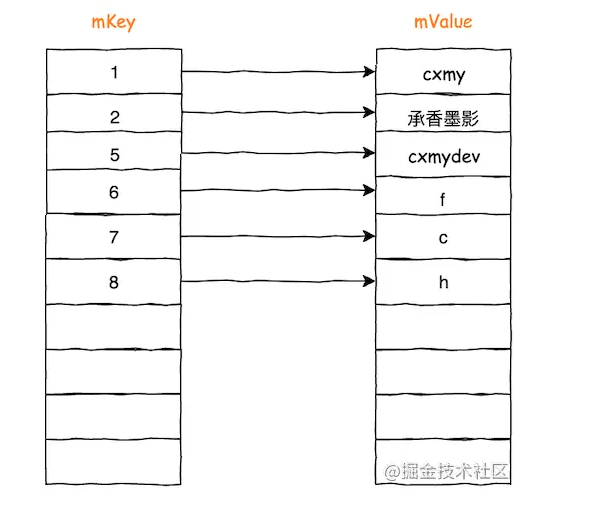
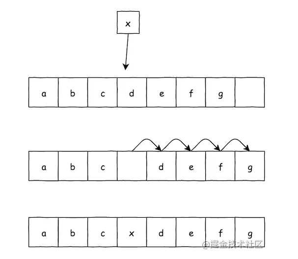
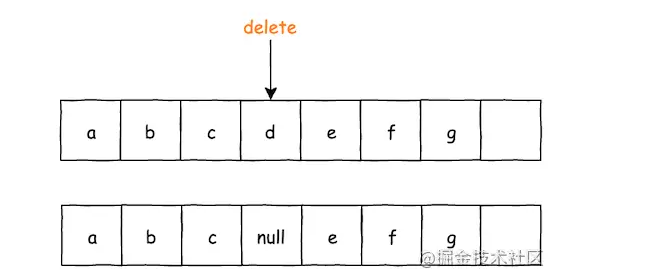
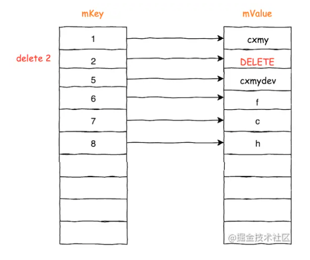
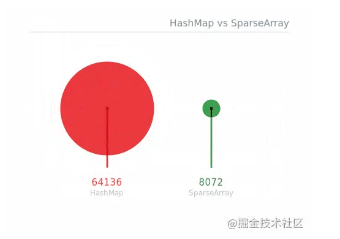

## 一. 序

很多写程序的人都听说过一个公式，程序 = 算法 + 数据结构。而在 Java 中，自身已经提供了丰富的集合，来帮助我们处理和管理数据，但是多数情况下，我们比较常用的就那么几个，可这并不妨碍我们学习了解其他「冷门」的集合类。

但是集合类那么多，怎么学？一个一个方法看其内部实现？我想你就算耐着性子看完了，没几天也都忘干净了，因为细节太多了，同时使用的频率低，遗忘是必然的。

所有的集合类都是为数据和业务服务的，对外无外乎就是增删改查几种操作，对内无法避免的还有一些例如初始化、数据的维护、动态扩容等等实现，细节都在内部。

在学习集合类的时候，我们应该保持一个清晰的主线，只关注几个重要的问题，你就可以还原对这个集合的认识。

比如我在看一个集合类的时候，会思考三个问题：

1. 它擅长解决什么数据问题？（或者说它以解决什么数据问题为目标？）
2. 它如何解决这些问题？
3. 为了解决这些问题，引入了什么新的问题，它是如何平衡的？

程序的世界里，没有银弹，否则其他集合就没有了存在的必要。也就是说每个集合一定有不同的侧重点，它在时间和空间上，一定是有所取舍，有所平衡，在这个目标下，做出最合适的优化实现。

就拿 HashMap 来说，它作为一个工业级的集合类，其中有不少复杂的实现细节，用哈希表让查询的时间复杂度达到 O(1)，但是「哈希冲突」是它需要面对的问题，所以它采用「拉链法」的方式解决冲突，又因为链表会让时间复杂度在极端情况下退化到 O(n)，又引入了红黑树，以保证在最恶劣的情况下时间复杂度也不会退化的太严重。

凡事都要讲个平衡，没有银弹。

那接下来，再说说本文的主角 SparseArray。

在 Android 中，IDE 偶尔会提到我们应该使用 SparseArray 替换掉 HashMap，其根本原因就在于 SparseArray 相比较 HashMap 会更省内存。

具体理解 SparseArray 呢？记住三句话就好了。

1. SparseArray 内部使用**双数组**，分别存储 Key 和 Value，Key 是 int[]，用于查找 Value 对应的 Index，来定位数据在 Value 中的位置。
2. 使用**二分查找**来定位 Key 数组中对应值的位置，所以 Key 数组是有序的。
3. 使用数组就要面临删除数据时数据搬移的问题，所以引入了 **DELETE 标记**。

接下来，我们就围绕这三句话，看看 SparseArray 的细节。

## 二. SparseArray 的三句话

### 2.1 SparseArray 的基本使用

在分析这三句话之前，先来了解一下 SparseArray 的基本使用，对 SparseArray 有一个基本认识，才能更好的理解它。

在创建 SparseArray 的时候，需要指定一个泛型类型，它就是 SparseArray 存储的数据类型。

```kotlin
val sparseArray = SparseArray<Student>()
// or
val sparseArray = SparseArray<Student>(10)
复制代码
```

其中 Key 数组的类型已经被定义成了一个 int 类型的数组，所以无需也没办法在构造时指定。

虽然构造 SparseArray 的时候无需指定 key，但是在增删改查的时候，Key 是一个重要的检索条件，它作为定位一个数据的唯一标识，会贯穿 SparseArray 的大部分的操作方法。

```kotlin
// 增加数据
sparseArray.put(int key, E value) 
// 移除数据
sparseArray.delete(int key)
// 获取数据
sparseArray.get(int key)
sparseArray.get(int key, E valueIf NotFound)
复制代码
```

最基本的增删改查就这几个方法，不过 SparseArray 内部使用数组这种顺序表的结构，同样也提供了一些通过 index 的操作方式。

```kotlin
sparseArray.indexOfKey(int key);
sparseArray.indexOfValue(E value);
sparseArray.keyAt(int index);
sparseArray.valueAt(int index);
sparseArray.setValueAt(int index);
sparseArray.removeAt(int index);
sparseArray.removeAt(int index,int size);
复制代码
```

SparseArray 的使用方式，符合我们的使用习惯，基本上看看方法名就大概知道它的含义。

接下来就来看看它的内部实现。

### 2.2 第一句话

**SparseArray 内部使用双数组，分别存储 Key 和 Value，Key 是 int[]，用于查找 Value 对应的 Index，来定位数据在 Value 中的位置。**

在 SparseArray 内部，采用两个数组来存放数据，它们是一一对应的关系。





mValue 数组是为了存储数据的索引，它和 mKey 数组的关系是一一对应的，我们通过 key 的值，就可以定位出它在 mKey 数组中的 index，进而可以操作 mValue 数组中对应的位置。

因为是一一对应的关系，所有对数据的操作，都需要对这两个数据进行操作。第一句话就是为了对 SparseArray 数据是如何存储的，有一个基本的认识。

### 2.3 第二句话

**使用二分查找来定位 Key 数组中对应值的位置，所以 Key 数组是有序的。**

既然是使用数组这种顺序表，在查找的时候通常需要从前向后遍历数组，这时的时间复杂度就是 O(n)，这明显不是 SparseArray 想要的。

在 SparseArray 中，采用二分查找算法，来快速通过 key 定位出它在 mKey 数组中的位置，二分查找的实现，在 `ContainerHelpers.binarySearch()` 中。正因为使用了二分查找， SparseArray 的查找操作，时间复杂度可以做到 O(logn)。

再看 SparseArray 的源码，所有和 key 相关的操作，第一步都是通过二分查找，定位出它的 index，再进行后续的处理，例如 `get()` 的实现。

```java
public E get(int key, E valueIfKeyNotFound) {
  int i = ContainerHelpers.binarySearch(mKeys, mSize, key);

  if (i < 0 || mValues[i] == DELETED) {
    return valueIfKeyNotFound;
  } else {
    return (E) mValues[i];
  }
}
复制代码
```

先忽略其中的 DELETE 标记的逻辑，后面会讲到。

`binarySearch()` 中会通过 key 查找对应的 index，如果查询不到，它会返回一个负数 **i**，注意这个 **i** 是有意义的，**i** 的相反数，就是 key 在 mKey 数组中，比较合适的位置（index）。

**什么叫比较合适的位置？**

就是虽然这个 key 没有在 mKey 数组中找到，但是如果把 key 插入到 mKey 数组的第 **i** 个位置上，mKey 数组依然是有序的。

我们知道，**二分查找的前提条件，就是必须是针对有序并且支持下标随机访问的数据结构**，所以它在执行插入操作的时候，必须保证 mKey 数据中的数据有序。也正因为如此，mKey 数组是一个基本类型的 int 数组，天然有序并且大小比对也简单。

我们看看 `put()` 方法的实现就清楚了。

```java
public void put(int key, E value) {
  int i = ContainerHelpers.binarySearch(mKeys, mSize, key);

  if (i >= 0) {
    mValues[i] = value;
  } else {
    i = ~i;

    if (i < mSize && mValues[i] == DELETED) {
      mKeys[i] = key;
      mValues[i] = value;
      return;
    }

    if (mGarbage && mSize >= mKeys.length) {
      gc();

      // Search again because indices may have changed.
      i = ~ContainerHelpers.binarySearch(mKeys, mSize, key);
    }

    mKeys = GrowingArrayUtils.insert(mKeys, mSize, i, key);
    mValues = GrowingArrayUtils.insert(mValues, mSize, i, value);
    mSize++;
  }
}
复制代码
```

数组的插入，一定会伴随着数据的搬移。



而在 `put()` 方法中，也会用到二分查找定位 key 的 index，我们主要关注其中的 `GrowingArrayUtils.insert()` 方法。

在这个 `insert()` 方法中，完成两个任务：

1. 将数据插入到指定数组对应的位置上。
2. 如果发现数组空间不够了，就生成一个更大的新数组，将数组通过复制的方法，动态扩容后搬移到新数组中，并返回新数组。

这些高级集合类，和基本数据结构有一个最显著的区别，就是它支持动态扩容，而 SparseArray 动态扩容的实现代码，在 GrowingArrayUtils 的 `insert()` 方法中，其原理就是一次动态复制来扩容。

扩容的逻辑也很简单，就是依据当前的 Size 动态放大，Size 在 4 以上时，每次扩容 2 倍。具体算法在 GrowingArrayUtils 的 `growSize()` 方法中。

```java
public static int growSize(int currentSize) {
  return currentSize <= 4 ? 8 : currentSize * 2;
}
复制代码
```

第二句话，说明了 SparseArray 内部使用二分查找，在 mKey 数组中定位 key 的位置。又因为需要支持二分查找，所以 mKey 数组内存储的数据，必须是有序的。所以在 `put()` 操作的时候，就需要通过数组插入的方式，来保证数据的有序。

又因为使用了数组结构，在数据空间不够时，还需要采取动态扩容的方式，采用新旧数组复制的方式，增大数组的空间，这部分操作都封装在 GrowingArrayUtils 的 `insert()` 方法中。

### 2.3 第三句话

**使用数组就要面临删除数据时数据搬移的问题，所以引入了 DELETE 标记。**

SparseArray 用到了「数组」结构，在插入的时候为了给新数据腾位置，需要执行一个时间复杂度度为 O(n) 的搬移操作，这是无法避免的。

但是删除操作其实是有优化空间的。对数组的删除，如果不做数据搬移，数组中必然存在数据空洞。

SparseArray 对删除操作的优化，引入 DELETE 标记，以此来减少在删除数据时对数据的搬运次数，以此达到在删除时做到 O(1) 的时间复杂度。



而在插入的时候，遇到 DELETE 标识，表示当前数据已经被删除掉了。

这样优化的删除的同时，对插入操作也起到了一定的优化，就像前面展示的 `put()` 代码实现中，如果二分查找的结果，发现对应文字的 value 为 DELETE，则直接替换，减少了一次插入带来的数组的数据搬运。

注意 DELETE 标识是在 mValue 数组中存储的，mKey 中依然存储着它上一次对应数据的 key 值。


但是引入 DELETE 标识就会有个问题，虽然数据被删除了，但是它依然在数组中占有位置空间，也就是它会影响到一些操作，例如在调用 `size()` 方法的时候，肯定是想知道真实数据的数量，而不应该包含 DELETE 标识的数据量。又例如在 `put()` 操作时发现数组空间不够，但是数组内存在 DELETE 标识，此时应该做的是去清理 DELETE 标识，而不是去扩容数组。

引入 DELETE 让 `delete()` 操作可以做到 O(1) 的时间复杂度，但是也带来了问题，这就引入了 SparseArray 的 `gc()` 机制。

GC 我相信大家都比较熟悉，它在 JVM 里代表对内存的回收机制，而在 SparseArray 中，它标识了对 DELETE 标识的回收。

在一些必要的条件下，会触发 `gc()` 逻辑，来清理双数组中的 DELETE 标识。



`gc()` 方法中，通过一次循环，就可以完成 DELETE 标识的清除，在 `gc()` 方法中，用了一个布尔类型的 `mGarbage` 属性，来记录当前 mValue 中，是否存在 DELETE 标识，这是判定是否需要 GC 的依据。。

`gc()` 会有一次循环，这是 O(n) 的时间复杂度，那什么时候执行 `gc()` 也是有讲究的。

如果你在 SparseArray 文件中搜索 `gc()` 方法的调用，你会发现有很多地方都用到了 `gc()` 方法。原则上，有两类操作可能会触发到 `gc()` 逻辑，**所有和 size 相关的操作**以及**和数组扩容相关的操作**。这很好理解，通过 index 获取数据，必须保证 size 的准确，所以如果有 DELETE 标识，必须执行 `gc()`，扩容时也是，存在 DELETE 标识说明还有剩余的空间，无需进行扩容。

到这里第三句话也理清楚了，引入 DELETE 标识是为了减少删除数据时数据的搬移次数，而这必然带来了数组的「空洞」，为了解决这个问题，又需要在适当的时候触发 GC 操作，来回收 DELETE 标识。

## 三. 查缺补漏

三句话理解 SparseArray 就说完了，这三句话帮助我们理解 SparseArray 使用的数据结构，实现原理，以及如何平衡遇到的问题。

理解了这些，就可以很好的区分 SparseArray 的使用场景，以及可以借鉴的地方。

当然我这样解释，一定是忽略了一些细节，但是这些都不是最重要的，最后这里再查缺补漏。

### 3.1 装箱和拆箱

SparseArray 的 Key 是基本数据类型的 int[]，从文档和其他的文章中都会提到，自动装箱和拆箱对性能的影响，但我认为这不是最重要的。

如果你理解 SparseArray 的设计目标，就会发现用基本数据类型是一个必然的结果，SparseArray 就是为了节省内存空间而存在的。之所以用基本数据类型，首先基本数据类型本身比类更省空间，其次因为用到了二分查找，所以需要保证 mKey 数组的有序，排序就涉及到了数据大小的比对，使用基本数据类型也能很好的解决两数比对大小的效率问题。

### 3.2 省内存的说法

节省和浪费其实都是相对的，说到 SparseArray 更省内存，通常是与 HashMap 之间做对比。

HashMap 相较于 SparseArray 复杂很多，使用到的属性变量也多不少，而 SparseArray 从头到尾就是在操作两个数组，大小的差距可想而知。

同时 HashMap 为了应对哈希冲突，引入了「负载因子」，它的默认值是 0.75。什么意思呢？就是 table 的容量达到了指定尺寸的 0.75%，就会开始扩容，也就是必然有 25% 的空间是不存储数据而被浪费的。而 SparseArray 是可以把数组利用到最后一个空间，不会轻易扩容。

在 Stack Overflow 中就有人以 1000 条数据作为样本，计算 HashMap 与 SparseArray 对内存的占用情况，单位是 byte。



虽然这里的测试不是很严谨，但是依然可以看到他们在内存空间的使用上，已经不是一个数量积的了。

对计算方式有兴趣的，可以在文末找到 Stack Overflow 的地址。

### 3.3 对数据插入顺序的依赖

前面提到，SparseArray 因为需要使用二分查找，这就要求 mKey 中存储的数据必须是有序的。

所以当插入数据的数据模型不同时，其效率也会受到影响，这完全取决于插入数据时，key 的有序度。

**有序度是什么意思呢？**

有序度这个概念通常被使用在排序中，例如 1 2 3 4 就被称为**满有序度**，而相反的 4 3 2 1 则被称为**满逆序度**。

这很好理解，如果每次插入都需要伴随着数组的数据搬移，那必然是会影响效率，而如果每次插入新数据，只是在数组尾部追加，当然要快不少。

为此 SparseArray 还提供了一个 `append()` 方法，来优化追加的情况。该方法会判断追加的 key 值，是否大于 mKey 数组中最大的值，如果是则直接追加在数组末尾，否则执行 `put()` 方法插入 mKey 数组。

下面就用一个 10000 的数据，分别用三种方式将数据加入到全新的 SparseArray 中，看其对执行效率的影响，单位是毫秒。

1. 插入满有序度的 1000 条数据，耗时 29ms。
2. 插入满逆序度的 10000 调数据，耗时 240ms。
3. 使用 `append()` 追加 10000 调满有序度的数据，耗时 14ms。


可以看到，插入的 key 是完全逆序的，效率最差。而如果 key 的数据是有序的，使用 `append()` 的效率要高于直接使用 `put()`。如果是逆序的情况，`append()` 也会退化成 `put()` 去执行，所以追加 key 更大的数据场景下，可以考虑用 `append()`。

### 3.4 SparseArray 的一些变体

SparseArray 还存在一些变体类，用于处理不同的情况。

- SparseBooleanArray
- SparseIntArray
- SparseLongArray
- LongSparseArray
- LongSparseLongArray

但是核心原理与 SparseArray 一致，有兴趣单独了解。

## 四. 小结时刻

到这里就基本上讲清楚 SparseArray 的所有细节，如题所说，记住三句话就可以理解 SparseArray。

1. SparseArray 内部使用**双数组**，分别存储 Key 和 Value，Key 是 int[]，用于查找 Value 对应的 Index，来定位数据在 Value 中的位置。
2. 使用**二分查找**来定位 Key 数组中对应值的位置，所以 Key 数组是有序的。
3. 使用数组就要面临删除数据时数据搬移的问题，所以引入了 **DELETE 标记**。

使用双数组结构来存储数据，Key 是 int[] 类型，和 Value 数据的 Index 一一对应。需要使用二分查找来保证查询的时间复杂度在 O(logn)，所以 mKey 数组必须是有序的，同时为了优化删除数据时数据的搬移，引入了 DELETE 标记，让删除操作的时间复杂度控制在 O(1) 上，而又因为删除数据其实是将原本的「数组空洞」标记成了 DELETE，所以在必要的时候需要 GC 来清理 DELETE 标记。

到这里就结束了，如果三句话太短，记住三个点：**双数组、二分查找、DELETE 标识**。

References:

- https://stackoverflow.com/questions/25560629/sparsearray-vs-hashmap

本文对你有帮助吗？**留言、转发、点好看**是最大的支持，谢谢！


作者：承香墨影
链接：https://juejin.cn/post/6844903961963528199
来源：掘金
著作权归作者所有。商业转载请联系作者获得授权，非商业转载请注明出处。