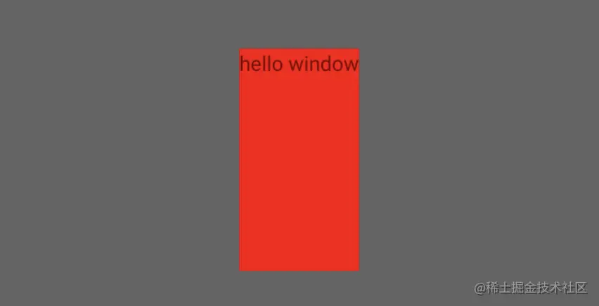
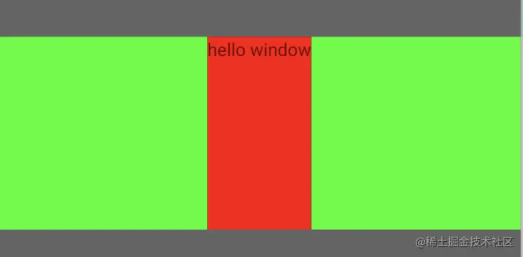
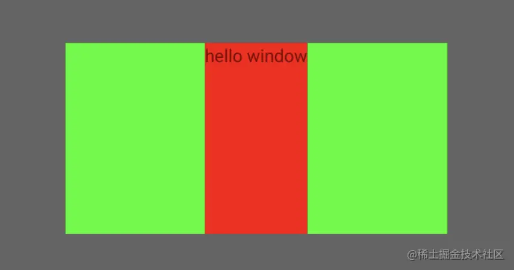
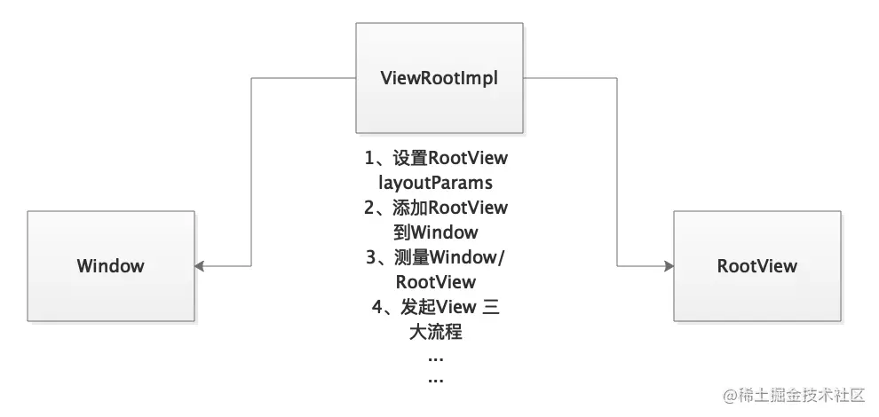
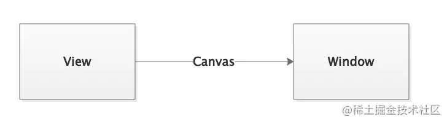

我们知道父布局根据自身和子布局的要求给子布局生成测量模式和测量尺寸，并封装在MeasureSpec 对象里，最终传递给子布局让它最后确定自身的尺寸。
 很自然就会想到，既然子布局是从父布局拿的测量结果，父布局又从它的父布局拿测量结果，最终到ViewTree的顶点根View是谁测量的呢？
 循着这个问题，从源码角度一探究竟。

系列文章：

> [Window/WindowManager 不可不知之事](https://juejin.cn/post/7015978746104512548)
>  [Android Window 如何确定大小/onMeasure()多次执行原因](https://juejin.cn/post/7015980840047869983)

通过本篇文章，你将了解到：

> 1、Window 尺寸测量
>  2、根View 尺寸测量
>  3、Window、ViewRootImpl、View 三者关系

# 1、Window 尺寸测量

## 一个小Demo

通过WindowManager.addView(xx)展示一个悬浮窗：

```
    private void showView() {
        //获取WindowManager实例
        wm = (WindowManager) App.getApplication().getSystemService(Context.WINDOW_SERVICE);

        //设置LayoutParams属性
        layoutParams = new WindowManager.LayoutParams();
        //宽高尺寸
        layoutParams.height = ViewGroup.LayoutParams.WRAP_CONTENT;
        layoutParams.width = ViewGroup.LayoutParams.WRAP_CONTENT;
        layoutParams.format = PixelFormat.TRANSPARENT;
        //设置背景阴暗
        layoutParams.flags |= WindowManager.LayoutParams.FLAG_DIM_BEHIND;
        layoutParams.dimAmount = 0.6f;

        //Window类型
        if (Build.VERSION.SDK_INT >= Build.VERSION_CODES.O) {
            layoutParams.type = WindowManager.LayoutParams.TYPE_APPLICATION_OVERLAY;
        } else {
            layoutParams.type = WindowManager.LayoutParams.TYPE_PHONE;
        }

        //构造TextView
        TextView myView = new TextView(this);
        myView.setText("hello window");
        //设置背景为红色
        myView.setBackgroundResource(R.color.colorRed);
        FrameLayout.LayoutParams myParam = new FrameLayout.LayoutParams(ViewGroup.LayoutParams.WRAP_CONTENT, 400);
        myParam.gravity = Gravity.CENTER;
        myView.setLayoutParams(myParam);

        //myFrameLayout 作为rootView
        FrameLayout myFrameLayout = new FrameLayout(this);
        //设置背景为绿色
        myFrameLayout.setBackgroundColor(Color.GREEN);
        myFrameLayout.addView(myView);

        //添加到window
        wm.addView(myFrameLayout, layoutParams);
    }
复制代码
```

上述代码简单概述如下：

> 1、构造TextView，设置其背景为红色
>  2、构造FrameLayout，设置其背景为绿色
>  3、将TextView作为子View添加到FrameLayout
>  4、将FrameLayout作为RootView(根View)添加到Window里

悬浮窗展示完整Demo请移步：[Window/WindowManager 不可不知之事](https://juejin.cn/post/7015978746104512548)

注意到

```
wm.addView(myFrameLayout, layoutParams);
复制代码
```

layoutParams 里重点关注宽、高字段的值，我们知道这是给Window的尺寸约束，以宽为例，设置不同的值，看看其效果：
 **1、wrap_content**

> layoutParams.height = ViewGroup.LayoutParams.WRAP_CONTENT;
>  layoutParams.width = ViewGroup.LayoutParams.WRAP_CONTENT;




可以看出：RootView(FrameLayout) 包裹着TextView，两者宽度一致。

**2、match_parent**

> layoutParams.height = ViewGroup.LayoutParams.WRAP_CONTENT;
>  layoutParams.width = ViewGroup.LayoutParams.MATCH_PARENT;



可以看出：RootView(FrameLayout) 宽充满屏幕


**3、设置具体的值**

> layoutParams.height = ViewGroup.LayoutParams.WRAP_CONTENT;
>  layoutParams.width = 800;



可以看出：RootView(FrameLayout) 宽没充满屏幕，屏幕宽1080px。


结合上述三张图，我们有理由相信，wm.addView(myFrameLayout, layoutParams) 里的layoutParams 是用来约束myFrameLayout(RootView)，那么Window尺寸是怎么来的呢？

## Window 尺寸的确定

从wm.addView(xx)开始分析，WindowManager 是个接口，其实现类是：WindowManagerImpl。

```java
#WindowManagerImpl.java
    public void addView(@NonNull View view, @NonNull ViewGroup.LayoutParams params) {
        //赋值token，在启动Dialog/PopupDialog 会判断该值
        applyDefaultToken(params);
        //mGlobal 为单例，管理所有的ViewRootImpl、RootView
        mGlobal.addView(view, params, mContext.getDisplay(), mParentWindow);
    }
复制代码
```

接着看WindowManagerGlobal 的处理：

```java
#WindowManagerGlobal.java
    public void addView(View view, ViewGroup.LayoutParams params,
                        Display display, Window parentWindow) {
        ...
        final WindowManager.LayoutParams wparams = (WindowManager.LayoutParams) params;
        ViewRootImpl root;
        View panelParentView = null;

        synchronized (mLock) {
            ...
            //构造ViewRootImpl 对象
            root = new ViewRootImpl(view.getContext(), display);

            //view 作为RootView
            //将传进来的wparams作为该RootView的LayoutParams
            view.setLayoutParams(wparams);

            //记录对象
            mViews.add(view);
            mRoots.add(root);
            mParams.add(wparams);

            try {
                //ViewRootImpl 关联RootView
                root.setView(view, wparams, panelParentView);
            } catch (RuntimeException e) {
                ...
            }
        }
    }
复制代码
```

由上可知，在wm.addView(xx)里传递进来的LayoutParams设置给了RootView。
 继续来看ViewRootImpl.setView(xx)过程。

```java
#ViewRootImpl.java
    public void setView(View view, WindowManager.LayoutParams attrs, View panelParentView) {
        synchronized (this) {
            if (mView == null) {
                mView = view;
                ...
                //将LayoutParams记录到成员变量 mWindowAttributes 里
                //该变量用来描述Window属性
                mWindowAttributes.copyFrom(attrs);
                ...
                //开启View layout 三大流程
                requestLayout();
                ...
                try {
                    ...
                    //IPC 通信，告诉WindowManagerService 要创建Window
                    //将mWindowAttributes 传入
                    //返回mTmpFrame 表示该Window可以展示的最大尺寸
                    res = mWindowSession.addToDisplay(mWindow, mSeq, mWindowAttributes,
                            getHostVisibility(), mDisplay.getDisplayId(), mTmpFrame,
                            mAttachInfo.mContentInsets, mAttachInfo.mStableInsets,
                            mAttachInfo.mOutsets, mAttachInfo.mDisplayCutout, mInputChannel,
                            mTempInsets);
                    //将返回的值记录到成员变量 mWinFrame 里
                    setFrame(mTmpFrame);
                } catch (RemoteException e) {
                    ...
                } finally {
                    if (restore) {
                        attrs.restore();
                    }
                }
                ...
            }
        }
    }
复制代码
```

上面这段重点关注2个方面：

> 1、传入的LayoutParams记录到成员变量mWindowAttributes，最后用来约束Window。
>  2、添加Window时返回Window的最大尺寸，最终记录在成员变量：mWinFrame里。

综上所述，我们发现：
 **wm.addView(myFrameLayout, layoutParams) 里的layoutParams不仅约束了RootView，也约束了Window。**

# 2、根View 尺寸测量

既然知道了RootView 的layoutParams，依据我们之前分析过的ViewTree的测量过程：[Android 自定义View之Measure过程](https://link.juejin.cn?target=https%3A%2F%2Fwww.jianshu.com%2Fp%2F23519665ff32) 可知还需要为RootView生成MeasureSpec对象。
 在setView(xx)过程中调用了requestLayout 注册了回调，当屏幕刷新信号到来之时执行performTraversals()开启三大流程。

```java
#ViewRootImpl.java
    private void performTraversals() {
        ...
        //之前记录的Window LayoutParams
        WindowManager.LayoutParams lp = mWindowAttributes;

        //Window需要的大小
        int desiredWindowWidth;
        int desiredWindowHeight;
        ...

        Rect frame = mWinFrame;
        if (mFirst) {
            ...
            if (shouldUseDisplaySize(lp)) {
                ...
            } else {
                //mWinFrame即是之前添加Window时返回的Window最大尺寸
                desiredWindowWidth = mWinFrame.width();
                desiredWindowHeight = mWinFrame.height();
            }
            ...
        } else {
            ...
        }

        ...
        if (layoutRequested) {
            ...
            //从方法名看应该是测量ViewTree -----------(1)
            windowSizeMayChange |= measureHierarchy(host, lp, res,
                    desiredWindowWidth, desiredWindowHeight);
        }
        ...

        if (mFirst || windowShouldResize || insetsChanged ||
                viewVisibilityChanged || params != null || mForceNextWindowRelayout) {
            ...
            try {
                ...
                //重新确定Window尺寸 --------(2)
                relayoutResult = relayoutWindow(params, viewVisibility, insetsPending);
                ...
            } catch (RemoteException e) {
            }
            ...
            if (!mStopped || mReportNextDraw) {
                ...
                if (focusChangedDueToTouchMode || mWidth != host.getMeasuredWidth()
                        || mHeight != host.getMeasuredHeight() || contentInsetsChanged ||
                        updatedConfiguration) {
                    ...
                    //再次测量ViewTree -------- (3)
                    performMeasure(childWidthMeasureSpec, childHeightMeasureSpec);
                    ...
                }
            }
        } else {
            ...
        }
        ...
        if (didLayout) {
            //对ViewTree 进行Layout ---------- (4)
            performLayout(lp, mWidth, mHeight);
            ...
        }
        ...
        if (!cancelDraw) {
            ...
            //开始ViewTree Draw过程 ------- (5)
            performDraw();
        } else {
            ...
        }
    }

复制代码
```

来看看标注的重点：
 **(1)**
 measureHierarchy(xx)

```java
#ViewRootImpl.java
    private boolean measureHierarchy(final View host, final WindowManager.LayoutParams lp,
                                     final Resources res, final int desiredWindowWidth, final int desiredWindowHeight) {
        int childWidthMeasureSpec;
        int childHeightMeasureSpec;
        boolean windowSizeMayChange = false;
        ...

        //标记是否测量成功
        boolean goodMeasure = false;
        //宽度为wrap_content时
        if (lp.width == ViewGroup.LayoutParams.WRAP_CONTENT) {
            final DisplayMetrics packageMetrics = res.getDisplayMetrics();
            res.getValue(com.android.internal.R.dimen.config_prefDialogWidth, mTmpValue, true);
            int baseSize = 0;
            if (mTmpValue.type == TypedValue.TYPE_DIMENSION) {
                baseSize = (int)mTmpValue.getDimension(packageMetrics);
            }
            //baseSize 为预置的宽度
            //desiredWindowWidth 想要的宽度是否大于预置宽度
            if (baseSize != 0 && desiredWindowWidth > baseSize) {
                //以baseSize 作为宽度传入
                childWidthMeasureSpec = getRootMeasureSpec(baseSize, lp.width);
                childHeightMeasureSpec = getRootMeasureSpec(desiredWindowHeight, lp.height);
                //测量----------------- 第一次
                performMeasure(childWidthMeasureSpec, childHeightMeasureSpec);
                //如果ViewTree的子布局需要的宽度大于父布局能给的宽度，则该标记被设置
                if ((host.getMeasuredWidthAndState()&View.MEASURED_STATE_TOO_SMALL) == 0) {
                    //该标记没被设置，说明父布局给的尺寸够用，测量完成
                    goodMeasure = true;
                } else {
                    //父布局不能满足子布局的需求，尝试扩大宽度
                    //desiredWindowWidth > baseSize，因此新计算的baseSize要大于原先的baseSize
                    baseSize = (baseSize+desiredWindowWidth)/2;
                    childWidthMeasureSpec = getRootMeasureSpec(baseSize, lp.width);
                    //拿到后继续测量----------------- 第二次
                    performMeasure(childWidthMeasureSpec, childHeightMeasureSpec);
                    //继续检测是否满足
                    if ((host.getMeasuredWidthAndState()&View.MEASURED_STATE_TOO_SMALL) == 0) {
                        goodMeasure = true;
                    }
                }
            }
        }

        //没测量好，继续测量
        if (!goodMeasure) {
            //可以看出是为RootView 生成MeasureSpec
            //传入的参数：能给RootView分配的最大尺寸值以及RootView本身想要的尺寸(记录在LayoutParams里）
            childWidthMeasureSpec = getRootMeasureSpec(desiredWindowWidth, lp.width);
            childHeightMeasureSpec = getRootMeasureSpec(desiredWindowHeight, lp.height);

            //既然MeasureSpec 有了，那么就可以测量RootView了
            //该过程就是测量整个ViewTree----------------- 第三次
            performMeasure(childWidthMeasureSpec, childHeightMeasureSpec);
            if (mWidth != host.getMeasuredWidth() || mHeight != host.getMeasuredHeight()) {
                //Window尺寸变化了，用于后续判断执行performMeasure(xx)
                windowSizeMayChange = true;
            }
        }
        ...
        return windowSizeMayChange;
    }

    private static int getRootMeasureSpec(int windowSize, int rootDimension) {
        int measureSpec;
        switch (rootDimension) {

            case ViewGroup.LayoutParams.MATCH_PARENT:
                //RootView 希望填充Window，则满足它，此时它尺寸是确切值
                measureSpec = MeasureSpec.makeMeasureSpec(windowSize, MeasureSpec.EXACTLY);
                break;
            case ViewGroup.LayoutParams.WRAP_CONTENT:
                //RootView 希望根据自身内容来确定尺寸，则设置为AT_MOST 模式
                measureSpec = MeasureSpec.makeMeasureSpec(windowSize, MeasureSpec.AT_MOST);
                break;
            default:
                //RootView 希望直接指定尺寸值，则满足它，此时它尺寸是确切值
                measureSpec = MeasureSpec.makeMeasureSpec(rootDimension, MeasureSpec.EXACTLY);
                break;
        }
        return measureSpec;
    }
```

以上代码主要做了两件事：

> 1、结合Window尺寸，确定RootView 的测量模式和预估测量值(MeasureSpec)
>  2、根据第一步的结果，发起对ViewTree的测量（从RootView开始)

**(2)**
 经过对ViewTree的测量后，RootView的测量值已经确定了。
 来看看relayoutWindow(xx):

```
#ViewRootImpl.java
    private int relayoutWindow(WindowManager.LayoutParams params, int viewVisibility,
                               boolean insetsPending) throws RemoteException {
        ...
        //重新设置Window大小
        //传入的尺寸值为RootView的尺寸值
        //返回Window尺寸值存放在 mTmpFrame里
        int relayoutResult = mWindowSession.relayout(mWindow, mSeq, params,
                (int) (mView.getMeasuredWidth() * appScale + 0.5f),
                (int) (mView.getMeasuredHeight() * appScale + 0.5f), viewVisibility,
                insetsPending ? WindowManagerGlobal.RELAYOUT_INSETS_PENDING : 0, frameNumber,
                mTmpFrame, mPendingOverscanInsets, mPendingContentInsets, mPendingVisibleInsets,
                mPendingStableInsets, mPendingOutsets, mPendingBackDropFrame, mPendingDisplayCutout,
                mPendingMergedConfiguration, mSurfaceControl, mTempInsets);
        //关联Window和surface
        if (mSurfaceControl.isValid()) {
            mSurface.copyFrom(mSurfaceControl);
        } else {
            destroySurface();
        }
        
        //记录Window 尺寸
        setFrame(mTmpFrame);
        return relayoutResult;
    }
复制代码
```

我们发现：

> - Window的尺寸是依赖于RootView的测量尺寸，并且一般来说appScale=1，也就是说Window尺寸就是RootView的尺寸。
> - 此处也即是解释了之前的Demo现象。

而(1)步骤的测量ViewTree是为了确定RootView的尺寸从而在此步骤确定Window尺寸。

**(3)(4)(5)**

### 这里分析经典问题：onMeasure() 为什么会执行多次？

这三部分即是我们熟知的View 的三大过程，此处值得注意的是：
 **步骤(1)**
 在(1)步骤里的measureHierarchy(xx)，我们标注了三次测量。

> 1、第一次：先用预置宽度测量ViewTree，得到测量结果
>  2、发现第一次测量结果不满足，因为存在需要宽度比预置宽度大的子布局，于是给子布局更大的宽度，再进行第二次测量
>  3、发现第二次测量结果仍然不满足，于是用Window能够拿到的最大宽度再进行测量

可以看出measureHierarchy(xx)里至少执行一次performMeasure()，最多能执行三次。而调用performMeasure()方法，该方法最终会调用到各个View的onMeasure()。
 每次performMeasure() 一定能够触发执行onMeasure()吗？会。
 原因：
 再次简单回顾一下measure(xx)代码：

```
    public final void measure(xx) {
        ...
        final boolean forceLayout = (mPrivateFlags & PFLAG_FORCE_LAYOUT) == PFLAG_FORCE_LAYOUT;
        final boolean needsLayout = specChanged
                && (sAlwaysRemeasureExactly || !isSpecExactly || !matchesSpecSize);
        //两个条件满足其中一个
        //1、需要强制layout
        //2、尺寸发生改变
        if (forceLayout || needsLayout) {
            ...
            onMeasure();
            ...
        }
        ...
    }
复制代码
```

从上面可知，能执行onMeasure()，说明上述条件满足了。
 needsLayout肯定是不满足的了，因为View尺寸没变过。
 那么只能是forceLayout=true了。在第一次测量ViewTree的时候，仅仅只是走了Measure过程，并未走Layout过程。而我们知道PFLAG_FORCE_LAYOUT 标记是在Layout结束后清空的，因此此处PFLAG_FORCE_LAYOUT 标记并没有清空，当然needsLayout=true满足条件。
 详细的Measure/Layout/Draw 系列请移步：

> - [Android 自定义View之Measure过程](https://link.juejin.cn?target=https%3A%2F%2Fwww.jianshu.com%2Fp%2F23519665ff32)
> - [Android 自定义View之Layout过程](https://link.juejin.cn?target=https%3A%2F%2Fwww.jianshu.com%2Fp%2Fea6dd79f1aba)
> - [Android 自定义View之Draw过程(上)](https://link.juejin.cn?target=https%3A%2F%2Fwww.jianshu.com%2Fp%2F16e5cf827ea8)

**步骤(3)**
 而在(3)步骤又再次测量了ViewTree，此时View/ViewGroup onMeasure() 再次执行。

结合步骤(1)、步骤(3)总结一下：

> 在步骤(1)里至少执行了一次测量，最多执行三次
>  而在步骤(3)里也会执行一次测量

当requestLayout的时候，步骤(1)一定会执行，也就是说保底执行一次performMeasure(xx)->onMeasure()。
 而步骤(3)在第一次展示View的时候会执行或者窗口尺寸发生变化会执行。
 于是我们得出如下结论：

> 1、第一次展示View的时候，步骤(1) 、(3)一定会执行，因此onMeasure()至少执行两次
>  2、后续通过requestLayout()触发时，不一定执行步骤(3)，因此此时onMeasure()可能只会执行一次

**这就是onMeasure() 为什么会执行多次的原因**
 **什么时候步骤(1)会执行三次测量？**
 一般来说，步骤(1)里通常只会走第三次测量，第一次、第二次不会走，因为对于DecorView作为RootView来说，lp.width == ViewGroup.LayoutParams.MATCH_PARENT。不满足走第一次、第二次的条件。所以通常只会看到onMeasure()执行两次，而不是多次。
 当然我们可以满足它条件，让onMeasure()执行5次。

```
  #展示悬浮窗
    private void testMeasure() {
        WindowManager.LayoutParams layoutParams = new WindowManager.LayoutParams();
        layoutParams.height = ViewGroup.LayoutParams.WRAP_CONTENT;
        //一定要是WRAP_CONTENT
        layoutParams.width = ViewGroup.LayoutParams.WRAP_CONTENT;

        //TransView为自定义View
        final TransView transView = new TransView(this);
        windowManager.addView(transView, layoutParams);
    }

    #重写TransView onMeasure(xx)
    @Override
    protected void onMeasure(int widthMeasureSpec, int heightMeasureSpec) {
        //该View 需要宽度大于屏幕宽度
        int width = resolveSizeAndState(10000, widthMeasureSpec, 0);
        setMeasuredDimension(width, View.MeasureSpec.getSize(heightMeasureSpec));
    }
复制代码
```

TransView 为自定义View，TransView 作为RootView。
 以上代码主要做了两件事:

> 1、约束Window的宽为WRAP_CONTENT
>  2、让其子View(TransView)申请大于屏幕宽度的宽度

想要验证执行多少次，在TransView onMeasure(xx)打印即可。

另外，除了上述原因导致onMeasure()执行多次外，onMeasure()有可能执行更多次，比如FrameLayout在测量子布局的时候，在某些条件下会再次触发child.measure()过程，此时算起来子布局的onMeasure()执行次数可能就会更多了，有兴趣可以看看FrameLayout->onLayout(xx)。

### onMeasure()为什么要执行两次

我们知道了会执行两次的原因，为什么这么设计呢？
 不考虑特殊情况，View在第一次展示的时候会执行两次onMeasure(xx)。
 前面提到过只要执行了requestLayout()，步骤(1)一定会执行。
 步骤(1)执行的目的是为了获取RootView的测量值，而RootView的测量值会在relayoutWindow(xx)用来重新确定Window的宽高，而步骤(3)的执行在relayoutWindow(xx)之后，因此步骤(1)就有执行的必要了。

至此，我们知道了RootView与Window的尺寸是如何确定了。

# 3、Window、ViewRootImpl、View 三者关系

上边涉及到了Window、RootView，所用的方法基本都是ViewRootImpl里提供的。那么三者到底是个什么关系呢？
 RootView需要添加到Window里才能展示，但是Window并不是直接管理RootView，而是通过ViewRootImpl进行管理。



ViewRootImpl可以看做是Window、RootView的中间者，负责协调这两者。


那么Window与RootView又是什么关系的？
 你可能已经发现了，addToDisplay(xx)并没有传入RootView，那么RootView是如何添加到Window里呢？
 实际上，这里的添加说法比较拟人化。
 在relayoutWindow(xx)里，传入了mSurfaceControl，返回后就与Surface mSurface 建立了联系。也就是说底层的Surface与Java 层的Surface关联起来了。而通过Surface，能够拿到Canvas。而每个View的绘制都需要关联Canvas，以此类推，View就与Surface关联了，那么在View上进行的绘制都会反馈到Surface上。这也就是说View添加到了Window。



