## 1：画笔

### 抗锯齿：

 paint.setAntiAlias(true);//抗锯齿功能 

### 颜色：

paint.setColor(Color.RED)

### 填充样式：

 paint.setStyle(Style.FILL)

​	 										Style.FILL   Style.FILL_AND_STROKE   Style.STROKE 

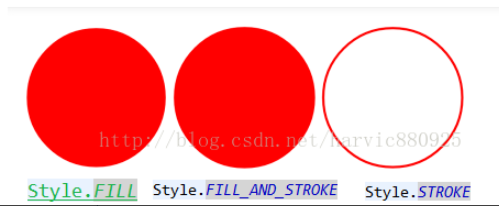

### 添加阴影： 

setShadowLayer (float radius, float dx, float dy, int color)  

	 radius:阴影的倾斜度   dx:水平位移 dy:垂直位移   color:颜色 
eg： paint.setShadowLayer(10, 15, 15, Color.GREEN);//设置阴影 


### 画笔宽度： paint.setStrokeWidth(5); 

## 2：绘制基础

### 		2.1：设置背景  

​		 canvas.drawColor(Color.BLUE); 

 		canvas.drawRGB(255, 255, 0); 

### 		2.2：绘制几何图形

#### 		2.2.1：点

​			单点：

```
 void drawPoint (float x, float y, Paint paint) 
```

​			多个点：

```
		void drawPoints (float[] pts, Paint paint)
		void drawPoints (float[] pts, int offset, int count, Paint paint) 
		
		float[] pts:点的合集，与上面直线一直，样式为｛x1,y1,x2,y2,x3,y3,……｝
		int offset:集合中跳过的数值个数，注意不是点的个数！一个点是两个数值；
		count:参与绘制的数值的个数，指pts[]里人数值个数，而不是点的个数，因为一个点是两个数值
```

eg：

```
offset与count的含义：（跳过第一个点，画出后面两个点，第四个点不画），注意一个点是两个数值！
float []pts={10,10,100,100,200,200,400,400};
canvas.drawPoints(pts, 2, 4, paint);
```

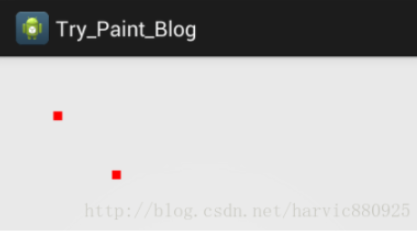

#### 2.2.2：线条

单线条：

```
startX:开始点X坐标
startY:开始点Y坐标
stopX:结束点X坐标
stopY:结束点Y坐标
void drawLine (float startX, float startY, float stopX, float stopY, Paint paint)
```

多线条：

```
pts:是点的集合，大家下面可以看到，
这里不是形成连接线，而是每两个点形成一条直线，
pts的组织方式为｛x1,y1,x2,y2,x3,y3,……｝
void drawLines (float[] pts, Paint paint)
void drawLines (float[] pts, int offset, int count, Paint paint)
```

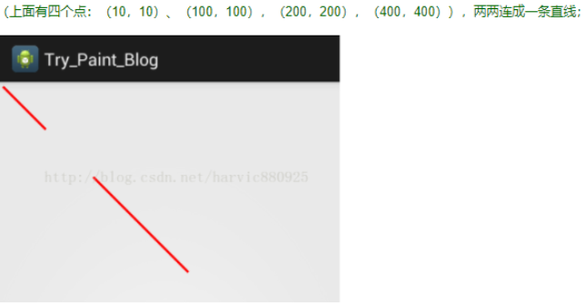

#### 2.2.3：矩形

```
RectF()
RectF(float left, float top, float right, float bottom)
RectF(RectF r)
RectF(Rect r)

void drawRect (float left, float top, float right, float bottom, Paint paint)
void drawRect (RectF rect, Paint paint)
void drawRect (Rect r, Paint paint)

圆角矩形
RectF rect = new RectF(100, 10, 300, 100);
参数：
RectF rect:要画的矩形
float rx:生成圆角的椭圆的X轴半径
float ry:生成圆角的椭圆的Y轴半径
canvas.drawRoundRect(rect, 20, 10, paint);
```

#### 2.2.4：圆

```
参数：
float cx：圆心点X轴坐标 
float cy：圆心点Y轴坐标
float radius：圆的半径
void drawCircle (float cx, float cy, float radius, Paint paint)
```

#### 2.2.5：椭圆


```
RectF oval：用来生成椭圆的矩形
void drawOval (RectF oval, Paint paint)


eg：
RectF rect = new RectF(100, 10, 300, 100);
canvas.drawRect(rect, paint);//画矩形
paint.setColor(Color.GREEN);//更改画笔颜色
canvas.drawOval(rect, paint);//同一个矩形画椭圆
```

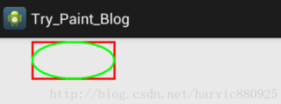

#### 2.2.6：弧线

```
参数：
RectF oval:生成椭圆的矩形
float startAngle：弧开始的角度，以X轴正方向为0度
float sweepAngle：弧持续的角度
boolean useCenter:是否有弧的两边，True，还两边，False，只有一条弧

void drawArc (RectF oval, float startAngle, float sweepAngle, boolean useCenter, Paint paint)

eg：
RectF rect1 = new RectF(100, 10, 300, 100);
canvas.drawArc(rect1, 0, 90, true, paint);
RectF rect2 = new RectF(400, 10, 600, 100);
canvas.drawArc(rect2, 0, 90, false, paint);
```


### 2.3：绘制路径

 void drawPath (Path path, Paint paint) 

#### 2.3.1：直线路径

```
void moveTo (float x1, float y1):直线的开始点；即将直线路径的绘制点定在（x1,y1）的位置；
void lineTo (float x2, float y2)：直线的结束点，又是下一次绘制直线路径的开始点；lineTo（）可以一直用；
void close ():如果连续画了几条直线，但没有形成闭环，调用Close()会将路径首尾点连接起来，形成闭环；
eg：
Path path = new Path();
path.moveTo(10, 10); //设定起始点
path.lineTo(10, 100);//第一条直线的终点，也是第二条直线的起点
path.lineTo(300, 100);//画第二条直线
path.lineTo(500, 100);//第三条直线
path.close();//闭环
canvas.drawPath(path, paint);
```

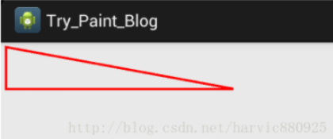

#### 2.3.2：矩形路径

```
这里Path类创建矩形路径的参数与上篇canvas绘制矩形差不多，唯一不同的一点是增加了Path.Direction参数；
Path.Direction有两个值：
Path.Direction.CCW：是counter-clockwise缩写，指创建逆时针方向的矩形路径；
Path.Direction.CW：是clockwise的缩写，指创建顺时针方向的矩形路径；

void addRect (float left, float top, float right, float bottom, Path.Direction dir)
void addRect (RectF rect, Path.Direction dir)


eg:
//先创建两个大小一样的路径
//第一个逆向生成
Path CCWRectpath = new Path();
RectF rect1 =  new RectF(50, 50, 240, 200);
CCWRectpath.addRect(rect1, Direction.CCW);

//第二个顺向生成
Path CWRectpath = new Path();
RectF rect2 =  new RectF(290, 50, 480, 200);
CWRectpath.addRect(rect2, Direction.CW);

//先画出这两个路径 
canvas.drawPath(CCWRectpath, paint);
canvas.drawPath(CWRectpath, paint);
```

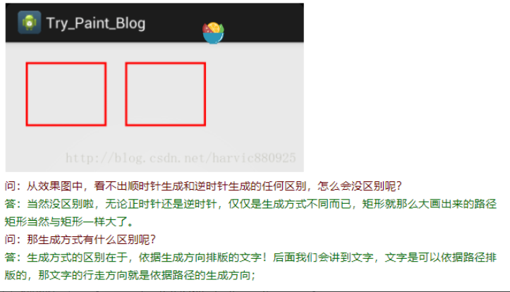

```
//先创建两个大小一样的路径
//第一个逆向生成
Path CCWRectpath = new Path();
RectF rect1 =  new RectF(50, 50, 240, 200);
CCWRectpath.addRect(rect1, Direction.CCW);

//第二个顺向生成
Path CWRectpath = new Path();
RectF rect2 =  new RectF(290, 50, 480, 200);
CWRectpath.addRect(rect2, Direction.CW);

//先画出这两个路径 
canvas.drawPath(CCWRectpath, paint);
canvas.drawPath(CWRectpath, paint);

//依据路径写出文字
String text="风萧萧兮易水寒，壮士一去兮不复返";
paint.setColor(Color.GRAY);
paint.setTextSize(35);
canvas.drawTextOnPath(text, CCWRectpath, 0, 18, paint);//逆时针生成
canvas.drawTextOnPath(text, CWRectpath, 0, 18, paint);//顺时针生成
```

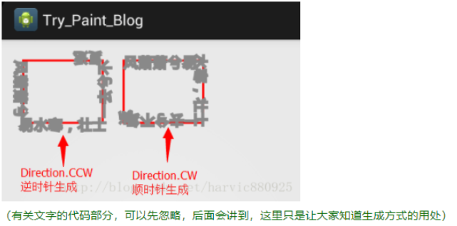

#### 2.3.3:圆角矩形

```
第一个构造函数：可以定制每个角的圆角大小：
float[] radii：必须传入8个数值，分四组，分别对应每个角所使用的椭圆的横轴半径和纵轴半径，如｛x1,y1,x2,y2,x3,y3,x4,y4｝，
其中，x1,y1对应第一个角的（左上角）用来产生圆角的椭圆的横轴半径和纵轴半径，其它类推……
第二个构造函数：只能构建统一圆角大小
float rx：所产生圆角的椭圆的横轴半径；
float ry：所产生圆角的椭圆的纵轴半径；

void addRoundRect (RectF rect, float[] radii, Path.Direction dir)
void addRoundRect (RectF rect, float rx, float ry, Path.Direction dir)

eg:
Path path = new Path();
RectF rect1 =  new RectF(50, 50, 240, 200);
path.addRoundRect(rect1, 10, 15 , Direction.CCW);

RectF rect2 =  new RectF(290, 50, 480, 200);
float radii[] ={10,15,20,25,30,35,40,45};
path.addRoundRect(rect2, radii, Direction.CCW);

canvas.drawPath(path, paint)
```

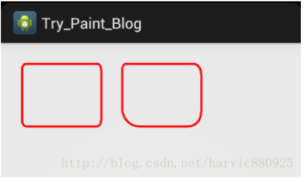

#### 2.3.4:圆形路径

```
参数说明：
float x：圆心X轴坐标 
float y：圆心Y轴坐标
float radius：圆半径

void addCircle (float x, float y, float radius, Path.Direction dir)

eg：
Path path = new Path();
path.addCircle(200, 200, 100, Direction.CCW);
canvas.drawPath(path, paint);
```

#### 2.3.4：椭圆路径

```
参数说明：
RectF oval：生成椭圆所对应的矩形
Path.Direction :生成方式，与矩形一样，分为顺时针与逆时针，意义完全相同，不再重复
void addOval (RectF oval, Path.Direction dir)
```

#### 2.3.5：弧形路径

```
参数：
RectF oval：弧是椭圆的一部分，这个参数就是生成椭圆所对应的矩形；
float startAngle：开始的角度，X轴正方向为0度
float sweepAngel：持续的度数；
void addArc (RectF oval, float startAngle, float sweepAngle)

eg:

Path path = new Path();
RectF rect = new RectF(50, 50, 240, 200);
path.addArc(rect, 0, 100);
canvas.drawPath(path, paint);//画出路径
```


#### 2.3.6:线段轨迹

```
void quadTo (float x1, float y1, float x2, float y2)
```

#### 2.3.6：贝塞尔曲线

```
二阶：
//参数不能为负数
public void quadTo(float x1, float y1, float x2, float y2)
//参数可以为负数  可以用来实现波浪线
public void rQuadTo(float dx1, float dy1, float dx2, float dy2)


三阶：
public void cubicTo(float x1, float y1, float x2, float y2,float x3, float y3)
public void rCubicTo(float x1, float y1, float x2, float y2,float x3, float y3)
```

解决问题：

1：手写板 线段绘制平滑

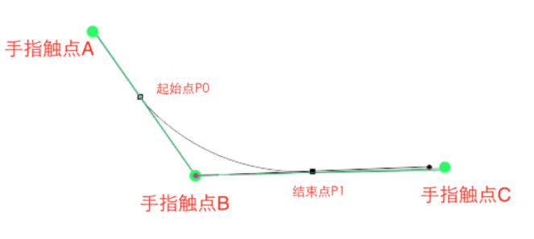


```kotlin
    val path = Path()
    // 控制点： 手指的前一个点，用来当控制点
    var prevX = 0f
    var prevY = 0f

    override fun onDraw(canvas: Canvas) {
        val paint = Paint(Paint.ANTI_ALIAS_FLAG).apply {
            strokeWidth = 2f
            style = Paint.Style.STROKE
            color = Color.RED
        }
        canvas.drawPath(path, paint)
    }

    override fun onTouchEvent(event: MotionEvent): Boolean {
        when (event.action) {
            MotionEvent.ACTION_DOWN -> {
                path.moveTo(event.x, event.y)
                prevX = event.x
                prevY = event.y
                return true
            }
            MotionEvent.ACTION_MOVE -> {
//                path.lineTo(event.x, event.y)
                // 结束点 为线段的中间位置
                val endX = (event.x + prevX) / 2
                val endY = (event.y + prevY) / 2
                path.quadTo(prevX, prevY, endX, endY)
                prevX = endX   // 下一个控制点
                prevY = endY
                postInvalidate()
            }
        }
        return super.onTouchEvent(event)
    }
```

2：拖拽效果

3：水波浪


### 2.4绘制文字

#### 2.4.1：画笔设置

##### 2.4.1.1：文字对齐

```
align.CENTER
align.RIGHT
align.LEFT
paint.setTextAlign(Align.CENTER);
```

##### 2.4.1.2：样式设置

```
设置是否为粗体
paint.setFakeBoldText(true);
设置下划线
paint.setUnderlineText(true)
设置倾斜角度
paint.setTextSkewX((float) -0.25);
设置删除线
paint.setStrikeThruText(true);
```

##### 2.4.1.3:字体样式

```
Typeface.NORMAL  //正常体
Typeface.BOLD //粗体
Typeface.ITALIC //斜体
Typeface.BOLD_ITALIC //粗斜体
paint.setTypeface(typeface);

创建指定字体
Typeface create(String familyName, int style) //直接通过指定字体名来加载系统中自带的文字样式
 Typeface create(Typeface family, int style)     //通过其它Typeface变量来构建文字样式
 Typeface createFromAsset(AssetManager mgr, String path) //通过从Asset中获取外部字体来显示字体样式
 Typeface createFromFile(String path)//直接从路径创建
 Typeface createFromFile(File path)//从外部路径来创建字体样式
 Typeface defaultFromStyle(int style)//创建默认字体
 
 eg:
 Typeface的所有函数中可知，使用系统中自带的字体有下面两种方式来构造Typeface：
 Typeface defaultFromStyle(int style)//创建默认字体
 Typeface create(String familyName, int style) //直接通过指定字体名来加载系统中自带的文字样式
 
  //使用系统自带字体绘制
    Paint paint=new Paint();
    paint.setColor(Color.RED);  //设置画笔颜色    

    paint.setStrokeWidth (5);//设置画笔宽度
    paint.setAntiAlias(true); //指定是否使用抗锯齿功能，如果使用，会使绘图速度变慢
    paint.setTextSize(60);//设置文字大小
    paint.setStyle(Paint.Style.STROKE);//绘图样式，设置为填充

    String familyName = "宋体";
    Typeface font = Typeface.create(familyName,Typeface.NORMAL);
    paint.setTypeface(font);
    canvas.drawText("欢迎光临Harvic的博客",10,100, paint);
    
 //使用自定义字体
 //自定义字体，，，迷你简罗卜
    Paint paint=new Paint();
    paint.setColor(Color.RED);  //设置画笔颜色    

    paint.setStrokeWidth (5);//设置画笔宽度
    paint.setAntiAlias(true); //指定是否使用抗锯齿功能，如果使用，会使绘图速度变慢
    paint.setTextSize(60);//设置文字大小
    paint.setStyle(Paint.Style.FILL);//绘图样式，设置为填充

    AssetManager mgr=m_context.getAssets();//得到AssetManager
    Typeface typeface=Typeface.createFromAsset(mgr, "fonts/jian_luobo.ttf");//根据路径得到Typeface
    paint.setTypeface(typeface);
    Log.v("msg",typeface.toString());
    canvas.drawText("欢迎光临Harvic的博客",10,100, paint);//两个构造函数
    
```

##### 2.4.1.4：文字基准线

```
/**
* text:要绘制的文字
* x：绘制x坐标 基准先位置
* y：绘制y坐标 基准线位置
* paint:用来做画的画笔
*/
public void drawText(String text, float x, float y, Paint paint)

文字对齐方式是以原点为基准
paint.setTextAlign(Paint.Align.CENTER)
```

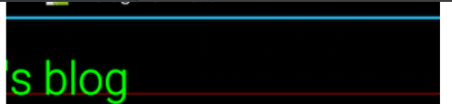

不设置：


文字四线格

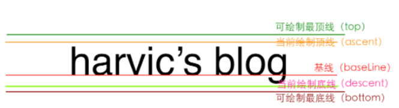

```
ascent: 系统建议的，绘制单个字符时，字符应当的最高高度所在线
descent:系统建议的，绘制单个字符时，字符应当的最低高度所在线
top: 可绘制的最高高度所在线
bottom: 可绘制的最低高度所在线
```

四线格测量:

只有绘制之后才会有

```
FontMetrics：
FontMetrics::ascent;
ascent = ascent线的y坐标 - baseline线的y坐标  负数
FontMetrics::descent;
descent = descent线的y坐标 - baseline线的y坐标；正数


```

获取FontMetrics

```
Paint paint = new Paint();
Paint.FontMetrics fm = paint.getFontMetrics();
Paint.FontMetricsInt fmInt = paint.getFontMetricsInt();
```

四线格位置：

```
ascent线Y坐标 = baseline线Y坐标 + fontMetric.ascent;
descent线Y坐标 = baseline线的y坐标 + fontMetric.descent；
top线Y坐标 = baseline线的y坐标 + fontMetric.top；
bottom线Y坐标 = baseline线的y坐标 + fontMetric.bottom；
```

字符串测量：
高度：

```
Paint.FontMetricsInt fm = paint.getFontMetricsInt();
int top = baseLineY + fm.top;
int bottom = baseLineY + fm.bottom;
//所占高度
int height = bottom - top;
```

宽度：

```
int width = paint.measureText(String text);
```


#### 2.4.2：绘制方式

##### 2.4.2.1：水平绘制

```
void drawText (String text, float x, float y, Paint paint)
void drawText (CharSequence text, int start, int end, float x, float y, Paint paint)
void drawText (String text, int start, int end, float x, float y, Paint paint)
void drawText (char[] text, int index, int count, float x, float y, Paint paint)

说明：
第一个构造函数：最普通简单的构造函数；
第三、四个构造函数：实现截取一部分字体给图；
第二个构造函数：最强大，因为传入的可以是charSequence类型字体，所以可以实现绘制带图片的扩展文字（待续），而且还能截取一部分绘制
```

##### 2.4.2.2：指定文字位置

```
void drawPosText (char[] text, int index, int count, float[] pos, Paint paint)
void drawPosText (String text, float[] pos, Paint paint)


说明：
第一个构造函数：实现截取一部分文字绘制；
参数说明：
char[] text：要绘制的文字数组
int index:：第一个要绘制的文字的索引
int count：要绘制的文字的个数，用来算最后一个文字的位置，从第一个绘制的文字开始算起
float[] pos：每个字体的位置，同样两两一组，如｛x1,y1,x2,y2,x3,y3……｝

eg：
Paint paint=new Paint();
paint.setColor(Color.RED);  //设置画笔颜色    

paint.setStrokeWidth (5);//设置画笔宽度
paint.setAntiAlias(true); //指定是否使用抗锯齿功能，如果使用，会使绘图速度变慢
paint.setTextSize(80);//设置文字大小
paint.setStyle(Paint.Style.FILL);//绘图样式，设置为填充

float []pos=new float[]{80,100,
80,200,
80,300,
80,400};
canvas.drawPosText("画图示例", pos, paint);//两个构造函数
```

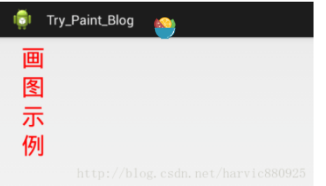

##### 2.4.2.4：沿路径绘制

```
void drawTextOnPath (String text, Path path, float hOffset, float vOffset, Paint paint)
void drawTextOnPath (char[] text, int index, int count, Path path, float hOffset, float vOffset, Paint paint)

参数说明：
有关截取部分字体绘制相关参数（index,count），没难度，就不再讲了，下面首重讲hOffset、vOffset
float hOffset  : 与路径起始点的水平偏移距离
float vOffset  : 与路径中心的垂直偏移量

eg：
Paint paint=new Paint();
paint.setColor(Color.RED);  //设置画笔颜色    

paint.setStrokeWidth (5);//设置画笔宽度
paint.setAntiAlias(true); //指定是否使用抗锯齿功能，如果使用，会使绘图速度变慢
paint.setTextSize(45);//设置文字大小
paint.setStyle(Paint.Style.STROKE);//绘图样式，设置为填充

String string="风萧萧兮易水寒，壮士一去兮不复返";

//先创建两个相同的圆形路径，并先画出两个路径原图
Path circlePath=new Path();
circlePath.addCircle(220,200, 180, Path.Direction.CCW);//逆向绘制,还记得吗,上篇讲过的
canvas.drawPath(circlePath, paint);//绘制出路径原形

Path circlePath2=new Path();
circlePath2.addCircle(750,200, 180, Path.Direction.CCW);
canvas.drawPath(circlePath2, paint);//绘制出路径原形

paint.setColor(Color.GREEN);
//hoffset、voffset参数值全部设为0，看原始状态是怎样的
canvas.drawTextOnPath(string, circlePath, 0, 0, paint);
//第二个路径，改变hoffset、voffset参数值
canvas.drawTextOnPath(string, circlePath2, 80, 30, paint);
```

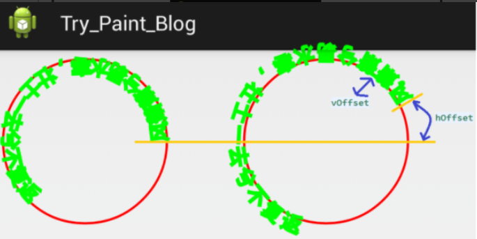


## 3:绘制区域Region

创建区域：

```
 public Region()  //创建一个空的区域  
 public Region(Region region) //拷贝一个region的范围  
 public Region(Rect r)  //创建一个矩形的区域  
 public Region(int left, int top, int right, int bottom) //创建一个矩形的区域
```

设置：

```
 只要设置就会覆盖
 public void setEmpty()  //置空
 public boolean set(Region region)   
 public boolean set(Rect r)   
 public boolean set(int left, int top, int right, int bottom)   
 public boolean setPath(Path path, Region clip)
```

绘制区域：

```
private void drawRegion(Canvas canvas,Region rgn,Paint paint)
{
    RegionIterator iter = new RegionIterator(rgn);
    Rect r = new Rect();

    while (iter.next(r)) {
      canvas.drawRect(r, paint);
    } 
}
```

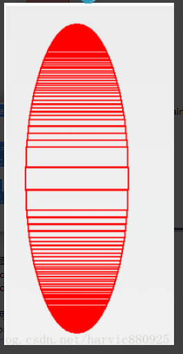

交集:

```
//构造两个Region
Region region = new Region(rect1);
Region region2= new Region(rect2);

//取两个区域的交集
region.op(region2, Op.INTERSECT);
```

```
假设用region1  去组合region2   
public enum Op {  
    DIFFERENCE(0), //最终区域为region1 与 region2不同的区域  
    INTERSECT(1), // 最终区域为region1 与 region2相交的区域  
    UNION(2),      //最终区域为region1 与 region2组合一起的区域  
    XOR(3),        //最终区域为region1 与 region2相交之外的区域  
    REVERSE_DIFFERENCE(4), //最终区域为region2 与 region1不同的区域  
    REPLACE(5); //最终区域为为region2的区域  
 } 
```

## 4:画布变换

平移： canvas.translate(100, 100); 

旋转： canvas.rotate(30); 

缩放： canvas.scale 

错切： void skew (float sx, float sy)
参数说明：
float sx:将画布在x方向上倾斜相应的角度，sx倾斜角度的tan值，
float sy:将画布在y轴方向上倾斜相应的角度，sy为倾斜角度的tan值 

## 5：画布裁剪

```
boolean clipPath(Path path)
boolean clipPath(Path path, Region.Op op)
boolean clipRect(Rect rect, Region.Op op)
boolean clipRect(RectF rect, Region.Op op)
boolean clipRect(int left, int top, int right, int bottom)
boolean clipRect(float left, float top, float right, float bottom)
boolean clipRect(RectF rect)
boolean clipRect(float left, float top, float right, float bottom, Region.Op op)
boolean clipRect(Rect rect)
boolean clipRegion(Region region)
boolean clipRegion(Region region, Region.Op op)
```

## 6：画布保存于恢复

```
Save（）：
每次调用Save（）函数，都会把当前的画布的状态进行保存，然后放入特定的栈中；
```

```
restore（）：
每当调用Restore（）函数，就会把栈中最顶层的画布状态取出来，并按照这个状态恢复当前的画布，并在这个画布上做画。
```

## 7：BitmapShader

```
bitmapShader = new BitmapShader(pgBitmap, Shader.TileMode.CLAMP, Shader.TileMode.CLAMP);
pgPaint.setShader(bitmapShader);

三个参数：bitmap 指的是要作为纹理的图片，tileX 指的是在ｘ方向纹理的绘制模式，tileY 指的是Ｙ方向上的绘制模式。

CLAMP 拉伸:横向的最后一个横行像素，不断的重复，纵项的那一列像素，不断的重复；
REPEAT 重复:就是横向、纵向不断重复这个bitmap
MIRROR 镜像:横向不断翻转重复，纵向不断翻转重复；
```

## 8： PorterDuffXfermode 

```
PorterDuff.Mode.SRC_ATOP
。。。
。。。
```

