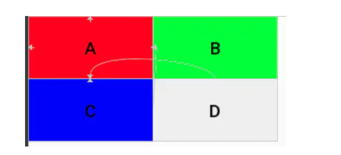
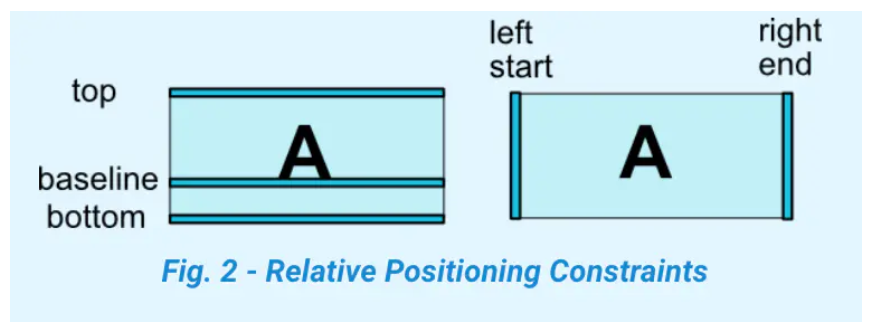
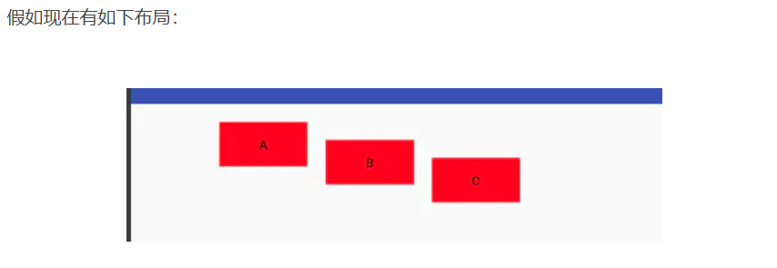

# 布局：

# 1：定位

layout_constraintLeft_toLeftOf

layout_constraintLeft_toRightOf

layout_constraintRight_toLeftOf

layout_constraintRight_toRightOf

layout_constraintTop_toTopOf

layout_constraintTop_toBottomOf

layout_constraintBottom_toTopOf

layout_constraintBottom_toBottomOf

layout_constraintBaseline_toBaselineOf

layout_constraintStart_toEndOf

layout_constraintStart_toStartOf

layout_constraintEnd_toStartOf

layout_constraintEnd_toEndOf

eg：

```xml
<android.support.constraint.ConstraintLayout 
    ...>

    <Button
        android:id="@+id/a"
         ....
        app:layout_constraintLeft_toLeftOf="parent"
        app:layout_constraintTop_toTopOf="parent"
        android:text="A" />

    <Button
        android:id="@+id/b"
        ....
        app:layout_constraintLeft_toRightOf="@id/a"
        app:layout_constraintTop_toTopOf="@id/a"
        android:text="B" />

    <Button
        android:id="@+id/c"
         ....
        app:layout_constraintLeft_toLeftOf="@id/a"
        app:layout_constraintTop_toBottomOf="@id/a"
        android:text="C" />

    <Button
        android:id="@+id/d"
         ....
        app:layout_constraintLeft_toRightOf="@id/a"
        app:layout_constraintTop_toTopOf="@id/c"
        android:text="D" />
</android.support.constraint.ConstraintLayout>
```



官方给的边界定义：




# 2：margin

 设置margin还是继续用以前的属性`layout_margin*` 。
不过需要注意，要使margin生效，必须具有对应方向的`layout_constraint*`，否则margin不生效 


# 3:view gone





```xml
<?xml version="1.0" encoding="utf-8"?>
<android.support.constraint.ConstraintLayout 
    ...>

    <Button
        android:id="@+id/a"
        ...
        android:layout_marginLeft="100dp"
        android:layout_marginTop="20dp"
        app:layout_constraintLeft_toLeftOf="parent"
        app:layout_constraintTop_toTopOf="parent" />

    <Button
        android:id="@+id/b"
        ...
        android:layout_marginLeft="20dp"
        android:layout_marginTop="20dp"
        app:layout_constraintLeft_toRightOf="@id/a"
        app:layout_constraintTop_toTopOf="@id/a"
         />

    <Button
        android:id="@+id/c"
       ....
        android:layout_marginLeft="20dp"
        android:layout_marginTop="20dp"
        app:layout_constraintLeft_toRightOf="@id/b"
        app:layout_constraintTop_toTopOf="@id/b" />
</android.support.constraint.ConstraintLayout>
```


可以看出，b设为gone之后，他的宽、高、margin都失效了，变为一个点了，但它的constrain还生效，位于指定的位置。c还是可以继续以他为锚点。

1. 如果可以，尽量使用invisible
2. 尽量其他view的布局不依赖会gone的view
3. google也提供了属性`layout_goneMargin*="xdp"`，意思是比如当constrainleft的锚点gone时，layout_goneMarginLeft将生效。但因为这个只能设置固定的距离，个人感觉灵活性不是很高。


# 4:居中及bias


一个view如何设置为居中呢？如果查找属性，会发现并没有如RelativeLayout类似的layout_centerVertical属性，那如何设置居中呢？constraint的思想很巧妙。
 根据第一节的知识，大家知道如果设置`app:layout_constraintLeft_toLeftOf="parent"`,则view会贴着父view的左边，设置`app:layout_constraintRight_toRightOf="parent"` 则会贴着右边，那如果两个都设置，效果会怎样呢？


如图，两个都设置，view则会居中。


- layout_constraintHorizontal_bias
- layout_constraintVertical_bias

bias即偏移量,他们的取值范围从0~1，0即挨着左边，1是挨着右边，所以要使处于1/3处，可以设置如下属性`app:layout_constraintHorizontal_bias="0.33"`,效果图如下：


# 5:view的尺寸

设置view的大小除了传统的wrap_content、指定尺寸、match_parent(虽然官方不推荐使用match_parent)外，还可以设置为0dp（官方取名叫MATCH_CONSTRAINT），0dp在constraint可不是指大小是0dp，而是有特殊含义的。他的作用会随着不同的设置有不同的含义：

## 1: layout_constraintWidth_default 权重显示（类似权重+约束布局）

layout_constraintWidth_default有三个取值，作用如下：

==spread==，默认值，意思是占用所有的符合约束的空间 


```xml
<?xml version="1.0" encoding="utf-8"?>
<android.support.constraint.ConstraintLayout 
  ...>

    <Button
        android:id="@+id/a"
        android:layout_width="0dp"
        ...
        android:layout_marginLeft="20dp"
        android:layout_marginRight="20dp"
        app:layout_constraintRight_toRightOf="parent"
        app:layout_constraintLeft_toLeftOf="parent"/>

</android.support.constraint.ConstraintLayout>
```


 可以看到layout_width为0dp，实际的效果则是宽度和约束一样，左右两边的留白是margin的效果。 


 ==percent==，意思是按照父布局的百分比设置,需要`layout_constraintWidth_percent`设置百分比例 


```xml
<?xml version="1.0" encoding="utf-8"?>
<android.support.constraint.ConstraintLayout >

    <android.support.constraint.ConstraintLayout
        android:layout_width="300dp"
        android:layout_height="400dp"
        app:layout_constraintHorizontal_bias="0.3"
        >

        <Button
            android:id="@+id/a"
            android:layout_width="0dp"
            ...
            app:layout_constraintRight_toRightOf="parent"
            app:layout_constraintWidth_default="percent"
            app:layout_constraintWidth_percent="0.4" />
    </android.support.constraint.ConstraintLayout>

</android.support.constraint.ConstraintLayout>
```

A的宽度设为0.4，则其宽度为父布局的0.4倍。另外，设置了==layout_constraintWidth_percent==属性，可以不用指定==layout_constraintWidth_default==，他会自动设置为percent

 ==wrap==  意思匹配内容大小但不超过约束限制，注意和直接指定宽度为wrap_content的区别就是**不超过约束限制**，如下： 


```xml
<?xml version="1.0" encoding="utf-8"?>
<android.support.constraint.ConstraintLayout 
    ...>


    <Button
        android:id="@+id/a"
        ...
        app:layout_constraintLeft_toLeftOf="parent" />
    <Button
        android:id="@+id/c"
        ...
        app:layout_constraintRight_toRightOf="parent" />

    <Button
        android:id="@+id/b"
        android:layout_width="0dp"
         ...
        app:layout_constraintWidth_default="wrap"
        app:layout_constraintLeft_toRightOf="@id/a"
        app:layout_constraintRight_toLeftOf="@id/c"/>

    <Button
        android:id="@+id/d"
        android:layout_width="wrap_content"
        ...
        app:layout_constraintTop_toBottomOf="@id/b"
        app:layout_constraintLeft_toRightOf="@id/a"
        app:layout_constraintRight_toLeftOf="@id/c"/>

</android.support.constraint.ConstraintLayout>
```


可以看到虽然文字很长，但第一行的绿色button宽度达到约束时，就不在增加，而第二行的button显示了完整的内容，超过约束的限制。
 在1.1上 对于wrap_content会超过约束限制，谷歌又新增了如下属性

- app:layout_constrainedWidth=”true|false”
- app:layout_constrainedHeight=”true|false”

设置为true也可以限制内容不超过约束(这样感觉layout_constraintWidth_default这个属性已经没什么用了)

##  2: ratio  设置宽高比例

1. `layout_constraintDimensionRatio`，即宽和高成一定的比例，其值可以是"width:height"的形式，也可以是width/height的值。该属性生效的前提：宽和高其中有一项为0dp，有constraint。下面按照有几个0dp来分别介绍下：

- 如果只有一项为0dp，则该项值按照比例计算出来。比如高为20dp，宽为0dp，radio为"2:1",则最终宽为40dp
- 如果两项都为0dp，则尺寸会设置为满足约束的最大值并保持比例。因为这是系统计算的，有的时候不是我们想要的，我们也可以通过在前面加H、W来指定是哪一个边需要计算。例如"H,2:1",则是指宽度匹配约束，高度是宽度的1/2

## 3: max min  约束布局最大最小宽高

layout_constraintWidth_min

layout_constraintWidth_max

layout_constraintHeight_max

layout_constraintHeight_min

## 4: wieight

# 6:链

 如图，在一个水平或者竖直方向上，一排view两两互相约束，即为链 


 链的第一个元素称为链头，可以通过设置==`layout_constraintHorizontal_chainStyle`==来控制链的分布形式 

- ==spread==
  默认模式,分布样式如上图
- ==spread_inside==
  如图，和spread的区别是没算两端的约束


- ==packed==
  所有元素挤在中间,也可以配合使用bias来改变位置偏移


可以看出，链与LinearLayout效果大致一样。和LinearLayout一样，链也可以使用==`layout_constraintHorizontal_weight`，==来分割剩余空间。但又和android:layout_weight不太一样，不一样的地方如下：

- layout_weight ，不管当前view的大小设的是多大，都会继续占据剩余空间

- layout_constraintHorizontal_weight，这个只对0dp并且layout_constraintWidth_default为spread的view生效，使其大小按比例分割剩余空间，对于已经设定大小的view不生效

  

```xml
<?xml version="1.0" encoding="utf-8"?>
<LinearLayout 
    ...>

    <LinearLayout
        ...
        android:orientation="horizontal">
        <Button
            android:layout_width="10dp"
            android:layout_height="50dp"
            android:layout_weight="1"
            ... />
        <Button
            android:layout_width="wrap_content"
            android:layout_height="50dp"
            android:layout_weight="1"
            ... />
        <Button
            android:layout_width="0dp"
            android:layout_height="50dp"
            android:layout_weight="1"
            ... />
    </LinearLayout>

    <android.support.constraint.ConstraintLayout
        ....>

        <Button
            android:id="@+id/a"
            android:layout_width="10dp"
            android:layout_height="50dp"
            ....
            app:layout_constraintHorizontal_weight="1"
            app:layout_constraintLeft_toLeftOf="parent"
            app:layout_constraintRight_toLeftOf="@id/b" />
        <Button
            android:id="@+id/b"
            android:layout_width="wrap_content"
            android:layout_height="50dp"
            ....
            app:layout_constraintHorizontal_weight="1"
            app:layout_constraintLeft_toRightOf="@id/a"
            app:layout_constraintRight_toLeftOf="@id/c" />

        <Button
            android:id="@+id/c"
            android:layout_width="0dp"
            android:layout_height="50dp"
            ...
            app:layout_constraintHorizontal_weight="1"
            app:layout_constraintLeft_toRightOf="@id/b"
            app:layout_constraintRight_toRightOf="parent" />

        />
    </android.support.constraint.ConstraintLayout>

</LinearLayout>
```

 可以看出，LinearLayout和ConstraintLayout虽然三个子view的layout_width值是一样的，weight也都设置了1，但效果完全不一样 

# 7:圆形布局


ConstraintLayout还提供了一种比较炫酷的圆形布局，这是以往的布局所做不到的。涉及到的属性也很简单，就下面三个：

- ==layout_constraintCircle== : 圆心，值是某个view的id 也就是指定相对于某个view的
- ==layout_constraintCircleRadius== : 半径
- ==layout_constraintCircleAngle==：角度，值是从0-360，0是指整上方


```xml
<?xml version="1.0" encoding="utf-8"?>
<android.support.constraint.ConstraintLayout xmlns:android="http://schemas.android.com/apk/res/android"
   ...>

   <Button
       android:id="@+id/a"
       ...
       />

   <Button
       android:id="@+id/b"
       ...
       app:layout_constraintCircle="@id/a"
       app:layout_constraintCircleAngle="300"
       app:layout_constraintCircleRadius="100dp" />

   <Button
       android:id="@+id/c"
       ...
       app:layout_constraintCircle="@id/a"
       app:layout_constraintCircleAngle="45"
       app:layout_constraintCircleRadius="200dp" />
   />
</android.support.constraint.ConstraintLayout>
```

# 8：辅助组件

## 1: ==GuideLine==

 即参考线的意思，有水平参考线和竖直参考线两种。他的作用就像是一个虚拟的参考线，只是用来方便其他View以他为锚点来布局。如上一篇所了解到的，==ConstraintLayout 的定位原则就是一个View参考其他View的相对布局==，如果有的时候当前布局没有合适的参考View，而建一个专门用于定位的View又会太重，这种情况正是GuideLine的用武之地。


```xml
<?xml version="1.0" encoding="utf-8"?>
<android.support.constraint.ConstraintLayout 
    ...>

    <android.support.constraint.Guideline
        android:id="@+id/guideline"
        ...
        android:orientation="vertical"
        app:layout_constraintGuide_percent="0.33" />

    <android.support.constraint.Guideline
        android:id="@+id/guideline2"
        ...
        android:orientation="horizontal"
        app:layout_constraintGuide_begin="130dp" />

    <Button
        ...
        app:layout_constraintLeft_toLeftOf="@id/guideline"
        app:layout_constraintTop_toTopOf="@id/guideline2" />


</android.support.constraint.ConstraintLayout>
```


可以看到我分别添加了一个水平参考线和竖直参考线，之后的Button的布局就参考与这两个参考线，而在布局中并不会显示。
 `Guideline`的大部分的属性如layout_width都是不会生效的，而他的位置的确定是由下面三个属性之一来确定的：

- ==orientation== 决定方向 horizontal vertical

- ==layout_constraintGuide_begin==：距离父布局的左边或者上边多大距离
- ==layout_constraintGuide_end==:距离父布局的右边或者下边多大距离
- ==layout_constraintGuide_percent==：百分比，0~1，距离父布局的左边或者上边占父布局的比例

## 2: ==Group==

 Group是一个可以同时控制多个view 可见性的虚拟View。 

```xml
<?xml version="1.0" encoding="utf-8"?>
<android.support.constraint.ConstraintLayout 
  ...>

    <android.support.constraint.Group
       ...
        android:visibility="invisible"
        app:constraint_referenced_ids="a,c" />

    <android.support.constraint.Group
        ...
        android:visibility="visible"
        app:constraint_referenced_ids="b,d" />

    <Button
        android:id="@+id/a"
        ... />

    <Button
        android:id="@+id/b"
        ... />

    <Button
        android:id="@+id/c"
       ... />

    <Button
        android:id="@+id/d"
        .../>
</android.support.constraint.ConstraintLayout>
```

可以看到，第一个Group通过`app:constraint_referenced_ids`指定了a、c两个控件，这样当该Group可见性为invisible时，a、c的可见性都会变为invisible，为gone则都为gone。所以Group很适合处理有网无网之类的场景，不再需要像之前那样一个一个view控制可见性，通过Group就可以统一处理了。
 Group有一些注意事项：

- xml中，可见性配置的优先级：Group优先于View，下层Group优先于上层。
- Group只可以引用当前ConstraintLayout下的View，子Layout 下的View不可以。
-  ==`app:constraint_referenced_ids`里直接写的是id的字符串，初始化后会通过`getIdentifier`来反射查找叫该名字的id。所以如果你的项目用了类似AndResGuard的混淆id名字的功能，切记不要混淆`app:constraint_referenced_ids`里的id，否则在release版本就会因找不到该id而失效。或者也可以通过代码`setReferencedIds`来设置id==

## 3: ==Placeholder==

 占位布局。他自己本身不会绘制任何内容，但他可以通过设置`app:content="id"`，将id View的内容绘制到自己的位置上，而原id的 View就像gone了一样。
如下： 

```xml
<?xml version="1.0" encoding="utf-8"?>
<android.support.constraint.ConstraintLayout 
...>
    <Button
        android:id="@+id/a"
        android:layout_width="50dp"
        android:layout_height="50dp"
        android:layout_marginLeft="30dp"
       ...
        app:layout_constraintLeft_toLeftOf="parent"
        app:layout_constraintTop_toTopOf="parent" />

    <Button
        android:id="@+id/b"
        android:layout_width="50dp"
        android:layout_height="50dp"
        android:layout_marginLeft="20dp"
        ...
        app:layout_constraintLeft_toRightOf="@+id/a"
        app:layout_constraintTop_toTopOf="@+id/a" />

    <android.support.constraint.Placeholder
        android:id="@+id/place"
        android:layout_width="200dp"
        android:layout_height="200dp"
        app:content="@+id/a"
        app:layout_constraintBottom_toBottomOf="parent"
        app:layout_constraintLeft_toLeftOf="parent"/>

    <Button
        ...
        app:layout_constraintBottom_toBottomOf="@+id/place"
        app:layout_constraintLeft_toRightOf="@+id/place" />
</android.support.constraint.ConstraintLayout>
```


可以看到，原本B是位于A的右边并且顶部对齐的，但因为A被Placeholder引用，使A 相当于Gone了。而Placeholder的位置则显示了A的内容，并且大小也和A相符，Placeholder的大小设置并没有生效。
 大概总结可以认为，Placeholder引用A后的效果是，原本位置的A gone，原本位置的Placeholder变为Placeholder的约束属性+A的内容属性。另外，Placeholder也支持使用代码`setContentId`动态的修改设置内容。

关于Placeholder的应用场景，网上其他人也都列出了一些例子：

比如可以作为位置模板，引入后只需要写内容view；使用代码动态改变内容，结合TransitionManager可以做一些有趣的过度动画等。

## 4:  ==Barrier==


 如上图布局，两个TextView，一个button位于他们的右边。现在button设置的是在下面TextView的右边。假设有时候上面的TextView文本变长了，则布局会变为下面这个样子： 


上面的TextView和Button重叠了。这时该怎么解决这个问题呢？Button只能设置一个View作为锚点，设置了上面就顾不了下面了。。。
 所以就诞生了Barrier，他可以设置N个View作为锚点，使用方式如下：

```xml
<android.support.constraint.Barrier
              android:id="@+id/barrier"
              android:layout_width="wrap_content"
              android:layout_height="wrap_content"
              app:barrierDirection="end"//end,left,right,top,bottom
              app:constraint_referenced_ids="text1,text2" />
```

 则Barrier始终位于text1,text2两个View最大宽度的右边，示意图如下： 


 这里基本的用法就讲完了。
下面再考虑一个情况，假如有如下的布局： 


```xml
<?xml version="1.0" encoding="utf-8"?>
<android.support.constraint.ConstraintLayout 
  ...>

    <Button
        android:id="@+id/a"
        ...
        android:layout_marginTop="20dp"
         />

    <Button
        android:id="@+id/b"
        ...
        android:layout_marginTop="40dp"
         />

    <android.support.constraint.Barrier
        android:id="@+id/barrier"
        ...
        app:barrierDirection="top"
        app:constraint_referenced_ids="a,b" />

    <Button
        android:id="@+id/c"
        ...
        app:layout_constraintTop_toTopOf="@+id/barrier" />
</android.support.constraint.ConstraintLayout>
```


 目前Button C和Button a、b的最上值对齐，没有问题。但如果a Gone了呢？效果如下： 


其实也是符合逻辑，a gone后，会变为一个点，所以C顶齐父布局也没问题。但有的时候这不符合我们的需求，我们希望Barrier不要关注Gone的View了，所以谷歌提供了属性`barrierAllowsGoneWidgets`,设为false后，就不在关注Gone的View了，效果如下：


