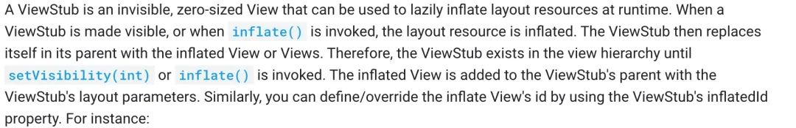

**通过这篇文章你将学习到以下内容，将在文末会给出相应的答案**

- View 中的 INVISIBLE、VISIBLE、GONE 都有什么作用？
- 为什么 ViewStub 是大小为0的视图
- ViewStub 有什么作用？
- ViewStub 是如何创建的？
- 为什么 ViewStub 能做到延迟加载？
- ViewStub 指定的 Layout 布局文件是什么时候被加载的？
- LayoutInflater 是一个抽象类它如何被创建的？
- 系统服务存储在哪里？如何获取和添加系统服务？

在上一篇文章 [Android 资源加载源码分析一](https://mp.weixin.qq.com/s?__biz=MzAwNDgwMzU4Mw==&mid=2247484975&idx=1&sn=6308627df23ffcbc38323cd38b99b220&scene=21#wechat_redirect) 中通过 `LayoutInflater.inflate` 方法解析 XML 文件，了解到了系统如何对 merge、include 标签是如何处理的，本文主要围绕以下两方面内容

- 系统对 ViewStub 如何处理？
- LayoutInflater 是如何被创建的？

**系统对 merge、include 是如何处理的**

- 使用 merge 标签必须有父布局，且依赖于父布局加载
- merge 并不是一个 ViewGroup，也不是一个 View，它相当于声明了一些视图，等待被添加，解析过程中遇到 merge 标签会将 merge 标签下面的所有子 view 添加到根布局中
- merge 标签在 XML 中必须是根元素
- 相反的 include 不能作为根元素，需要放在一个 ViewGroup 中
- 使用 include 标签必须指定有效的 layout 属性
- 使用 include 标签不写宽高是没有关系的，会去解析被 include 的 layout

**merge 标签为什么可以起到优化布局的效果？**

解析过程中遇到 merge 标签，会调用 `rInflate()` 方法，部分代码如下

```
// 根据元素名解析，生成对应的view
final View view = createViewFromTag(parent, name, context, attrs);
final ViewGroup viewGroup = (ViewGroup) parent;
final ViewGroup.LayoutParams params = viewGroup.generateLayoutParams(attrs);
// rInflateChildren方法内部调用的rInflate方法，深度优先遍历解析所有的子view
rInflateChildren(parser, view, attrs, true);
// 添加解析的view
viewGroup.addView(view, params);
```

解析 merge 标签下面的所有子 view，然后添加到根布局中
更多信息查看 [Android 资源加载源码分析一](https://mp.weixin.qq.com/s?__biz=MzAwNDgwMzU4Mw==&mid=2247484975&idx=1&sn=6308627df23ffcbc38323cd38b99b220&scene=21#wechat_redirect)，接下来看一下系统对 ViewStub 如何处理


## 1. ViewStub是什么

**关于 ViewStub 的介绍，可以点击下方官网链接查看** 
*https://developer.android.google.cn/reference/android/view/ViewStub*

**ViewStub 的继承结构**



**简单来说主要以下几点：**

- ViewStub 控件是一个不可见，
- 大小为 0 的视图
- 当 ViewStub 控件设置可见，或者调用 `inflate()` 方法，ViewStub 所指定的 layout 资源就会被加载
- ViewStub 也会从其父控件中移除，ViewStub 会被新加载的 layout 文件代替

**为什么 ViewStub 是大小为 0 的视图** 
*frameworks/base/core/java/android/view/ViewStub.java*

```
protected void onMeasure(int widthMeasureSpec, int heightMeasureSpec) {
    // 设置视图大小为0
    setMeasuredDimension(0, 0);
}
```

**ViewStub 的作用**

主要用来延迟布局的加载，例如：在 Android 中非常常见的布局，用 ListView 来展示列表信息，当没有数据或者网络加载失败时, 加载空的  ListView 会占用一些资源，如果用 ViewStub 包裹 ListView，当有数据时，才会调用 `inflate()` 方法显示 ListView，起到延迟加载了布局效果

### 1.1 ViewStub 是如何被创建的

在上篇文章 [Android 资源加载源码分析一](https://mp.weixin.qq.com/s?__biz=MzAwNDgwMzU4Mw==&mid=2247484975&idx=1&sn=6308627df23ffcbc38323cd38b99b220&scene=21#wechat_redirect) 中，介绍了 View 的创建是通过调用了 LayoutInflater 的 `createView()` 方法根据完整的类的路径名利用反射机制构建 View 对象，因为 ViewStub 是继承 View，所以 ViewStub 的创建和 View 的创建是相同的，来看一下 LayoutInflater 的 `createView()` 方法 
*frameworks/base/core/java/android/view/LayoutInflater.java*

```
...

try {
    // 利用构造函数，创建View
    final View view = constructor.newInstance(args);
    if (view instanceof ViewStub) {
        // 如果是ViewStub，则设置LayoutInflater
        final ViewStub viewStub = (ViewStub) view;
        viewStub.setLayoutInflater(cloneInContext((Context) args[0]));
    }
    return view;
} finally {
    mConstructorArgs[0] = lastContext;
}

...
```

根据完整的类的路径名利用反射机制构建 View 对象，如果遇到 ViewStub 将当前 LayoutInflater 设置给 ViewStub，当 ViewStub 控件设置可见，或者调用 `inflate()`，会调用 LayoutInflater 的 `inflate()`方法完成布局加载，接下来分析 ViewStub 的构造方法

### 1.2 ViewStub 的构造方法

在上面提到了根据完整的类的路径名利用反射机制构建 View 对象，当 View 对象被创建的时候，会调用它的构造函数，来看一下 ViewStub 的构造方法

```
public ViewStub(Context context, AttributeSet attrs, int defStyleAttr, int defStyleRes) {
    super(context);

    final TypedArray a = context.obtainStyledAttributes(attrs,
            R.styleable.ViewStub, defStyleAttr, defStyleRes);
    saveAttributeDataForStyleable(context, R.styleable.ViewStub, attrs, a, defStyleAttr,
            defStyleRes);
    // 解析xml中设置的 android:inflatedId 的属性
    mInflatedId = a.getResourceId(R.styleable.ViewStub_inflatedId, NO_ID);
    // 解析xml中设置的 android:layout 属性
    mLayoutResource = a.getResourceId(R.styleable.ViewStub_layout, 0);
    // 解析xml中设置的 android:id 属性
    mID = a.getResourceId(R.styleable.ViewStub_id, NO_ID);
    a.recycle();
    // view不可见
    setVisibility(GONE);
    // 不会调用 onDraw 方法绘制内容
    setWillNotDraw(true);
}
```

1. 获取 `android:inflatedId` 、 `android:layout` 、 `android:id` 的值
2. 调用 `setVisibility()` 方法，设置 View 不可见
3. 调用 `setWillNotDraw()` 方法，不会调用 `onDraw()` 方法绘制内容

在上面提到了如果想要加载 ViewStub 所指定的 layout 资源，需要设置 ViewStub 控件设置可见，或者调用 `inflate()` 方法，来看一下 ViewStub 的 `setVisibility()`方法

### 1.3 ViewStub 的 setVisibility 方法

`setVisibility(int visibility)` 方法，参数 visibility 对应三个值分别是 INVISIBLE、VISIBLE、GONE

- VISIBLE：视图可见
- INVISIBLE：视图不可见的，它仍然占用布局的空间
- GONE：视图不可见，它不占用布局的空间

接下里查看一下 ViewStub 的 `setVisibility()` 方法 
*frameworks/base/core/java/android/view/ViewStub.java*

```
@Override
public void setVisibility(int visibility) {
    if (mInflatedViewRef != null) {
        // mInflatedViewRef 是 WeakReference的实例，调用inflate方法时候初始化
        View view = mInflatedViewRef.get();
        if (view != null) {
            // 设置View可见
            view.setVisibility(visibility);
        } else {
            throw new IllegalStateException("setVisibility called on un-referenced view");
        }
    } else {
        super.setVisibility(visibility);
        // 当View为空且设置视图可见(VISIBLE、INVISIBLE)，调用inflate方法
        if (visibility == VISIBLE || visibility == INVISIBLE) {
            inflate();
        }
    }
}
```

1. mInflatedViewRef 是 WeakReference 的实例，调用 inflate 方法时候初始化
2. 从 mInflatedViewRef 缓存中获取 View，并且设置 View 可见
3. 当 View 为空且设置视图可见(VISIBLE、INVISIBLE)，会调用 `inflate()` 方法

### 1.4 ViewStub.inflate 方法

调用了 ViewStub 的 `setVisibility()` 方法，最后都会调用 `ViewStub.inflate()` 方法，来查看一下 
*frameworks/base/core/java/android/view/ViewStub.java*

```
public View inflate() {
    final ViewParent viewParent = getParent();

    if (viewParent != null && viewParent instanceof ViewGroup) {
        if (mLayoutResource != 0) {
            final ViewGroup parent = (ViewGroup) viewParent;
            // 解析布局视图
            // 返回的view是android:layout指定的布局文件最顶层的view
            final View view = inflateViewNoAdd(parent);
            
            // 移除ViewStub
            // 添加view到被移除的ViewStub的位置
            replaceSelfWithView(view, parent);

            // 添加view到 mInflatedViewRef 中
            mInflatedViewRef = new WeakReference<>(view);
            if (mInflateListener != null) {
                // 加载完成之后，回调onInflate 方法
                mInflateListener.onInflate(this, view);
            }

            return view;
        } else {
            // 需要在xml中设置android:layout，不是layout，否则会抛出异常
            throw new IllegalArgumentException("ViewStub must have a valid layoutResource");
        }
    } else {
        // ViewStub不能作为根布局，它需要放在ViewGroup中, 否则会抛出异常
        throw new IllegalStateException("ViewStub must have a non-null ViewGroup viewParent");
    }
}
```

1. 调用 `inflateViewNoAdd()` 方法返回 `android:layout` 指定的布局文件最顶层的 View
2. 调用 `replaceSelfWithView()`方法, 移除 ViewStub, 添加 View 到被移除的 ViewStub 的位置
3. 添加 View 到 mInflatedViewRef 中
4. 加载完成之后，回调 onInflate 方法

**需要注意以下两点：**

- 使用 ViewStub 需要在 XML 中设置 `android:layout`，不是 layout，否则会抛出异常
- ViewStub 不能作为根布局，它需要放在 ViewGroup 中, 否则会抛出异常

来查看一下 `inflateViewNoAdd()` 方法和 `replaceSelfWithView()` 方法

### 1.5 ViewStub.inflateViewNoAdd 方法

调用 `inflateViewNoAdd()` 方法返回 `android:layout` 指定的布局文件最顶层的 View 
*frameworks/base/core/java/android/view/ViewStub.java*

```
private View inflateViewNoAdd(ViewGroup parent) {
    final LayoutInflater factory;

    // mInflater 是View被创建的时候，如果是ViewStub, 将LayoutInflater赋值给mInflater
    if (mInflater != null) {
        factory = mInflater;
    } else {
        // 如果mInflater为空，则创建LayoutInflater
        factory = LayoutInflater.from(mContext);
    }

    // 从指定的 mLayoutResource 资源中解析布局视图
    // mLayoutResource 是在xml设置的 Android:layout 指定的布局文件
    final View view = factory.inflate(mLayoutResource, parent, false);

    // mInflatedId 是在xml设置的 inflateId
    if (mInflatedId != NO_ID) {
        // 将id复制给view
        view.setId(mInflatedId);
        //注意：如果指定了mInflatedId , 被inflate的layoutView的id就是mInflatedId
    }
    return view;
}
```

- mInflater 是 View 被创建的时候，如果是 ViewStub, 将 LayoutInflater 赋值给 mInflater
- 如果 mInflater 为空则通过 `LayoutInflater.from(mContext)` 构建 LayoutInflater
- 调用 LayoutInflater 的 inflate 方法解析布局视图
- 将 mInflatedId 设置 View

### 1.6 ViewStub.replaceSelfWithView 方法

调用 replaceSelfWithView 方法, 移除 ViewStub, 添加 View 到被移除的 ViewStub 的位置 
*frameworks/base/core/java/android/view/ViewStub.java*

```
private void replaceSelfWithView(View view, ViewGroup parent) {
    // 获取ViewStub在视图中的位置
    final int index = parent.indexOfChild(this);
    // 移除ViewStub
    // 注意：调用removeViewInLayout方法之后，调用findViewById()是找不到该ViewStub对象
    parent.removeViewInLayout(this);

    final ViewGroup.LayoutParams layoutParams = getLayoutParams();
    // 将xml中指定的 android:layout 布局文件中最顶层的View，添加到被移除的 ViewStub的位置
    if (layoutParams != null) {
        parent.addView(view, index, layoutParams);
    } else {
        parent.addView(view, index);
    }
}
```

1. 获取 ViewStub 在视图中的位置，然后移除 ViewStub
2. 添加 android:layout 布局文件中最顶层的 View 到被移除的  ViewStub 的位置

### 1.7 ViewStub 的注意事项

- 使用 ViewStub 需要在 XML 中设置 `android:layout`，不是 layout，否则会抛出异常

```
throw new IllegalArgumentException("ViewStub must have a valid layoutResource");
```

- ViewStub 不能作为根布局，它需要放在 ViewGroup 中, 否则会抛出异常

```
throw new IllegalStateException("ViewStub must have a non-null ViewGroup viewParent");
```

- 一旦调用 `setVisibility(View.VISIBLE)` 或者 `inflate()` 方法之后，该 ViewStub 将会从试图中被移除（此时调用  `findViewById()` 是找不到该 ViewStub 对象).

```
// 获取ViewStub在视图中的位置
final int index = parent.indexOfChild(this);
// 移除ViewStub
// 注意：调用removeViewInLayout方法之后，调用findViewById()是找不到该ViewStub对象
parent.removeViewInLayout(this);
```

- 如果指定了 mInflatedId , 被 inflate 的 layoutView 的 id 就是 mInflatedId

```
// mInflatedId 是在xml设置的 inflateId
if (mInflatedId != NO_ID) {
    // 将id复制给view
    view.setId(mInflatedId);
    //注意：如果指定了mInflatedId , 被inflate的layoutView的id就是mInflatedId
}
```

- 被 inflate 的 layoutView 的 layoutParams 与 ViewStub 的 layoutParams 相同

```
final ViewGroup.LayoutParams layoutParams = getLayoutParams();
// 将xml中指定的 android:layout 布局文件中最顶层的View 也就是根view，
// 添加到被移除的 ViewStub的位置
if (layoutParams != null) {
    parent.addView(view, index, layoutParams);
} else {
    parent.addView(view, index);
}
```

到这里关于 ViewStub 的构建、布局的加载以及注意事项分析完了，接下来分析一下 LayoutInflater 是如何被创建的

## 2 关于 LayoutInflater

在 [Android 资源加载源码分析一](https://mp.weixin.qq.com/s?__biz=MzAwNDgwMzU4Mw==&mid=2247484975&idx=1&sn=6308627df23ffcbc38323cd38b99b220&scene=21#wechat_redirect) 文章中，介绍了 Activity 启动的时候通过调用 LayoutInflater 的 `inflater()` 的方法加载 layout 文件，那么 LayoutInflater 是如何被创建的呢，先来看一段代码，相信下面的代码都不会很陌生

```
public RecyclerView.ViewHolder onCreateViewHolder(@NonNull ViewGroup viewGroup, int i) {
    return new AllVh(LayoutInflater
            .from(viewGroup.getContext())
            .inflate(R.layout.list_item, viewGroup, false));
}
```

**LayoutInflater的inflate方法的三个参数都代表什么意思？**

- resource：要解析的 XML 布局文件 Id
- root：表示根布局
- attachToRoot：是否要添加到父布局 root中

resource 其实很好理解就是资源 Id，而 root 和 attachToRoot 分别代表什么意思：

- 当 `attachToRoot == true` 且 `root ！= null` 时，新解析出来的 View 会被 add 到 root 中去，然后将 root 作为结果返回
- 当 `attachToRoot == false` 且 `root ！= null` 时，新解析的 View 会直接作为结果返回，而且 root 会为新解析的 View 生成 LayoutParams 并设置到该View中去
- 当 `attachToRoot == false` 且 `root == null` 时，新解析的 View 会直接作为结果返回

### 2.1 LayoutInflater 是如何被创建的

LayoutInflater 是一个抽象类，通过调用了 `from()` 的静态函数，经由系统服务 LAYOUT_INFLATER_SERVICE，最终创建了一个 LayoutInflater 的子类对象 PhoneLayoutInflater，继承结构如下：


`LayoutInflater.from(ctx)` 就是根据传递过来的 Context 对象，调用 `getSystemService()` 来获取对应的系统服务, 来看一下这个方法 
*frameworks/base/core/java/android/view/LayoutInflater.java*

```
public static LayoutInflater from(Context context) {
    // 获取系统服务 LAYOUT_INFLATER_SERVICE ，并赋值给 LayoutInflater
    // Context 是一个抽象类，真正的实现类是ContextImpl
    LayoutInflater LayoutInflater =
            (LayoutInflater) context.getSystemService(Context.LAYOUT_INFLATER_SERVICE);
    if (LayoutInflater == null) {
        throw new AssertionError("LayoutInflater not found.");
    }
    return LayoutInflater;
}
```

而 Context 本身是一个抽象类，它真正的实例化对象是 ContextImpl 
*frameworks/base/core/java/android/app/ContextImpl.java*

```
public Object getSystemService(String name) {
    // SystemServiceRegistry 是管理系统服务的
    // 调用getSystemService方法，通过服务名字查找对应的服务
    return SystemServiceRegistry.getSystemService(this, name);
}
```

### 2.2 SystemServiceRegistry

SystemServiceRegistry 管理所有的系统服务，调用 `getSystemService()` 方法，通过服务名字查找对应的服务 
*frameworks/base/core/java/android/app/SystemServiceRegistry.java*

```
public static Object getSystemService(ContextImpl ctx, String name) {
    // SYSTEM_SERVICE_FETCHERS 是一个map集合
    // 从 map 集合中取出系统服务
    ServiceFetcher<?> fetcher = SYSTEM_SERVICE_FETCHERS.get(name);
    return fetcher != null ? fetcher.getService(ctx) : null;
}
```

- ServiceFetcher 为 SystemServiceRegistry 类的静态内部接口，定义了 `getService()` 方法
- ServiceFetcher 的实现类 CachedServiceFetcher 实现了 `getService()` 方法
- 所有的系统服务都存储在一个 map 集合 SYSTEM_SERVICE_FETCHERS当 中，调用 `get()` 方法来获取对应的服务

如果有 `getSystemService()` 方法来获取服务，那么相应的也会有添加服务的方法 
*frameworks/base/core/java/android/app/SystemServiceRegistry.java*

```
private static <T> void registerService(String serviceName, Class<T> serviceClass,
        ServiceFetcher<T> serviceFetcher) {
    SYSTEM_SERVICE_NAMES.put(serviceClass, serviceName);
    SYSTEM_SERVICE_FETCHERS.put(serviceName, serviceFetcher);
}
```

通过调用 SYSTEM_SERVICE_NAMES 的 put 方法，往 map 集合中添加数据，那么 `registerService()`是什么时候调用的，在 SystemServiceRegistry 类中搜索 `registerService()` 方法，知道了在类加载的时候通过静态代码块中添加的，来看一下

```
static {
    // 初始化加载所有的系统服务

    ...
    // 省略了很多系统服务

    registerService(Context.LAYOUT_INFLATER_SERVICE, LayoutInflater.class,
            new CachedServiceFetcher<LayoutInflater>() {
        @Override
        public LayoutInflater createService(ContextImpl ctx) {
            return new PhoneLayoutInflater(ctx.getOuterContext());
        }});

    ...
    // 省略了很多系统服务
}
```

最终是创建了一个 PhoneLayoutInflater 并返回的，到这里 LayoutInflater 的创建流程就分析完了

## 总结

**View 中的 INVISIBLE、VISIBLE、GONE 都有什么作用？**

如果想隐藏或者显示 View，可以通过调用 `setVisibility(int visibility)` 方法来实现，参数 visibility 对应三个值分别是INVISIBLE、VISIBLE、GONE

- VISIBLE：视图可见
- INVISIBLE：视图不可见的，它仍然占用布局的空间
- GONE：视图不可见，它不占用布局的空间

**为什么 ViewStub 是大小为0的视图？** 
*frameworks/base/core/java/android/view/ViewStub.java*

```
protected void onMeasure(int widthMeasureSpec, int heightMeasureSpec) {
    // 设置视图大小为0
    setMeasuredDimension(0, 0);
}
```

**ViewStub 有什么作用？**

ViewStub 的作用主要用来延迟布局的加载

**ViewStub 是如何创建的？**

因为 ViewStub 是继承 View, 所以 ViewStub 的创建和 View 的创建是相同的，通过调用了 `LayoutInflater.createView()` 方法根据完整的类的路径名利用反射机制构建 View 对象 
*frameworks/base/core/java/android/view/LayoutInflater.java*

```
...

try {
    // 利用构造函数，创建View
    final View view = constructor.newInstance(args);
    if (view instanceof ViewStub) {
        // 如果是ViewStub，则设置LayoutInflater
        final ViewStub viewStub = (ViewStub) view;
        viewStub.setLayoutInflater(cloneInContext((Context) args[0]));
    }
    return view;
} finally {
    mConstructorArgs[0] = lastContext;
}

...
```

**为什么 ViewStub 能做到延迟加载？**

因为在解析 layout 文件过程中遇到 ViewStub，只是构建 ViewStub 的对象和初始化 ViewStub 的属性，没有真正开始解析 View，所以可以做到延迟初始化

**ViewStub 指定的 Layout 布局文件是什么时候被加载的？**

当ViewStub 控件设置可见，或者调用 `inflate()` 方法，ViewStub 所指定的 layout 资源就会被加载

**LayoutInflater 是一个抽象类它如何被创建的？**

LayoutInflater 是一个抽象类，通过调用了 `from()` 的静态函数，经由系统服务 LAYOUT_INFLATER_SERVICE，最终创建了一个 LayoutInflater的子类对象 PhoneLayoutInflater，继承结构如下：


`LayoutInflater.from(ctx)` 就是根据传递过来的 Context 对象，调用 `getSystemService()` 来获取对应的系统服务

**系统服务存储在哪里？如何获取和添加系统服务？**

SystemServiceRegistry 管理所有的系统服务，所有的系统服务都存储在一 个map集合SYSTEM_SERVICE_FETCHERS 当中，调用 `getSystemService()` 方法获取系统服务，调用 `registerService()` 方法添加系统服务