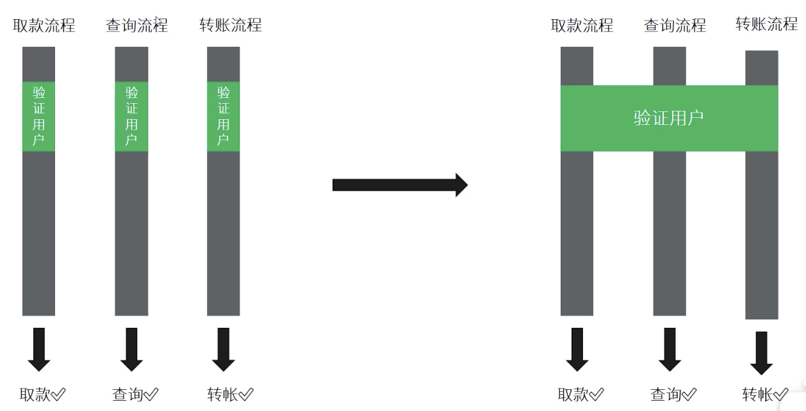
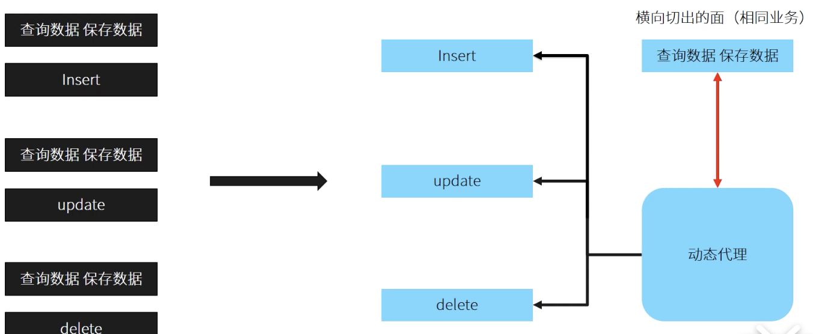
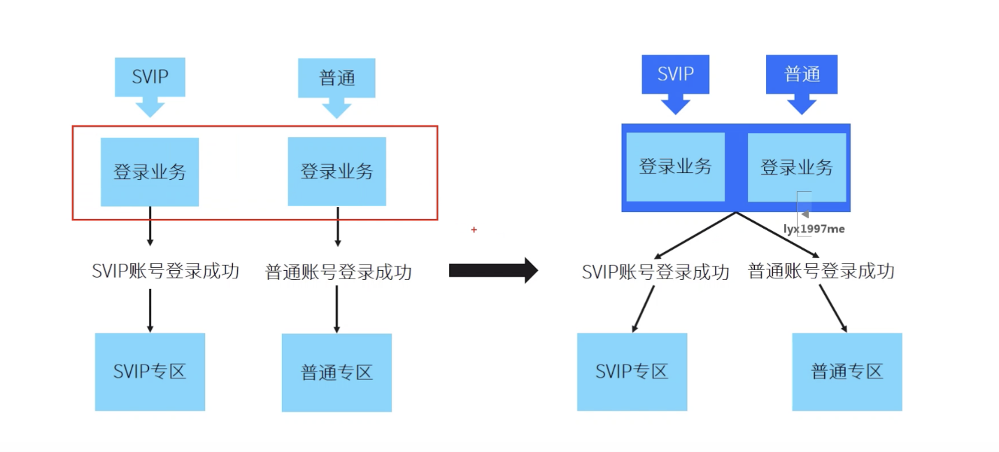
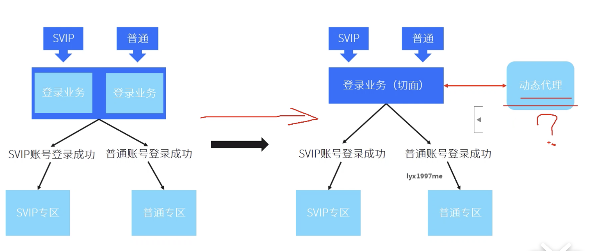
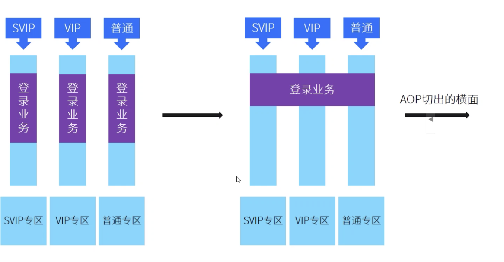

# 面向切面编程 横向切面

针对业务中重复或者相同的业务场景进行 横向抽象（横向切面）

eg：

```java
//android application 中监控所有Activity的声明周期
registerActivityLifecycleCallbacks(new ActivityLifecycleCallbacks(){
    .....
    .....
    .....
    .....
    
});
```

Eg:



Eg：

动态代理切面需求：




```java
public interface DBOperation{
	void insert();
	void delete();
	void update();
  //数据备份
	void save();
}
```

```java
public class MainAction implements DBOperation{
  
  private DBOperation db;
  
  public void main(){
    db = Proxy.newProxyInstance(DBOperation.class.getClassLoader(),new DBHandler(this));
  	db.delete();
  }
  
  class DBHandler implements InvocationHandler{
    private DBOperation db;
    public DBHandler(DBOperation db){
      this.db = db;
    }
    @Override
    public Object invoke(Object proxy,Method method,Object[] args) throws Throwable{
      if(db != null){
        save();//数据备份完成
        return method.invoke(this,args)
      }
      return null;
    }
  }
  
  @Override
  public void insert(){
    
  }
  @Override
  public void delete(){
   
  }
  @Override
  public void upadate(){
    
  }
  @Override
  public void save(){
    
  }
}
```

# 面向切面思想之集中式登录架构设计 （预编译）








# AspectJ  切面框架  


java ----->calss         javac

  AspectJ   定制的javac编译器


# Aspectj  能做哪些事情？


- 日志

- 持久化

- 性能监控

- 数据校验

- 缓存

  。。。。。


# AspectJ 术语

- JPoint：代码可注入的点，比如一个方法的调用处或者方法内部、“读、写”变量等。
- Pointcut：用来描述 JPoint 注入点的一段表达式，比如：调用 Animal 类 fly 方法的地方，call(* Animal.fly(..))。
- Advice：常见的有 Before、After、Around 等，表示代码执行前、执行后、替换目标代码，也就是在 Pointcut 何处注入代码。
- Aspect：Pointcut 和 Advice 合在一起称作 Aspect。


# AspectJ 操作手册

https://link.jianshu.com/?t=https://github.com/hiphonezhu/Android-Demos/blob/master/AspectJDemo/AspectJ.pdf


JPoint 的分类和对应的 Pointcut 如下：


1-1

Pointcut 中的 Signature 参考：


1-2

以上的 Signature 都是由一段表达式组成，且每个关键词之间都有“空格”，下面是对关键词的解释：


1-3

Pointcut 语法熟悉了之后，Advice 就显得很简单了，它包含以下几个：


1-4


# Android Studio 中使用


```java
public class Animal {
    private static final String TAG = "Animal";
    public void fly() {
        Log.e(TAG, this.toString() + "#fly");
    }
}
```


```java
//版本界限 AS-3.0.1+gradle4.4-all (需要配置r17ndk 环境)
//As-3.2.1+gradle4.6-all (正常使用 没有警告)
classpath 'org.aspectj:aspectjtools:1.8.9'
classpath 'org.aspectj:aspectjweaver:1.8.9'
```


```java
//app gralde 修改

buildsrcipt{//编译器利用Aspect 专门的编译器 不再使用传统的javac
  repositories{
    mavenCentral()
  }
  dependencies{
    classpath 'org.aspectj:aspectjtools:1.8.9'
		classpath 'org.aspectj:aspectjweaver:1.8.9'
  }
}
```

