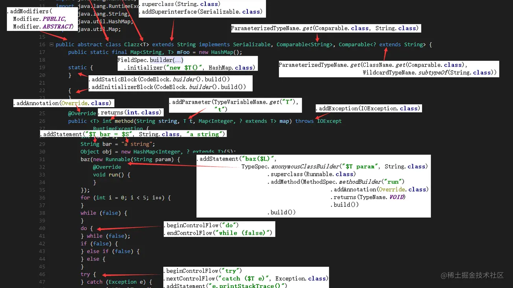
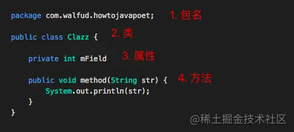
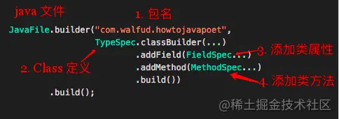
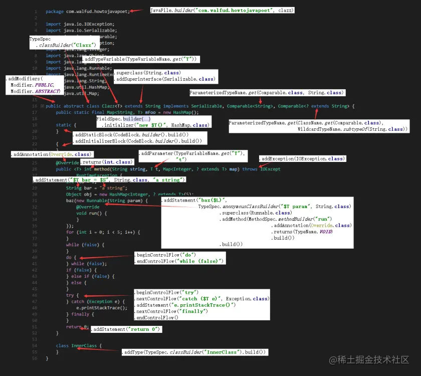

# JavaPoet 




Android/Java 框架常常会使用编译期注解, 而其中关键的一步是如何生成 Java 文件. JavaPoet 就是用来生成 Java 代码的一个 Java Library.

### 基础概念

首先， 让我们来看一个简单的 Java 文件：

[](https://link.juejin.cn/?target=https%3A%2F%2Fi1.wp.com%2Fandroid.walfud.com%2Fwp-content%2Fuploads%2F2017%2F04%2F无标题.png)

可以见， 一个 Java 文件由四部分组成。

也就是我们要生成一个 java 文件， 就是要生成上述四部分内容。

对应到 JavaPoet 中， 我们来看一张对比图：

[](https://link.juejin.cn/?target=https%3A%2F%2Fi2.wp.com%2Fandroid.walfud.com%2Fwp-content%2Fuploads%2F2017%2F04%2F1.png)

可见， `JavaFile` 对应的 Java 文件。 包名直接用一个字符串表示。 `TypeSpec` 表示一个 class 定义。 `FieldSpec` 表示类中的属性。 `MethodSpec` 表示类中的方法。

### 最简实例

理解了 JavaPoet 的大致结构， 我们就可以生成一个简单的 Java 文件了。

gradle 引用:

```java
compile 'com.squareup:javapoet:1.8.0'复制代码
public class HowToJavaPoetDemo {
  public static void main(String[] args) {
    // `JavaFile` 代表 Java 文件
    JavaFile javaFile = JavaFile.builder("com.walfud.howtojavapoet",
      // TypeSpec 代表一个类
      TypeSpec.classBuilder("Clazz")
              // 给类添加一个属性
              .addField(FieldSpec.builder(int.class, "mField", Modifier.PRIVATE)
                                 .build())
              // 给类添加一个方法
              .addMethod(MethodSpec.methodBuilder("method")
                    .addModifiers(Modifier.PUBLIC)
                    .returns(void.class)
                    .addStatement("System.out.println(str)")
                    .build())
              .build())
      .build();

    System.out.println(javaFile.toString());
  }
}
```

### 更多的数据类型

上个例子中， 我们为了单一目标， 特意简化了数据类型。 现实编程中绝大多数情况下要面对各种对象类型， 如 `File / List / Activity(android.app.Activity)` 等等。 下面我们来了解一下 JavaPoet 的类型系统。

我们要定义一个 `java.io.File` 类型的变量， 比如这样：

```
import java.io.File;

public class ... {
    private File mFile;
}
复制代码
```

我们需要使用 `FieldSpec.builder(File.class, "mFile", Modifier.PRIVATE).build()` 来定义这个属性。 这样 JavaPoet 就可以自动找到 File 所在的包并帮我们自动引入 `import java.io.File`。

但如果定义 `List<String>` 这种泛型的话， 该怎么写呢？`List<String>.class` 显然是不行的。 因为这是一个复合类型， 其中的参数类型无法被表示。

因此， JavaPoet 帮我们定义了如下几种专门描述类型的类。其关系图如下:

[](https://link.juejin.cn/?target=https%3A%2F%2Fi2.wp.com%2Fandroid.walfud.com%2Fwp-content%2Fuploads%2F2017%2F04%2F2-1.png)

共有六种类型， 我们举几个常见的例子：

| 分类                                  | 生成的类型       | JavaPoet 写法                                       | 也可以这么写 （等效的 Java 写法） |
| ------------------------------------- | ---------------- | --------------------------------------------------- | --------------------------------- |
| 内置类型                              | int              | TypeName.INT                                        | int.class                         |
| 数组类型                              | int[]            | ArrayTypeName.of(int.class)                         | int[].class                       |
| 需要引入包名的类型                    | java.io.File     | ClassName.get(“java.io”, “File”)                    | java.io.File.class                |
| 参数化类型 （ParameterizedType）      | List             | ParameterizedTypeName.get(List.class, String.class) | –                                 |
| 类型变量 （WildcardType）用于声明泛型 | T                | TypeVariableName.get(“T”)                           | –                                 |
| 通配符类型                            | ? extends String | WildcardTypeName.subtypeOf(String.class)            | –                                 |

这些类型之间可以相互嵌套， 比如 `ParameterizedTypeName.get(List.class, String.class)` 其中 `List.class` 等价于 `ClassName.get("java.util", "List")`。 因此，
`ParameterizedTypeName.get(List.class, String.class)`
可以写为
`ParameterizedTypeName.get(ClassName.get("java.util", "List"), ClassName.get("java.lang", "String"))`。

前者的好处是简洁， 后者的好处是 “使用 ClassName 代表某个类型而无需引入该类型“。 比如： 由于在 java 工程中是没有 android 的 sdk， 所以你在 java 工程中想生成 `android.app.Activity` 这种类型是不能直接 `Activity.class`。这种情况下只能通过 `ClassName` 进行引用。”


### 在 Statement 中使用类型

上面介绍了 JavaPoet 的类型系统， 现在我们来看看最后一道坎： statemenet 中的类型占位符。

我们先来看看 statement 占位符在哪里使用：

```
MethodSpec.methodBuilder("method")
    .addStatement("$T file", File.class)            // File file;
    .addStatement("$L = null", "file")              // file = null;
    .addStatement("file = new File($S)", "foo/bar") // file = new File("foo/bar");
    .build();
复制代码
```


$T 是类型替换, 一般用于 `("$T foo", List.class)` => `List foo`. $T 的好处在于 JavaPoet 会自动帮你补全文件开头的 `import`. 如果直接写 `("List foo")` 虽然也能生成 `List foo`， 但是最终的 java 文件就不会自动帮你添加 `import java.util.List`.
$L 是字面量替换, 比如 `("abc$L123", "FOO")` => `abcFOO123`. 也就是直接替换.
$S 是字符串替换, 比如: `("$S.length()", "foo")` => `"foo".length()` 注意 $S 是将参数替换为了一个带双引号的字符串. 免去了手写 `"\"foo\".length()"` 中转义 (`\"`) 的麻烦.
$N 是名称替换, 比如你之前定义了一个函数 `MethodSpec methodSpec = MethodSpec.methodBuilder("foo").build();` 现在你可以通过 $N 获取这个函数的名称 `("$N", methodSpec)` => `foo`.


### 万能例子

最后， 我们展示一段几乎涵盖你所常见 case 的例子 (仅为了展示 JavaPoet 用法， 生成的代码可能编译不过). 如果哪里不知道怎么生成的, 可以方便的在下面的生成代码里查找生成方法.

```
package com.walfud.howtojavapoet;

import java.io.File;
import java.io.IOException;
import java.io.Serializable;
import java.lang.Comparable;
import java.lang.Exception;
import java.lang.Integer;
import java.lang.Object;
import java.lang.Override;
import java.lang.Runnable;
import java.lang.RuntimeException;
import java.lang.String;
import java.util.HashMap;
import java.util.List;
import java.util.Map;

public abstract class Clazz<T> extends String implements Serializable, Comparable<String>, Map<T, ? extends String> {
  static {
  }

  private int mInt;

  private int[] mArr;

  private File mRef;

  private T mT;

  private List<String> mParameterizedField;

  private List<? extends String> mWildcardField;

  {
  }

  public Clazz() {
  }

  @Override
  public <T> int method(String string, T t, Map<Integer, ? extends T> map) throws IOException,
      RuntimeException {
    int foo = 1;
    String bar = "a string";
    Object obj = new HashMap<Integer, ? extends T>(5);
    baz(new Runnable(String param) {
      @Override
      void run() {
      }
    });
    for (int i = 0; i < 5; i++) {
    }
    while (false) {
    }
    do {
    } while (false);
    if (false) {
    } else if (false) {
    } else {
    }
    try {
    } catch (Exception e) {
      e.printStackTrace();
    } finally {
    }
    return 0;
  }

  class InnerClass {
  }
}
复制代码
```

JavaPoet 代码:

```
package com.walfud.howtojavapoet;


import com.squareup.javapoet.ClassName;
import com.squareup.javapoet.CodeBlock;
import com.squareup.javapoet.FieldSpec;
import com.squareup.javapoet.JavaFile;
import com.squareup.javapoet.MethodSpec;
import com.squareup.javapoet.ParameterizedTypeName;
import com.squareup.javapoet.TypeName;
import com.squareup.javapoet.TypeSpec;
import com.squareup.javapoet.TypeVariableName;
import com.squareup.javapoet.WildcardTypeName;

import java.io.File;
import java.io.IOException;
import java.io.Serializable;
import java.util.HashMap;
import java.util.List;
import java.util.Map;

import javax.lang.model.element.Modifier;

/**
 * http://android.walfud.com/javapoet-看这一篇就够了/
 */
class HowToJavaPoetDemo {
    public static void main(String[] args) {
        TypeSpec clazz = clazz(builtinTypeField(),          // int
                               arrayTypeField(),            // int[]
                               refTypeField(),              // File
                               typeField(),                 // T
                               parameterizedTypeField(),    // List<String>
                               wildcardTypeField(),         // List<? extends String>
                               constructor(),               // 构造函数
                               method(code()));             // 普通方法
        JavaFile javaFile = JavaFile.builder("com.walfud.howtojavapoet", clazz).build();

        System.out.println(javaFile.toString());
    }

    /**
     * `public abstract class Clazz<T> extends String implements Serializable, Comparable<String>, Comparable<? extends String> {
     * ...
     * }`
     *
     * @return
     */
    public static TypeSpec clazz(FieldSpec builtinTypeField, FieldSpec arrayTypeField, FieldSpec refTypeField,
                                 FieldSpec typeField, FieldSpec parameterizedTypeField, FieldSpec wildcardTypeField,
                                 MethodSpec constructor, MethodSpec methodSpec) {
        return TypeSpec.classBuilder("Clazz")
                    // 限定符
                    .addModifiers(Modifier.PUBLIC, Modifier.ABSTRACT)
                    // 泛型
                    .addTypeVariable(TypeVariableName.get("T"))

                    // 继承与接口
                    .superclass(String.class)
                    .addSuperinterface(Serializable.class)
                    .addSuperinterface(ParameterizedTypeName.get(Comparable.class, String.class))
                    .addSuperinterface(ParameterizedTypeName.get(ClassName.get(Map.class), 
                                                                 TypeVariableName.get("T"), 
                                                                 WildcardTypeName.subtypeOf(String.class)))

                    // 初始化块
                    .addStaticBlock(CodeBlock.builder().build())
                    .addInitializerBlock(CodeBlock.builder().build())

                    // 属性
                    .addField(builtinTypeField)
                    .addField(arrayTypeField)
                    .addField(refTypeField)
                    .addField(typeField)
                    .addField(parameterizedTypeField)
                    .addField(wildcardTypeField)

                    // 方法 （构造函数也在此定义）
                    .addMethod(constructor)
                    .addMethod(methodSpec)

                    // 内部类
                    .addType(TypeSpec.classBuilder("InnerClass").build())

                    .build();
    }

    /**
     * 内置类型
     */
    public static FieldSpec builtinTypeField() {
        // private int mInt;
        return FieldSpec.builder(int.class, "mInt", Modifier.PRIVATE).build();
    }

    /**
     * 数组类型
     */
    public static FieldSpec arrayTypeField() {
        // private int[] mArr;
        return FieldSpec.builder(int[].class, "mArr", Modifier.PRIVATE).build();
    }

    /**
     * 需要导入 import 的类型
     */
    public static FieldSpec refTypeField() {
        // private File mRef;
        return FieldSpec.builder(File.class, "mRef", Modifier.PRIVATE).build();
    }

    /**
     * 泛型
     */
    public static FieldSpec typeField() {
        // private File mT;
        return FieldSpec.builder(TypeVariableName.get("T"), "mT", Modifier.PRIVATE).build();
    }

    /**
     * 参数化类型
     */
    public static FieldSpec parameterizedTypeField() {
        // private List<String> mParameterizedField;
        return FieldSpec.builder(ParameterizedTypeName.get(List.class, String.class),
                                 "mParameterizedField",
                                 Modifier.PRIVATE)
                .build();
    }

    /**
     * 通配符参数化类型
     *
     * @return
     */
    public static FieldSpec wildcardTypeField() {
        // private List<? extends String> mWildcardField;
        return FieldSpec.builder(ParameterizedTypeName.get(ClassName.get(List.class),
                                                           WildcardTypeName.subtypeOf(String.class)),
                                 "mWildcardField",
                                 Modifier.PRIVATE)
                .build();
    }

    /**
     * 构造函数
     */
    public static MethodSpec constructor() {
        return MethodSpec.constructorBuilder()
                .addModifiers(Modifier.PUBLIC)
                .build();
    }

    /**
     * `@Override
     * public <T> Integer method(String string, T t, Map<Integer, ? extends T> map) throws IOException, RuntimeException {
     * ...
     * }`
     *
     * @param codeBlock
     * @return
     */
    public static MethodSpec method(CodeBlock codeBlock) {
        return MethodSpec.methodBuilder("method")
                .addAnnotation(Override.class)
                .addTypeVariable(TypeVariableName.get("T"))
                .addModifiers(Modifier.PUBLIC)
                .returns(int.class)
                .addParameter(String.class, "string")
                .addParameter(TypeVariableName.get("T"), "t")
                .addParameter(ParameterizedTypeName.get(ClassName.get(Map.class), 
                                                        ClassName.get(Integer.class), 
                                                        WildcardTypeName.subtypeOf(TypeVariableName.get("T"))), 
                              "map")
                .addException(IOException.class)
                .addException(RuntimeException.class)
                .addCode(codeBlock)
                .build();
    }

    /**
     * ‘method’ 方法中的具体语句
     */
    public static CodeBlock code() {
        return CodeBlock.builder()
                .addStatement("int foo = 1")
                .addStatement("$T bar = $S", String.class, "a string")

                // Object obj = new HashMap<Integer, ? extends T>(5);
                .addStatement("$T obj = new $T(5)", 
                              Object.class, ParameterizedTypeName.get(ClassName.get(HashMap.class), 
                                                                      ClassName.get(Integer.class), 
                                                                      WildcardTypeName.subtypeOf(TypeVariableName.get("T"))))

                // method(new Runnable(String param) {
                //   @Override
                //   void run() {
                //   }
                // });
                .addStatement("baz($L)", TypeSpec.anonymousClassBuilder("$T param", String.class)
                        .superclass(Runnable.class)
                        .addMethod(MethodSpec.methodBuilder("run")
                                .addAnnotation(Override.class)
                                .returns(TypeName.VOID)
                                .build())
                        .build())

                // for
                .beginControlFlow("for (int i = 0; i < 5; i++)")
                .endControlFlow()

                // while
                .beginControlFlow("while (false)")
                .endControlFlow()

                // do... while
                .beginControlFlow("do")
                .endControlFlow("while (false)")

                // if... else if... else...
                .beginControlFlow("if (false)")
                .nextControlFlow("else if (false)")
                .nextControlFlow("else")
                .endControlFlow()

                // try... catch... finally
                .beginControlFlow("try")
                .nextControlFlow("catch ($T e)", Exception.class)
                .addStatement("e.printStackTrace()")
                .nextControlFlow("finally")
                .endControlFlow()

                .addStatement("return 0")
                .build();
    }
}
复制代码
```

为了方便记忆, 我总结了一张图, 标注了关键或者稍微复杂的那些用法:
[](https://link.juejin.cn/?target=https%3A%2F%2Fi2.wp.com%2Fandroid.walfud.com%2Fwp-content%2Fuploads%2F2017%2F04%2FHowToJavaPoet_annotated.png)

注意: 在 Android 工程中, 是无法使用 `javax.lang.model.element.Modifier` 包的, 因为 Android 运行时没有相关的 class. 对于 Android Annotation 的正确姿势(工程结构以及用法)


