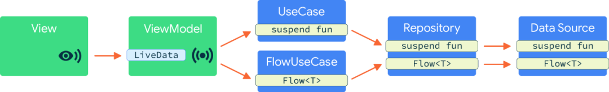

# 协程 Flow 最佳实践 | 基于 Android 开发者峰会应用

[谷歌开发者](https://www.zhihu.com/org/google-gu-ge)[](https://www.zhihu.com/question/48510028)

本文介绍了我们在开发 2019 Android 开发者峰会 (ADS) 应用时总结整理的 [Flow](https://link.zhihu.com/?target=https%3A//kotlin.github.io/kotlinx.coroutines/kotlinx-coroutines-core/kotlinx.coroutines.flow/-flow/)最佳实践 (应用源码已开源)，我们将和大家共同探讨应用中的每个层级将如何处理数据流。

ADS 应用的架构遵守 Android 官方的[推荐架构指南](https://link.zhihu.com/?target=https%3A//developer.android.google.cn/jetpack/docs/guide%23recommended-app-arch)，我们在其中引入了 Domain 层 (用以囊括各种 UseCases 类) 来帮助分离焦点，进而保持代码的精简、复用性、可测试性。

2019 ADS 应用的架构

更多关于应用架构指南的分层设计 (Data 层、Domain 层、UI 层)，请参考[示例应用 | Plaid 2.0 重构](https://link.zhihu.com/?target=https%3A//mp.weixin.qq.com/s%3F__biz%3DMzAwODY4OTk2Mg%3D%3D%26mid%3D2652050851%26idx%3D1%26sn%3Da1c33aefb63bd85beaee39ced2d29d08%26scene%3D21%23wechat_redirect)。

如同许多 Android 应用一样，ADS 应用从网络或缓存懒加载数据。我们发现，这种场景非常适合 Flow。[挂起函数 (suspend functions)](https://link.zhihu.com/?target=https%3A//mp.weixin.qq.com/s%3F__biz%3DMzAwODY4OTk2Mg%3D%3D%26mid%3D2652053382%26idx%3D2%26sn%3D3c9ffe976c69675e9c0e08940afd566f%26scene%3D21%23wechat_redirect) 更适合于一次性操作。为了使用协程，我们将重构分为两次 commit 提交: [第一次](https://link.zhihu.com/?target=https%3A//github.com/google/iosched/pull/333/commits/5f5115e21f1cb008b1a6c1d6130104a86f20904b)迁移了一次性操作，[第二次](https://link.zhihu.com/?target=https%3A//github.com/google/iosched/pull/333/commits/643e531d00884291d79c6742601e2bd53b9f2ee4)将其迁移至数据流。

在本文中，您将看到我们把应用从 "在所有层级使用 [LiveData](https://link.zhihu.com/?target=https%3A//developer.android.google.cn/topic/libraries/architecture/livedata)"，重构为 "只在 View 和 ViewModel 间使用 LiveData 进行通讯，并在应用的底层和 UserCase 层架构中使用协程"。

## **优先使用 Flow 来暴露数据流 (而不是 Channel)**

您有两种方法在协程中处理数据流: 一种是 [Flow API](https://link.zhihu.com/?target=https%3A//kotlin.github.io/kotlinx.coroutines/kotlinx-coroutines-core/kotlinx.coroutines.flow/-flow/)，另一种是 [Channel API](https://link.zhihu.com/?target=https%3A//kotlinlang.org/docs/reference/coroutines/channels.html)。Channels 是一种同步原语，而 Flows 是为数据流模型所设计的: 它是订阅数据流的工厂。不过我们可以使用 Channels 来支持 Flows，这一点我们稍后再说。

**相较于 Channel，Flow 更灵活，并提供了更明确的约束和更多操作符。**

由于末端操作符 (terminal operator) 会触发数据流的执行，同时会根据生产者一侧流操作来决定是成功完成操作还是抛出异常，因此 Flows 会自动地关闭数据流，您基本不会在生产者一侧泄漏资源；而一旦 Channel 没有正确关闭，生产者可能不会清理大型资源，因此 Channels 更容易造成资源泄漏。

应用数据层负责提供数据，通常是从数据库中读取，或从网络获取数据，例如，[示例](https://link.zhihu.com/?target=https%3A//github.com/google/iosched/blob/adssched/shared/src/main/java/com/google/samples/apps/iosched/shared/data/userevent/UserEventDataSource.kt)是一个数据源接口，它提供了一个用户事件数据流:

```text
interface UserEventDataSource {
  fun getObservableUserEvent(userId: String): Flow<UserEventResult>
}
```

## **如何将 Flow 应用在您的 Android 应用架构中**

**1. UseCase 层和 Repository 层**

介于 View/ViewModel 和数据源之间的层 (在我们的例子中是 UseCase 和 Repository) 通常需要合并来自多个查询的数据，或在 ViewModel 层使用之前转化数据。就像[Kotlin sequences](https://link.zhihu.com/?target=https%3A//kotlinlang.org/docs/reference/sequences.html)一样，Flow 支持大量操作符来转换数据。目前已经有[大量的可用的操作符](https://link.zhihu.com/?target=https%3A//kotlin.github.io/kotlinx.coroutines/kotlinx-coroutines-core/kotlinx.coroutines.flow/-flow/%23extension-functions)，同时您也可以创建您自己的转换器 (比如，使用[transform](https://link.zhihu.com/?target=https%3A//kotlin.github.io/kotlinx.coroutines/kotlinx-coroutines-core/kotlinx.coroutines.flow/transform.html)操作符)。不过 Flow 在许多的操作符中暴露了 suspend lambda 表达式，因此在大多数情况下没有必要通过自定义转换来完成复杂任务，可以直接在 Flow 中调用挂起函数。

在 ADS 应用中，我们想将 UserEventResult 和[Repository](https://link.zhihu.com/?target=https%3A//github.com/google/iosched/blob/adssched/shared/src/main/java/com/google/samples/apps/iosched/shared/data/userevent/DefaultSessionAndUserEventRepository.kt)层中的会话数据进行绑定。我们利用[map](https://link.zhihu.com/?target=https%3A//kotlin.github.io/kotlinx.coroutines/kotlinx-coroutines-core/kotlinx.coroutines.flow/map.html)操作符来将一个 suspend lambda 表达式应用在从数据源接收到的每一个 Flow 的值上:

```text
/* Copyright 2019 Google LLC.  
   SPDX-License-Identifier: Apache-2.0 */
class DefaultSessionAndUserEventRepository(
    private val userEventDataSource: UserEventDataSource,
    private val sessionRepository: SessionRepository
) : SessionAndUserEventRepository {

    override fun getObservableUserEvent(
        userId: String?,
        eventId: SessionId
    ): Flow<Result<LoadUserSessionUseCaseResult>> {
        // 处理 userId

        // 监听用户事件，并将其与 Session 数据进行合并
        return userEventDataSource.getObservableUserEvent(userId, eventId).map { userEventResult ->
            val event = sessionRepository.getSession(eventId)

           // 将 Session 和用户数据进行合并，并传递结果
            val userSession = UserSession(
                event,
                userEventResult.userEvent ?: createDefaultUserEvent(event)
            )
            Result.Success(LoadUserSessionUseCaseResult(userSession))
        }
    }
}
```

**2. ViewModel**

在利用 LiveData 执行 UI ↔ ViewModel 通信时，ViewModel 层应该利用末端操作符来消费来自数据层的数据流 (比如:[collect](https://link.zhihu.com/?target=https%3A//kotlin.github.io/kotlinx.coroutines/kotlinx-coroutines-core/kotlinx.coroutines.flow/-flow/collect.html)、[first](https://link.zhihu.com/?target=https%3A//kotlin.github.io/kotlinx.coroutines/kotlinx-coroutines-core/kotlinx.coroutines.flow/first.html)或者是[toList](https://link.zhihu.com/?target=https%3A//kotlin.github.io/kotlinx.coroutines/kotlinx-coroutines-core/kotlinx.coroutines.flow/to-list.html)) 。

```text
/* Copyright 2019 Google LLC.  
   SPDX-License-Identifier: Apache-2.0 */
// 真实代码的简化版
class SessionDetailViewModel(
    private val loadUserSessionUseCase: LoadUserSessionUseCase,
    ...
): ViewModel() {

    private fun listenForUserSessionChanges(sessionId: SessionId) {
        viewModelScope.launch {
            loadUserSessionUseCase(sessionId).collect { loadResult ->
            }
        }
    }
}
```

- 完整代码可以参考这里[https://github.com/google/iosched/blob/adssched/mobile/src/main/java/com/google/samples/apps/iosched/ui/sessiondetail/SessionDetailViewModel.kt](https://link.zhihu.com/?target=https%3A//github.com/google/iosched/blob/adssched/mobile/src/main/java/com/google/samples/apps/iosched/ui/sessiondetail/SessionDetailViewModel.kt)

如果您需要将 Flow 转化为 LiveData，则可以使用[AndroidX lifecycle library](https://link.zhihu.com/?target=https%3A//developer.android.google.cn/jetpack/androidx/releases/lifecycle)提供的[Flow.asLiveData()](https://link.zhihu.com/?target=https%3A//developer.android.google.cn/reference/kotlin/androidx/lifecycle/package-summary%23aslivedata)扩展函数 (extension function)。这个扩展函数非常便于使用，因为它共享了 Flow 的底层订阅，同时根据观察者的生命周期管理订阅。此外，LiveData 可以为后续添加的观察者提供最新的数据，其订阅在配置发生变更的时候依旧能够生效。下面利用一段简单的代码来演示如何使用这个扩展函数:

```text
class SimplifiedSessionDetailViewModel(
  private val loadUserSessionUseCase: LoadUserSessionUseCase,
  ...
): ViewModel() {
  val sessions = loadUserSessionUseCase(sessionId).asLiveData()
}
```

特别说明: 这段代码不是 ADS 应用的，它只是用来演示如何使用 Flow.asLiveData()。

## **具体实现时，该在何时使用 BroadcastChannel 或者 Flow**

回到数据源的实现，要怎样去实现之前暴露的 getObservableUserEvent 函数？我们考虑了两种实现: [flow](https://link.zhihu.com/?target=https%3A//kotlin.github.io/kotlinx.coroutines/kotlinx-coroutines-core/kotlinx.coroutines.flow/-flow/)构造器，或 [BroadcastChannel](https://link.zhihu.com/?target=https%3A//kotlin.github.io/kotlinx.coroutines/kotlinx-coroutines-core/kotlinx.coroutines.channels/-broadcast-channel/)接口，这两种实现应用于不同的场景。

**1. 什么时候使用 Flow ？**

Flow 是一种 "冷流"(Cold Stream)。"冷流" 是一种数据源，该类数据源的生产者会在每个监听者开始消费事件的时候执行，从而在每个订阅上创建新的数据流。一旦消费者停止监听或者生产者的阻塞结束，数据流将会被自动关闭。

**Flow 非常适合需要开始/停止数据的产生来匹配观察者的场景。**

您可以利用 flow 构造器来发送有限个/无限个元素。

```text
val oneElementFlow: Flow<Int> = flow {
  // 生产者代码开始执行，流被打开
  emit(1)
 // 生产者代码结束，流将被关闭
}
val unlimitedElementFlow: Flow<Int> = flow {
 // 生产者代码开始执行，流被打开
  while(true) {
    // 执行计算
    emit(result)
    delay(100)
  }
 // 生产者代码结束，流将被关闭
}
```

Flow 通过协程取消功能提供自动清理功能，因此倾向于执行一些重型任务。请注意，这里提到的取消是有条件的，一个永不挂起的 Flow 是永不会被取消的: 在我们的例子中，由于[delay](https://link.zhihu.com/?target=https%3A//kotlin.github.io/kotlinx.coroutines/kotlinx-coroutines-core/kotlinx.coroutines/delay.html)是一个挂起函数，用于检查取消状态，当订阅者停止监听时，Flow 将会停止并清理资源。

**2. 什么时候使用 BroadcastChannel**

Channel 是一个用于协程间通信的并发原语。[BroadcastChannel](https://link.zhihu.com/?target=https%3A//kotlin.github.io/kotlinx.coroutines/kotlinx-coroutines-core/kotlinx.coroutines.channels/-broadcast-channel/) 基于[Channel](https://link.zhihu.com/?target=https%3A//kotlinlang.org/docs/reference/coroutines/channels.html)，并加入了多播功能。

可能在这样一些场景里，您可能会考虑在数据源层中使用 BroadcastChannel:

**如果生产者和消费者的生命周期不同或者彼此完全独立运行时，请使用 BroadcastChannel。**

如果您希望生产者有独立的生命周期，同时向任何存在的监听者发送当前数据的时候，BroadcastChannel API 非常适合这种场景。在这种情况下，当新的监听者开始消费事件时，生产者不需要每次都被执行。

您依然可以向调用者提供 Flow，它们不需要知道具体的实现。您可以使用[BroadcastChannel.asFlow()](https://link.zhihu.com/?target=https%3A//kotlin.github.io/kotlinx.coroutines/kotlinx-coroutines-core/kotlinx.coroutines.flow/as-flow.html)这个扩展函数来将一个 BroadcastChannel 作为一个 Flow 使用。

不过，关闭这个特殊的 Flow 不会取消订阅。当使用 BroadcastChannel 的时候，您必须自己管理生命周期。BroadcastChannel 无法感知到当前是否还存在监听者，除非关闭或取消 BroadcastChannel，否则将会一直持有资源。请确保在不需要 BroadcastChannel 的时候将其关闭。同时请注意关闭后的 BroadcastChannel 无法再次被使用，如果需要，您需要重新创建实例。

接下来，我们将分享如何使用 BroadcastChannel API 的示例。

**3. 特别说明**

部分 Flow 和 Channel API 仍处于实验阶段，很可能会发生变动。在一些情况下，您可能会正在使用 Channel，不过在未来可能会建议您使用 Flow。具体来讲，[StateFlow](https://link.zhihu.com/?target=https%3A//github.com/Kotlin/kotlinx.coroutines/pull/1354)和 Flow 的 [share operator](https://link.zhihu.com/?target=https%3A//github.com/Kotlin/kotlinx.coroutines/issues/1261) 方案可能在未来会减少 Channel 的使用。

## **将数据流中基于回调的 API 转化为协程**

包含 [Room](https://link.zhihu.com/?target=https%3A//developer.android.google.cn/jetpack/androidx/releases/room) 在内的很多库已经支持将协程用于数据流操作。对于那些还不支持的库，您可以将任何基于回调的 API 转换为协程。

**1. Flow 的实现**

如果您想将一个基于回调的流 API 转换为使用 Flow，您可以使用[channelFlow](https://link.zhihu.com/?target=https%3A//kotlin.github.io/kotlinx.coroutines/kotlinx-coroutines-core/kotlinx.coroutines.flow/channel-flow.html) 函数 (当然也可以使用 [callbackFlow](https://link.zhihu.com/?target=https%3A//kotlin.github.io/kotlinx.coroutines/kotlinx-coroutines-core/kotlinx.coroutines.flow/callback-flow.html)，它们都基于相同的实现)。channelFlow 将会创建一个 Flow 的实例，该实例中的元素将传递给一个 Channel。这样可以允许我们在不同的上下文或并发中提供元素。

以下示例中，我们想要把从回调中拿到的元素发送到 Flow 中:

1. 利用 channelFlow 构造器创建一个可以把回调注册到第三方库的流；
2. 将从回调接收到的所有数据传递给 Flow；
3. 当订阅者停止监听，我们利用[挂起函数 "awaitClose"](https://link.zhihu.com/?target=https%3A//kotlin.github.io/kotlinx.coroutines/kotlinx-coroutines-core/kotlinx.coroutines.channels/await-close.html) 来解除 API 的订阅.

```text
/* Copyright 2019 Google LLC.  
   SPDX-License-Identifier: Apache-2.0 */
override fun getObservableUserEvent(userId: String, eventId: SessionId): Flow<UserEventResult> {
     // 1) 利用 channelFlow 创建一个 Flow
    return channelFlow<UserEventResult> {

        val eventDocument = firestore.collection(USERS_COLLECTION)
            .document(userId)
            .collection(EVENTS_COLLECTION)
            .document(eventId)
    
       // 1) 将回调注册到 API 上
        val subscription = eventDocument.addSnapshotListener { snapshot, _ ->
            val userEvent = if (snapshot.exists()) {
                parseUserEvent(snapshot)
            } else { null }
            
            // 2) 将数据发送到 Flow
            channel.offer(UserEventResult(userEvent))
        }
        // 3) 请不要关闭数据流，在消费者关闭或者 API 调用 onCompleted/onError 函数之前，请保证数据流
       // 一直处于打开状态。
        // 当数据流关闭后，请取消第三方库的订阅。
        awaitClose { subscription.remove() }
    }
}
```

- 详细代码可以参考这里[https://github.com/google/iosched/blob/adssched/shared/src/main/java/com/google/samples/apps/iosched/shared/data/userevent/FirestoreUserEventDataSource.kt](https://link.zhihu.com/?target=https%3A//github.com/google/iosched/blob/adssched/shared/src/main/java/com/google/samples/apps/iosched/shared/data/userevent/FirestoreUserEventDataSource.kt)

**2. BroadcastChannel 实现**

对于使用 Firestore 跟踪用户身份认证的数据流，我们使用了 BroadcastChannel API，因为我们希望注册一个有独立生命周期的 Authentication 监听者，同时也希望能向所有正在监听的对象广播当前的结果。

转化回调 API 为 BroadcastChannel 相比转化为 Flow 要略复杂一点。您可以创建一个类，并设置将实例化后的 BroadcastChannel 作为变量保存。在初始化期间，注册回调，像以前一样将元素发送到 BroadcastChannel:

```text
/* Copyright 2019 Google LLC.  
   SPDX-License-Identifier: Apache-2.0 */
class FirebaseAuthStateUserDataSource(...) : AuthStateUserDataSource {

    private val channel = ConflatedBroadcastChannel<Result<AuthenticatedUserInfo>>()

    private val listener: ((FirebaseAuth) -> Unit) = { auth ->
       // 数据处理逻辑
       
       // 将当前的用户 (数据) 发送给消费者
        if (!channel.isClosedForSend) {
            channel.offer(Success(FirebaseUserInfo(auth.currentUser)))
        } else {
            unregisterListener()
        }
    }

    @Synchronized
    override fun getBasicUserInfo(): Flow<Result<AuthenticatedUserInfo>> {
        if (!isListening) {
            firebase.addAuthStateListener(listener)
            isListening = true
        }
        return channel.asFlow()
    }
}
```

- 详细代码可以参考这里

[https://github.com/google/iosched/blob/adssched/mobile/src/main/java/com/google/samples/apps/iosched/shared/data/signin/datasources/FirebaseAuthStateUserDataSource.ktgithub.com/google/iosched/blob/adssched/mobile/src/main/java/com/google/samples/apps/iosched/shared/data/signin/datasources/FirebaseAuthStateUserDataSource.kt](https://link.zhihu.com/?target=https%3A//github.com/google/iosched/blob/adssched/mobile/src/main/java/com/google/samples/apps/iosched/shared/data/signin/datasources/FirebaseAuthStateUserDataSource.kt)

## **测试小建议**

为了**测试 Flow 转换**(就像我们在 UseCase 和 Repository 层中所做的那样)，您可以利用 flow 构造器返回一个假数据，例如:

```text
/* Copyright 2019 Google LLC.
   SPDX-License-Identifier: Apache-2.0 */
object FakeUserEventDataSource : UserEventDataSource {
  override fun getObservableUserEvents(userId: String) = flow {
    emit(UserEventsResult(userEvents))
  }
}
class DefaultSessionAndUserEventRepositoryTest {
  @Test
  fun observableUserEvents_areMappedCorrectly() = runBlockingTest {
   // 准备一个 repo
    val userEvents = repository
          .getObservableUserEvents("user", true).first()
   // 对接收到的用户事件进行断言
  }
}
```

为了成功完成测试，一个比较好的做法是使用[take](https://link.zhihu.com/?target=https%3A//kotlin.github.io/kotlinx.coroutines/kotlinx-coroutines-core/kotlinx.coroutines.flow/take.html)操作符来从 Flow 中获取一些数据，使用[toList](https://link.zhihu.com/?target=https%3A//kotlin.github.io/kotlinx.coroutines/kotlinx-coroutines-core/kotlinx.coroutines.flow/to-list.html)作为末端操作符来从数组中获取结果。示例如下:

```text
class AnotherStreamDataSourceImplTest {
  @Test
  fun `Test happy path`() = runBlockingTest {
   //准备好 subject
    val result = subject.flow.take(1).toList()
   // 断言结果和预期的一致
  }
}
```

take 操作符非常适合在获取到数据后关闭 Flow。在测试完毕后不关闭 Flow 或 BroadcastChannel 将会导致内存泄漏以及测试结果不一致。

**注意:**如果在数据源的实现是通过 BroadcastChannel 完成的，那么上面的代码还不够。您需要自己管理数据源的生命周期，并确保 BroadcastChannel 在测试开始之前已经启动，同时需要在测试结束后将其关闭，否则将会导致内存泄漏。

- 在这里获取更多信息

[https://github.com/manuelvicnt/MathCoroutinesFlow/blob/master/app/src/test/java/com/manuelvicnt/coroutinesflow/fibonacci/impl/NeverEndingFibonacciProducerTest.kt#L38github.com/manuelvicnt/MathCoroutinesFlow/blob/master/app/src/test/java/com/manuelvicnt/coroutinesflow/fibonacci/impl/NeverEndingFibonacciProducerTest.kt#L38](https://link.zhihu.com/?target=https%3A//github.com/manuelvicnt/MathCoroutinesFlow/blob/master/app/src/test/java/com/manuelvicnt/coroutinesflow/fibonacci/impl/NeverEndingFibonacciProducerTest.kt%23L38)

协程测试的最佳实践在这里依然适用。如果您在测试代码中创建新的协程，则可能想要在测试线程中执行它来确保测试获得执行。

您也可以通过视频回顾 2019 Android 开发者峰会演讲 —— 在 Android 上测试协程:

[在 Android 上测试协程 | ADS 中文字幕视频_腾讯视频v.qq.com/x/page/d3037jjhkh3.html](https://link.zhihu.com/?target=https%3A//v.qq.com/x/page/d3037jjhkh3.html)

## **总结**

- 因为 Flow 所提供的更加明确的约束和各种操作符，我们更建议向消费者暴露 Flow 而不是 Channel；
- 使用 Flow 时，生产者会在每次有新的监听者时被执行，同时数据流的生命周期将会被自动处理；
- 使用 BroadcastChannel 时，您可以共享生产者，但需要自己管理它的生命周期；
- 请考虑将基于回调的 API 转化为协程，以便在您的应用中更好、更惯用地集成 API；
- 使用[take](https://link.zhihu.com/?target=https%3A//kotlin.github.io/kotlinx.coroutines/kotlinx-coroutines-core/kotlinx.coroutines.flow/take.html) 和 [toList](https://link.zhihu.com/?target=https%3A//kotlin.github.io/kotlinx.coroutines/kotlinx-coroutines-core/kotlinx.coroutines.flow/to-list.html) 操作符可以简化 Flow 的相关代码测试。

2019 ADS 应用在 GitHub 开源，请访问下方链接在 GitHub 上查看更详细的代码实现: [https://github.com/google/iosch](https://link.zhihu.com/?target=https%3A//github.com/google/iosched/tree/adssched)