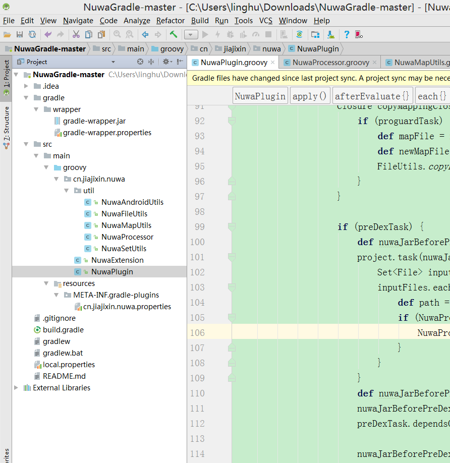

Nuwa :https://github.com/jasonross/Nuwa


# 原理：class加载流程

不说双亲委托了直接说源码

以android 12 源代码为例：
PathClassLoader：

```java
   
@UnsupportedAppUsage
private final DexPathList pathList;

@Override
protected Class<?> findClass(String name) throws ClassNotFoundException {
    。。。。。。
        // Check whether the class in question is present in the dexPath that
        // this classloader operates on.
        List<Throwable> suppressedExceptions = new ArrayList<Throwable>();
    //通过pathList 进行查找
    Class c = pathList.findClass(name, suppressedExceptions);
    if (c != null) {
        return c;
        。。。。。
            return c;
    }

```

DexPathList ：

```java
  
@UnsupportedAppUsage
private Element[] dexElements; //存储class的对象

 DexPathList(ClassLoader definingContext, String dexPath,
            String librarySearchPath, File optimizedDirectory, boolean isTrusted) {
 。。。。。
        ArrayList<IOException> suppressedExceptions = new ArrayList<IOException>();
        // save dexPath for BaseDexClassLoader
     	// 创建 dexElements 
        this.dexElements = makeDexElements(splitDexPath(dexPath), optimizedDirectory,
                                           suppressedExceptions, definingContext, isTrusted);
。。。。。
    }

public Class<?> findClass(String name, List<Throwable> suppressed) {
        for (Element element : dexElements) {
            //加载对应的class
            Class<?> clazz = element.findClass(name, definingContext, suppressed);
            if (clazz != null) {
                return clazz;
            }
        }

        if (dexElementsSuppressedExceptions != null) {
            suppressed.addAll(Arrays.asList(dexElementsSuppressedExceptions));
        }
        return null;
    }
```

DexPathList 的创建在 BaseDexClassLoader 中：

```java
 public BaseDexClassLoader(String dexPath,
            String librarySearchPath, ClassLoader parent, ClassLoader[] sharedLibraryLoaders,
            ClassLoader[] sharedLibraryLoadersAfter,
            boolean isTrusted) {
        super(parent);
  ....
     // 创建pathList
        this.pathList = new DexPathList(this, dexPath, librarySearchPath, null, isTrusted);

....
    }

```

DexClassLoader 与 PathClassLoader 继承自BaseDexClassLoader 
所以：
1：可以使用 DexClassLoader 加载 dex 文件 获取pathList  进而获取 element 数组

2：获取PatchClassLoader 中的 pathList 进而获取 element数组

3：合并element 数组 ，新的element数组进行替换 原PatchClassLoader中pathList的element数组 

热修复达到

# 补丁生成

　　Nuwa是比较流行的一种Android热补丁方案的开源实现，它的特点是成功率高，实现简单。当然，热补丁的方案目前已经有很多了，AndFix, Dexposed, Tinker等，之所以要分析Nuwa，是因为它代表了一种热修复的思想，通过它可以窥探到很多这方面的知识，包括更进一步的插件化。

Nuwa工作原理

　　Nuwa的实现分为Gradle插件和SDK两部分。插件部分负责编译补丁包， SDK部分负责具体打补丁。概括起来看似就两句话，实现起来还是有一定难度的。在插件源码解析之前，我们来具体分析一下这两个部分的工作原理，以便对Nuwa有个技术上的认识。
　　
　　产生补丁首先需要知道你对哪些类做了修改，比如我们发布了2.8.1版本，然后在2.8.1的代码上修改了类：A, B和C， 那这三个类就应该打成一个补丁包。Nuwa plugin就是负责产生补丁包的，他是一个gradle插件, 插件被应用上去以后首先会找到gradle编译时的task链条，然后实现一个自定义的task，我们称作customTask, 将customTask插入到生成dex的task之前，接着将dexTask的依赖作为customTask的依赖，然后让dexTask依赖于customTask，为什么要把customTask插入到这个位置，我们通过分析编译流程知道，dexTask之前的task会把所有类都编译成字节码class，然后作为dexTask的输入。 dexTask负责将这些classes编译成一个或者多个dex以备后续生成apk. 插入到这个位置就能确保我们在生成dex之前拿到所有的class，以便我们分析所有class然后生成补丁dex，这个过程称作hook。
　　
　　有了上述hook这个基础，我们还需要做两件事情，1：对所有类插庄， 2：收集变动过的类打成dex包。
　　
　　解释1: 为什么要插庄，这里涉及到android类加载的机制，我们不展开讲，简单理解就是，android上替换类不是说替换就替换的，android会有校验机制，不合规是不行的，插庄就是用一种讨巧的方式绕过这个校验机制，具体就是通过修改字节码， 为每一个编译好的class插入一个无参的构造函数, 然后让这个构造函数引用一个单独的dex中的类（这个类没有任何意义，只是为了跨dex引用)。
　　
　　解释2: 如何收集变动过的类？ 我们在customTask里会给每个参与编译的类文件生成hash， 第二次执行这个任务时对比每个类的hash值，如果不一样就认为是修改过的，将这些类收集到文件夹，然后调用build tools里的工具生成dex.

　　步骤2中生成的dex就是我们的补丁了， 他可以发布到服务器，通过一些下载机制，下载到用户手机，然后就交给sdk部分去完成真正的“打”补丁的过程。

　　SDK: SDK是一个Android library，需要打在Apk里，程序运行的适当的时候调用其中的方法，它提供一个核心方法：loadPatch(String path). 负责将传入的补丁加载到内存，当启动应用时，Apk内的dex文件会被挨个通过ClassLoader加载到内存, 同时dex会按顺序维持一个列表，当程序需要加载一个类时，就去这个列表里查，一但查到就会使用对应dex具体的类，如果都没找到就会报ClassNotFound错误， 我们加载补丁的原理就是通过反射将我们的补丁dex插入到列表的最开始，这样当需要加载bug类时就会先在补丁dex里面找到，这样系统就会使用修复过的类，便达到了热修复的目的。要注意的是loadPatch一定要在bug类使用前调用，一旦bug类使用过了，本次修复就会没有效果，只能杀死进程再启动应用才会生效。

　　本次我们只会分析Gradle插件部分的代码，sdk的代码以后有机会另开一篇分析。
　　
　　下面开始结合工程来分析 Nuwa plugin的实现, 为了篇幅，我们只关注主流程

项目目录结构



 

代码分析

实现一个plugin首先要实现Plugin接口，重写apply函数。 

```java
 1 class NuwaPlugin implements Plugin<Project> {
 2     HashSet<String> includePackage
 3     HashSet<String> excludeClass
 4     def debugOn
 5     def patchList = []
 6     def beforeDexTasks = []
 7     private static final String NUWA_DIR = "NuwaDir"
 8     private static final String NUWA_PATCHES = "nuwaPatches"
 9     private static final String MAPPING_TXT = "mapping.txt"
10     private static final String HASH_TXT = "hash.txt"
11     private static final String DEBUG = "debug"
12 
13     @Override
14     void apply(Project project) {
15         project.extensions.create("nuwa", NuwaExtension, project)
16         project.afterEvaluate {
17             def extension = project.extensions.findByName("nuwa") as NuwaExtension
18             includePackage = extension.includePackage
19             excludeClass = extension.excludeClass
20             debugOn = extension.debugOn
21            }
22       }
23 }
```

apply会在build.gradle声明插件的时候执行，比如使用插件的module的build.gradle文件的最开始声明应用插件，则执行这个build.gradle的时候就会先执行插件内apply函数的内容。

```
1 apply plugin: 'com.android.application'
2 apply plugin: 'plugin.test'
```

apply函数一开始执行了：project.extensions.create(“nuwa”, NuwaExtension, project)，这一句的作用是根据NuwaExtension类创建一个扩展，后面就可以按照NuwaExtension既有字段在build.gradle声明属性了。

```
1 class NuwaExtension {
2     HashSet<String> includePackage = []
3     HashSet<String> excludeClass = []
4     boolean debugOn = true
5 
6     NuwaExtension(Project project) {
7     }
8 }
```

然后可以在build.gradle中声明:

```
1     HashSet<String> includePackage
2     HashSet<String> excludeClass
3     def debugOn
4     def patchList = []
5     def beforeDexTasks = []
```

创建扩展的作用是方便我们动态的做一些配置。 
代码执行分为两个大的分支：混淆和不混淆，我们这里只分析不混淆的情况。

```
1 def preDexTask =project.tasks.findByName("preDex${variant.name.capitalize()}”)
```

查找preDexTask，如果有就说明开启了混淆，我们这里没有。

```
1 def dexTask = project.tasks.findByName("dex${variant.name.capitalize()}”)
```

查找dexTask， 这个是task非常关键，它的上一级task负责编译好了所有类，它的输入就是所有类的class文件（XXX.class)。

```java
  // 创建打patch的task，这个task负责把对比出有差异的class文件打包成dex
 def nuwaPatch = "nuwa${variant.name.capitalize()}Patch”  
project.task(nuwaPatch) << {
      if (patchDir) {
          // 真正负责打包的函数, 函数实现下面会分析
          NuwaAndroidUtils.dex(project, patchDir)  
      }
  }
  def nuwaPatchTask = project.tasks[nuwaPatch]
 if(preDexTask) {
 } else {
     //创建一个自定义task，负责遍历所有编译好的类，针对每一个class文件注入构造函数，构造函数中引用了一个独立的dex中的类，因为这个类不在当前dex, 
     //所以会防止类被打上ISPREVERIFIED标志
     def nuwaJarBeforeDex = "nuwaJarBeforeDex${variant.name.capitalize()}”  
         Set<File> inputFiles = dexTask.inputs.files.files ≈
        inputFiles.each { inputFile ->           
           // 这里它就能拿到所有编译好的jar包了(jar包不止一个，包括所有support的jar包和依赖的一些jar包还有项目源码打出的jar包, 
           // 总之这些jar包包涵了这个apk中所有的class)。
             def path = inputFile.absolutePath
             if (path.endsWith(".jar")) {
                 // 真正做class注入的函数, 函数实现下面会分析
                 NuwaProcessor.processJar(hashFile, inputFile, patchDir, hashMap, includePackage, excludeClass) 
             }
         }
    }
     // 因为上一步project.task(nuwaJarBeforeDex)已经创建了nuwaJarBeforeDex的task所以这里通过tasks这个系统成员变量可以拿到真正的task对象。
     def nuwaJarBeforeDexTask = project.tasks[nuwaJarBeforeDex]   
     // 让自定义task依赖于dexTask的依赖
     nuwaJarBeforeDexTask.dependsOn dexTask.taskDependencies.getDependencies(dexTask) 
    // 让dexTask依赖于我们的自定义task， 这样就相当于在原来的task链中插入了我们自己的task，在不影响原有流程的情况下可以做我们自己的事情
     dexTask.dependsOn nuwaJarBeforeDexTask  
     // 让打patch的task依赖于class注入的task， 这样我们可以在控制台手动执行这个task，就可以打出patch文件了。
     nuwaPatchTask.dependsOn nuwaJarBeforeDexTask  
 }

```

好了， 主流程就是这样的， 这里你可能还有几个问题，class注入究竟是怎么做的，在哪里对比的文件差异，又是在哪里把所有变动的文件打成patch呢。

这里就到关键的两个工具函数了：
NuwaProcessor.processJar和 NuwaAndroidUtils.dex。 前者负责class注入，后者负责对比和打patch。源码如下:

```java
/**
   参数说明： 
   hashFile: 本次编译所有类的“类名:hash”存放文件
   jarFile:  jar包, 调用这个函数的地方会遍历所有的jar包
   patchDir:  有变更的文件统一存放到这个目录里
   map:  上一次编译所有类的hash映射
   includePackage:  额外指定只需要注入这些包下的类
   excludeClass： 额外指定不参与注入的类
*/  
public static processJar(File hashFile, File jarFile, File patchDir, Map map, HashSet<String> includePackage, HashSet<String> excludeClass) {
     if (jarFile) {
         // 先在原始jar同级目录下创建“同名.opt”文件，每注入完成一个类则打到这个opt文件中，
         // opt文件实际上也是一个jar包，所有类都处理完后将文件后缀opt改为jar替换掉原来的jar   
         def optJar = new File(jarFile.getParent(), jarFile.name + ".opt”)  
         def file = new JarFile(jarFile);
         Enumeration enumeration = file.entries();  
         // 创建输入opt文件，实际也是一个jar包
         JarOutputStream jarOutputStream = new JarOutputStream(new FileOutputStream(optJar));  
         while (enumeration.hasMoreElements()) {  // 遍历jar包中的每一个entry
             JarEntry jarEntry = (JarEntry) enumeration.nextElement();
             String entryName = jarEntry.getName();
             ZipEntry zipEntry = new ZipEntry(entryName);
 
             InputStream inputStream = file.getInputStream(jarEntry);
             jarOutputStream.putNextEntry(zipEntry);
 
             if (shouldProcessClassInJar(entryName, includePackage, excludeClass)) {  // 根据一些规则和includePackage与excludeClass判断这个类要不要处理
                 def bytes = referHackWhenInit(inputStream);  // 拿到这个类的输入流调用这个函数完成字节码注入
                 jarOutputStream.write(bytes);  // 将注入完成的字节码写入opt文件中
 
                 def hash = DigestUtils.shaHex(bytes)  // 生成文件hash
                 hashFile.append(NuwaMapUtils.format(entryName, hash))  将hash值以键值对的形式写入到hash文件中，以便下次对比
 
                 if (NuwaMapUtils.notSame(map, entryName, hash)) { // 如果这个类和map中上次生成的hash不一样，则认为是修改过的，拷贝到需要最终打包的文件夹中
                     NuwaFileUtils.copyBytesToFile(bytes, NuwaFileUtils.touchFile(patchDir, entryName))
                 }
             } else {
                 jarOutputStream.write(IOUtils.toByteArray(inputStream));  // 如果这个类不处理则直接写进opt文件
             }
             jarOutputStream.closeEntry();
         }
         jarOutputStream.close();
         file.close();
 
         if (jarFile.exists()) {
             jarFile.delete()
         }
         optJar.renameTo(jarFile)
     }
 
 }
```


```java
/**
   负责注入,这里用到了asm框架（asm框架用来修改java字节码文件，非常强大，感兴趣的同学可以搜一下，类似的框架还有Javassist和BCEL）.实际的动作就是给类注入一个无参的构造函数，构造函数里引用了“jiajixin/nuwa/Hack”类，这个类是另外一个dex中的，这个dex需要在application入口处加载，
   这样就能保证所有类在用到这个类之前它已经被夹在到内存了，这么做就是为了防止类被打上ISPREVERIFIED标记，从而绕过android对类的检查，保证补丁生效。
*/ 
private static byte[] referHackWhenInit(InputStream inputStream) {
    ClassReader cr = new ClassReader(inputStream);
    ClassWriter cw = new ClassWriter(cr, 0);
    ClassVisitor cv = new ClassVisitor(Opcodes.ASM4, cw) {
        @Override
         public MethodVisitor visitMethod(int access, String name, String desc,
                                          String signature, String[] exceptions) {
 
             MethodVisitor mv = super.visitMethod(access, name, desc, signature, exceptions);
             mv = new MethodVisitor(Opcodes.ASM4, mv) {
                 @Override
                 void visitInsn(int opcode) {
                     if ("<init>".equals(name) && opcode == Opcodes.RETURN) {
                         super.visitLdcInsn(Type.getType("Lcn/jiajixin/nuwa/Hack;"));  // 引用另一个dex中的类
                     super.visitInsn(opcode);
                 }
             }
             return mv;
         }
 
     };
     cr.accept(cv, 0);
     return cw.toByteArray();
 ｝
```


```java
 /**
    NuwaAndroidUtils.dex
    对NuwaProcessor.processJar中拷贝到patch文件夹的类执行打包   操作，这里用到了build-tools中的命令行。
    参数说明：
    project: 工程对象，从插件那里传过来的
    classDir:  包含需要打包的类的文件夹
 */
 
 public static dex(Project project, File classDir) {
     if (classDir.listFiles().size()) {
         def sdkDir
 
         Properties properties = new Properties()
         File localProps = project.rootProject.file("local.properties")
         if (localProps.exists()) {
             properties.load(localProps.newDataInputStream())
             sdkDir = properties.getProperty("sdk.dir")
         } else {
             sdkDir = System.getenv("ANDROID_HOME")
         }
         if (sdkDir) {
             def cmdExt = Os.isFamily(Os.FAMILY_WINDOWS) ? '.bat' : ''
             def stdout = new ByteArrayOutputStream()
             project.exec {
                 commandLine "${sdkDir}/build-tools/${project.android.buildToolsVersion}/dx${cmdExt}",
                         '--dex',
                         "--output=${new File(classDir.getParent(), PATCH_NAME).absolutePath}",
                         "${classDir.absolutePath}"
                 standardOutput = stdout
             }
             def error = stdout.toString().trim()
             if (error) {
                 println "dex error:" + error
             }
         } else {
             throw new InvalidUserDataException('$ANDROID_HOME is not defined')
         }
     }
 }
```

好了， 当我们出包时，生成的apk中的所有类都是自动被注入了的，打正式包的这一次一定要把生成的hash文件所在的文件夹保存起来，以便下次改动代码后对比用，
　　
　　如果线上发现bug， 就把代码切回到当时版本，然后执行命令，传入上次编译出的hash文件所在的文件夹目录，就会生成一个本次修复的patch包（实际上是一个dex)，包里只包含了我们需要修复的类。
命令如下：

```
1 gradlew clean nuwaReleasePatch -P NuwaDir=/Users/GaoGao/nuwa
```

# 补丁加载

```java
package cn.jiajixin.nuwa.util;

import java.lang.reflect.Array;

import dalvik.system.DexClassLoader;
import dalvik.system.PathClassLoader;

/**
 * Created by jixin.jia on 15/10/31.
 */
public class DexUtils {

    public static void injectDexAtFirst(String dexPath, String defaultDexOptPath) throws NoSuchFieldException, IllegalAccessException, ClassNotFoundException {
        //dexclassLoder 加载外部dex文件
        DexClassLoader dexClassLoader = new DexClassLoader(dexPath, defaultDexOptPath, dexPath, getPathClassLoader());
       //获取基础Elements
        Object baseDexElements = getDexElements(getPathList(getPathClassLoader()));
      //获取dex中的Elements
        Object newDexElements = getDexElements(getPathList(dexClassLoader));
      //合并Elements
        Object allDexElements = combineArray(newDexElements, baseDexElements);
        Object pathList = getPathList(getPathClassLoader());
        //使用新的DexElements 替换 原始的elements
        ReflectionUtils.setField(pathList, pathList.getClass(), "dexElements", allDexElements);
    }

    private static PathClassLoader getPathClassLoader() {
        PathClassLoader pathClassLoader = (PathClassLoader) DexUtils.class.getClassLoader();
        return pathClassLoader;
    }

    private static Object getDexElements(Object paramObject)
            throws IllegalArgumentException, NoSuchFieldException, IllegalAccessException {
        return ReflectionUtils.getField(paramObject, paramObject.getClass(), "dexElements");
    }

    //获取 PathClassLoader 中 pathList
    private static Object getPathList(Object baseDexClassLoader)
            throws IllegalArgumentException, NoSuchFieldException, IllegalAccessException, ClassNotFoundException {
        return ReflectionUtils.getField(baseDexClassLoader, Class.forName("dalvik.system.BaseDexClassLoader"), "pathList");
    }

    private static Object combineArray(Object firstArray, Object secondArray) {
        Class<?> localClass = firstArray.getClass().getComponentType();
        int firstArrayLength = Array.getLength(firstArray);
        int allLength = firstArrayLength + Array.getLength(secondArray);
        Object result = Array.newInstance(localClass, allLength);
        for (int k = 0; k < allLength; ++k) {
            if (k < firstArrayLength) {
                Array.set(result, k, Array.get(firstArray, k));
            } else {
                Array.set(result, k, Array.get(secondArray, k - firstArrayLength));
            }
        }
        return result;
    }

}
```

