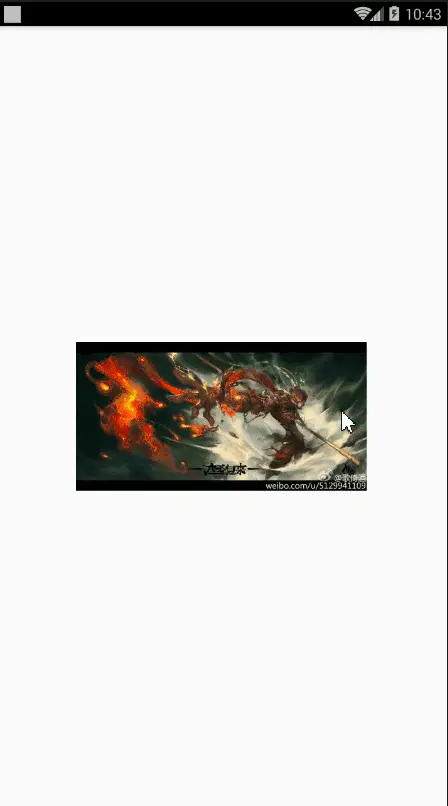

# Android手势监听类GestureDetector

**一、概述**
当用户触摸屏幕的时候，会产生许多手势，例如down，up，scroll，filing等等。一般情况下，我们知道View类有个View.OnTouchListener内部接口，通过重写他的onTouch(View v, MotionEvent event)方法，我们可以处理一些touch事件，但是这个方法太过简单，如果需要处理一些复杂的手势，用这个接口就会很麻烦（因为我们要自己根据用户触摸的轨迹去判断是什么手势）。Android sdk给我们提供了GestureDetector（Gesture：手势Detector：识别）类，通过这个类我们可以识别很多的手势，主要是通过他的onTouchEvent(event)方法完成了不同手势的识别。虽然他能识别手势，但是不同的手势要怎么处理，应该是提供给程序员实现的。

**首先**介绍一下触屏事件处理的基本思路。触屏一般有三个基本事件，down按下，move移动，up离开，通过对这三个基本事件的监听，判断用户执行了何种操作。一个标准的触屏操作一般都是一系列基本事件的组合，在Android的框架中，通过onTouch（）函数可以获取基本的触屏事件，而像onClick这样的函数，已经是一系列基本事件的组合。

比如，发生了Down事件，在up事件之前没有发生move事件，或者move的范围很小，并且down事件和up事件的间隔很短，这就是一个click或者singelTap事件，

对比实体键盘按键的事件，实体键盘是在down事件发生后进行操作，而触屏事件一般是up事件发生后进行操作。

**GestureDetector这个类对外提供了两个接口和一个外部类**
接口：OnGestureListener，OnDoubleTapListener
内部类:SimpleOnGestureListener
这个外部类，其实是两个接口中所有函数的集成，它包含了这两个接口里所有必须要实现的函数而且都已经重写，但所有方法体都是空的；不同点在于：该类是static class，程序员可以在外部继承这个类，重写里面的手势处理方法。
下面我们先看OnGestureListener接口；
二、GestureDetector.OnGestureListener---接口
1、基本讲解
如果我们写一个类并implements OnGestureListener，会提示有几个必须重写的函数，加上之后是这个样子的：


```java
private class gesturelistener implements GestureDetector.OnGestureListener{  
  
    public boolean onDown(MotionEvent e) {  
        // TODO Auto-generated method stub  
        return false;  
    }  
  
    public void onShowPress(MotionEvent e) {  
        // TODO Auto-generated method stub  
          
    }  
  
    public boolean onSingleTapUp(MotionEvent e) {  
        // TODO Auto-generated method stub  
        return false;  
    }  
  
    public boolean onScroll(MotionEvent e1, MotionEvent e2,  
            float distanceX, float distanceY) {  
        // TODO Auto-generated method stub  
        return false;  
    }  
  
    public void onLongPress(MotionEvent e) {  
        // TODO Auto-generated method stub  
          
    }  
  
    public boolean onFling(MotionEvent e1, MotionEvent e2, float velocityX,  
            float velocityY) {  
        // TODO Auto-generated method stub  
        return false;  
    }  
      
}  ```
可见，这里总共重写了六个函数，这些函数都在什么情况下才会触发呢，下面讲一下：

**OnDown(MotionEvent e)：**用户按下屏幕就会触发；
**onShowPress(MotionEvent e)：**如果是按下的时间超过瞬间，而且在按下的时候没有松开或者是拖动的，那么onShowPress就会执行，具体这个瞬间是多久，我也不清楚呃……
**onLongPress(MotionEvent e)：**长按触摸屏，超过一定时长，就会触发这个事件    触发顺序：    onDown->onShowPress->onLongPress
**onSingleTapUp(MotionEvent e)：**从名子也可以看出,一次单独的轻击抬起操作,也就是轻击一下屏幕，立刻抬起来，才会有这个触发，当然,如果除了Down以外还有其它操作,那就不再算是Single操作了,所以也就不会触发这个事件    
触发顺序：    
点击一下非常快的（不滑动）Touchup：   
 onDown->onSingleTapUp->onSingleTapConfirmed     
点击一下稍微慢点的（不滑动）Touchup：    
onDown->onShowPress->onSingleTapUp->onSingleTapConfirmed
**onFling(MotionEvent e1, MotionEvent e2, float velocityX,float velocityY) ：**滑屏，用户按下触摸屏、快速移动后松开，由1个MotionEvent ACTION_DOWN, 多个ACTION_MOVE, 1个ACTION_UP触发        
参数解释：    
e1：第1个ACTION_DOWN MotionEvent    
e2：最后一个ACTION_MOVE MotionEvent    
velocityX：X轴上的移动速度，像素/秒    
velocityY：Y轴上的移动速度，像素/秒   
**onScroll(MotionEvent e1, MotionEvent e2,float distanceX, float distanceY)：**在屏幕上拖动事件。无论是用手拖动view，或者是以抛的动作滚动，都会多次触发,这个方法       在ACTION_MOVE动作发生时就会触发    滑屏：手指触动屏幕后，稍微滑动后立即松开    
onDown-----》onScroll----》onScroll----》onScroll----》………----->onFling    
拖动    
onDown------》onScroll----》onScroll------》onFiling
    可见，无论是滑屏，还是拖动，影响的只是中间OnScroll触发的数量多少而已，最终都会触发onFling事件！

**2、实例**
要使用GestureDetector，有三步要走：

1、创建OnGestureListener监听函数：
可以使用构造实例：
```

GestureDetector.OnGestureListener listener = new GestureDetector.OnGestureListener(){


```go
};  ```
```

也可以构造类：


```java
private class gestureListener implements GestureDetector.OnGestureListener{  
  
}  ```
2、创建GestureDetector实例mGestureDetector：
构造函数有下面三个，根据需要选择：
```

GestureDetector gestureDetector=new GestureDetector(GestureDetector.OnGestureListener listener);
GestureDetector gestureDetector=new GestureDetector(Context context,GestureDetector.OnGestureListener listener);
GestureDetector gestureDetector=new GestureDetector(Context context,GestureDetector.SimpleOnGestureListener listener); ```
3、onTouch(View v, MotionEvent event)中拦截：


```csharp
public boolean onTouch(View v, MotionEvent event) {  
    return mGestureDetector.onTouchEvent(event);     
}  ```
4、控件绑定
```

imageView = (ImageView)findViewById(R.id.imager);
imageView.setImageBitmap(BitmapFactory.decodeResource(this.getResources(),R.drawable.a)); ```
现在进入实例阶段：
首先，在主布局页面添加一个ImageView代码为：


```xml
<?xml version="1.0" encoding="utf-8"?>
<LinearLayout xmlns:android="http://schemas.android.com/apk/res/android"
    android:layout_width="match_parent"
    android:layout_height="match_parent">
    <ImageView
        android:layout_width="match_parent"
        android:layout_height="match_parent"
        android:scaleType="centerInside"
        android:id="@+id/imager"
        android:src="@drawable/a"
        />

</LinearLayout>
```

然后在JAVA代码中，依据上面的原则


```java
package com.liaxi.dell.gesture;

import android.app.Activity;
import android.graphics.Bitmap;
import android.graphics.BitmapFactory;
import android.graphics.Matrix;
import android.graphics.drawable.BitmapDrawable;
import android.os.Bundle;
import android.view.GestureDetector;
import android.view.MotionEvent;
import android.widget.ImageView;

public class MainActivity extends Activity implements GestureDetector.OnGestureListener {

    //定义手势检测器实例
    GestureDetector detector;
    ImageView imageView;
    //初始的图片资源
    Bitmap bitmap;
    //定义图片的宽、高
    int width,height;
    //记录当前的缩放比例
    float currentScale = 1;
    //控制图片缩放的Matrx 对象
    Matrix matrix;
    @Override
    protected void onCreate(Bundle savedInstanceState) {
        super.onCreate(savedInstanceState);
        setContentView(R.layout.main);
        //创建手势检测器
        detector = new GestureDetector(this,this);
        imageView  = (ImageView)findViewById(R.id.imager);
        matrix = new Matrix();
        //获取被缩放的原图片
        bitmap = BitmapFactory.decodeResource(
                this.getResources(),R.drawable.a
        );
        //获得位图宽
        width = bitmap.getWidth();
        //获得位图高
        height = bitmap.getHeight();
        //设置ImaeView初始化时显示的图片
        imageView.setImageBitmap(BitmapFactory.decodeResource(this.getResources(),R.drawable.a));
    }

    @Override
    public boolean onTouchEvent(MotionEvent me) {
        //将该Activity上的触碰事件交给GesturDetector处理
        return detector.onTouchEvent(me);
    }

    @Override
    public boolean onDown(MotionEvent e) {
        return false;
    }

    @Override
    public void onShowPress(MotionEvent e) {

    }

    @Override
    public boolean onSingleTapUp(MotionEvent e) {
        return false;
    }

    @Override
    public boolean onScroll(MotionEvent e1, MotionEvent e2, float distanceX, float distanceY) {
        return false;
    }

    @Override
    public void onLongPress(MotionEvent e) {

    }

    @Override
    public boolean onFling(MotionEvent event1, MotionEvent event2, float velocityX, float velocityY) {
        velocityX = velocityX > 4000 ? 4000 : velocityX;
        velocityX = velocityX < -4000 ? -4000 : velocityX;
        //根据手势的速度来计算缩放比，如果velocityX>0,放大图像，否则缩小图像
        currentScale += currentScale * velocityX / 4000.0f;
        //重置Matrix
        matrix.reset();
        //缩放Matrix
        matrix.setScale(currentScale,currentScale,160,200);
        BitmapDrawable tmp = (BitmapDrawable)imageView.getDrawable();
        //如狗图片还未收回，先强制收回该图片
        if(!tmp.getBitmap().isRecycled())
        {
            tmp.getBitmap().recycle();
        }
        //根据原始位图和Matrix创建新图片
        Bitmap bitmap2 = Bitmap.createBitmap(bitmap,0,0,width,height,matrix,true);
        //显示新的位图
        imageView.setImageBitmap(bitmap2);
        return true;
    }
}
```

该示例的程序界面布局很简单，只在界面中间定义一个ImageView来显示图片即可。该程序的思路是使用一个GestureDetector来检测用户的手势，并根据用户手势在横向的速度缩放图片。
该程序的不同之处在于：程序实现GestureDetector.OnGestureListener监听器时，只实现了onFling(MotionEvent event1,MotionEvent even2,floatvelocityX,float veloctiyY)方法，并在该方法内根据velocityX参数（横向上的拖动速度）来计算图片的缩放比，这样该程序即可根据用户的“手势”来缩放图片。



ezgif-1-9471e7e52f.gif

源码下载：[https://github.com/gb0302/Gesture](https://link.jianshu.com/?t=https://github.com/gb0302/Gesture)