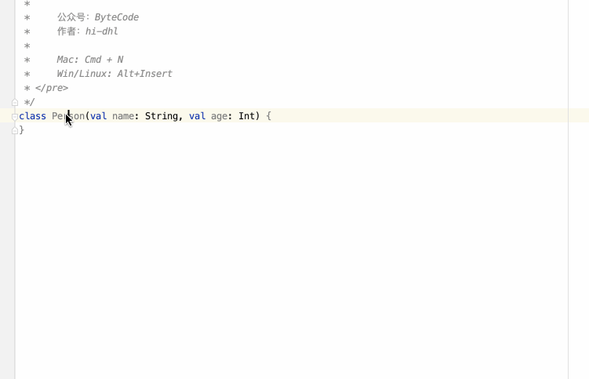
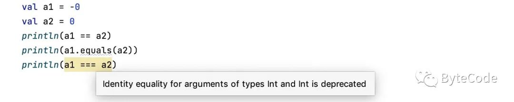
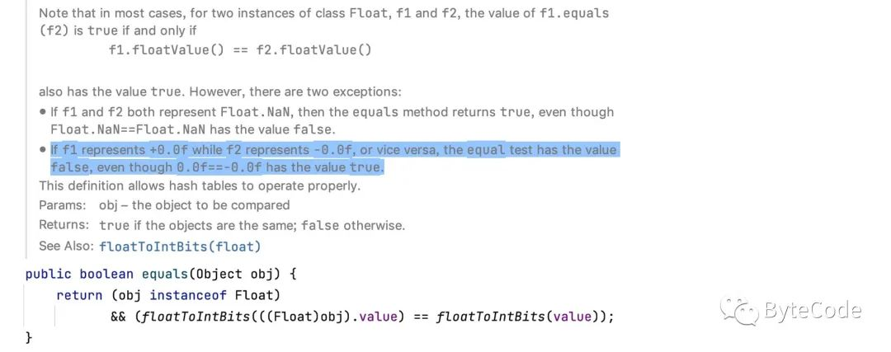
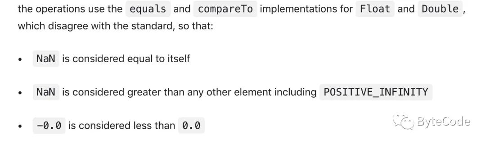

之前分别写了三篇文章，从原理、优化、实战、新特性（密封接口）以不同的角度分别介绍了  Sealed Classes。

- [Kotlin 密封类进化了](https://mp.weixin.qq.com/s?__biz=MzAwNDgwMzU4Mw==&mid=2247484945&idx=1&sn=5e0015cae9919c0acfc8db4de68b7120&scene=21#wechat_redirect)
- [Kotlin 中的密封类 优于 带标签的类](https://mp.weixin.qq.com/s?__biz=MzAwNDgwMzU4Mw==&mid=2247484930&idx=1&sn=b204262962852743b112cb6de3c3eb65&scene=21#wechat_redirect)
- [Kotlin Sealed 是什么？为什么 Google 都在用](https://mp.weixin.qq.com/s?__biz=MzAwNDgwMzU4Mw==&mid=2247483868&idx=1&sn=2d3616f222349700cf616af086d82d78&scene=21#wechat_redirect)

而这篇文章我们主要来分析 Kotlin 中的操作符 `==` 和 `===` 的区别，以及它们分别在什么场景下使用。这些操作符在实际项目和开源项目中，使用的频率非常的高。主要包含以下内容：

- Java 中的 `==` 和 `equals` 的区别？

- Kotlin 提供的操作符 `==` 和 `===` 分别做什么用？

- - 比较对象的结构是否相等( `==` 或者 `equals` )
  - 比较对象的引用是否相等 (`===` )

- Kotlin 中的操作符在以下场景中的使用

- - 基本数据类型
  - 包装类
  - 普通类
  - 数据类

在开始分析之前，我们先来简单回顾一下 Java 中的操作符 `==` 和 `equals` 的区别。

## Java 中的操作符 ==  和 equals 的区别

**操作符 ==**

- 如果是基本数据类型比较的是值
- 如果是引用数据类型比较的是地址

**操作符 equals**

- 默认情况下在不重写 `equals` 方法时，等价于 `==`，比较的是地址

```
public boolean equals(Object obj) {
    return (this == obj);
}
```

- 重写 `equals` 方法时，一般用于比较结构是否相等，例如 `String`

```
public boolean equals(Object anObject) {
    if (this == anObject) {
        return true;
    }
    if (anObject instanceof String) {
        String anotherString = (String)anObject;
        int n = value.length;
        if (n == anotherString.value.length) {
            char v1[] = value;
            char v2[] = anotherString.value;
            int i = 0;
            while (n-- != 0) {
                if (v1[i] != v2[i])
                    return false;
                i++;
            }
            return true;
        }
    }
    return false;
}
```

但是需要注意的是重写 `equals` 方法时，需要重写 `hashCode()` 方法，否则无法和 hash 集合类一起正常工作，可以通过快捷键自动生成 `equals()` 、`hashCode()` 、 `toString()` 等等方法。

- Mac: Cmd + N
- Win/Linux: Alt+Insert



更多 AndroidStudio 快捷键使用技巧查看下列文章：

- [图解多平台 AndroidStudio 技巧(一)](https://mp.weixin.qq.com/s?__biz=MzAwNDgwMzU4Mw==&mid=2247484647&idx=1&sn=d64a4ec8ca991fde7ab56ee6a0bba067&scene=21#wechat_redirect)
- [图解多平台 AndroidStudio 技巧(二)](https://mp.weixin.qq.com/s?__biz=MzAwNDgwMzU4Mw==&mid=2247484681&idx=1&sn=f13f1ddb93e463d4178c9506c8e6549c&scene=21#wechat_redirect)
- [图解多平台 AndroidStudio 技巧(三)](https://mp.weixin.qq.com/s?__biz=MzAwNDgwMzU4Mw==&mid=2247484855&idx=1&sn=6beb6550bd75d47f16e40f306f248094&scene=21#wechat_redirect)

关于 Java 的操作符介绍就到这里了，接下来重点来分析 Kotlin 中的操作符。

## Kotlin 中的操作符 == 和 === 及 equals

Kotlin 提供了两种方式用于对象的比较。

- 比较对象的结构是否相等（ `==` 或者 `equals` ）

  Kotlin 中的操作符 `==` 等价于 `equals` 用于比较对象的结构是否相等, 很多情况下使用的是 `==`，因为对于浮点类型 Float 和 Double，其实现方法 `equals` 不遵循 IEEE 754 浮点运算标准。

- 比较对象的引用是否相等 ( `===` )

  Kotlin 中的操作符 `===` 用于比较对象的引用是否指向同一个对象，运行时如果是基本数据类型 `===` 等价于 `==`。

我们知道了基本概念之后，接下来一起来看一下这些操作符（ `==` 和 `===` 及 `equals` ），在以下场景中的使用。

- 基本数据类型
- 包装类
- 普通类
- 数据类

### 基本数据类型

我们先来看一个例子：

```
val a1 = -0
val a2 = 0
println(a1 == a2)       // true
println(a1.equals(a2))  // true
println(a1 === a2)      // true

a1 = 100
a2 = 100
println(a1 == a2)       // true
println(a1.equals(a2))  // true
println(a1 === a2)      // true
```

运行时，对于基本数据类型 `===` 等价于 `==` 比较的是值（即对象的结构是否相等），如果比较基本数据类型时使用 `===`，编译器就会给出一个警告，不建议使用。



但是 `equals` 比较特殊, 对于浮点类型 Float 和 Double 却有不同的表现，代码如下所示。

```
val a3 = -0f
val a4 = 0f
println(a3 == a4)       // true
println(a3.equals(a4))  // false
println(a3 === a4)      // true
```

正如你所看到的 `a3.equals(a4)` 结果为 false，那么为什么会这样呢，一起来查看反编译后的 Java 代码都做了什么。`Tools → Kotlin → Show Kotlin Bytecode` 。

```
float a3 = -0.0F;
float a4 = 0.0F;
boolean var2 = Float.valueOf(a3).equals(a4);
boolean var3 = false;
System.out.println(var2);
```

将 float 转换为包装类型 Float，调用其 `equals` 方法来进行比较，来看一下 `equals` 方法。



运行结果正如源码注释高亮部分一样，使用 `equals` 方法比较 `+0.0f` 和 `-0.0f` 其结果为 false, 如果使用操作符 `==` 结果为 true。

在 `equals` 方法中调用了 `floatToIntBits` 方法，在这个方法中是根据 **IEEE 754 浮点算法标准**，返回指定浮点值的表示形式，结果是一个整数，如下所示。

```
System.out.println(Float.floatToIntBits(-0f));  // -2147483648
System.out.println(Float.floatToIntBits(0f));   // 0
```

正如你所见，`Float.floatToIntBits(-0f)` 计算出来的结果，是整数的最小值 -2147483648，从结果来看它不遵循 **IEEE 754 浮点运算标准**，一起来看一下官方是如何解释的，更多信息点击查看 **IEEE 754 浮点运算标准** *h**ttps://kotlinlang.org/docs/basic-types.html#unsigned-integers*



对于浮点类型 Float 和 Double，其实现方法 `equals` 不遵循 **IEEE 754 浮点运算标准**：

- `NaN` 被认为和它自身相等
- `NaN` 被认为比包括正无穷在内的任何其他元素都大
- `-0.0` 小于 `+0.0`

因此在 Kotlin 中如果使用 `equals` 方法进行比较的时候，需要注意这个情况。

### 包装类

无论是 Java 还是 Kotlin 每一种基本类型都会对应一个唯一的包装类，只不过它们的区分方式不一样。

| 基本数据类型 | 包装类    |
| :----------- | :-------- |
| byte         | Byte      |
| short        | Short     |
| int          | Integer   |
| long         | Long      |
| float        | Float     |
| double       | Double    |
| char         | Character |
| boolean      | Boolean   |

```
val a5 = Integer(10)    
val a6 = Integer(10)
println(a5 == a6)       // true
println(a5.equals(a6))  // true
println(a5 === a6)      // false
```

因为包装类重写了 `equals` 方法，所以使用操作符 `==` 和 `equals` 比较的是对象的结构是否相等，所以结果为 true。而操作符 `===` 比较的是对象的引用，是否指向同一个对象，因为是不同的对象，所以结果为 false。

### 普通的类

普通的类其实就是我们自己新建的类，并没有重写 `equals` 方法，一起来看一下这三种操作符的运行结果。

```
class Person1(val name: String, val age: Int)

val p1 = Person1(name = "hi-dhl", age = 10)
val p2 = Person1(name = "hi-dhl", age = 10)
println(p1 == p2)       // false
println(p1.equals(p2))  // false
println(p1 === p2)      // false

println(p1.name == p2.name)         // true
println(p1.name.equals(p2.name))    // true
println(p1.name === p2.name)        // true
```

因为普通的类 Person1 并没有实现 `equals` 方法，所以使用操作符 `==` 和 `equals` 比较的结果为 false，而 p1 和 p2 是不同的对象所以操作符 `===` 的结果为 false。

参数 name 是 String 类型，在上文分析过了 String 重写了 `equals` 方法，操作符 `==` 和 `equals` 比较的结果为 true。而 `p1.name === p2.name` 结果为 true , 是因为会先去常量池中查找是否存在 "hi-dhl"，如果存在直接返回常量池中的引用。

### 数据类

最后我们在来看一下这三种操作符在数据类中的表现。

```
data class Person2(val name: String, val age: Int)

val p3 = Person2(name = "ByteCode", age = 10)
val p4 = Person2(name = "ByteCode", age = 10)
println(p3 == p4)       // true
println(p3.equals(p4))  // true
println(p3 === p4)      // false

println(p3.name == p4.name)     // true
println(p3.name.equals(p4.name))// true
println(p3.name === p4.name)    // true
```

因为编译器会根据数据类中的参数，自动生成 `equals` 、 `hashCode` 、 `toString` 等等方法，编译后的代码如下所示。

```
public int hashCode() {
  String var10000 = this.name;
  return (var10000 != null ? var10000.hashCode() : 0) * 31 + Integer.hashCode(this.age);
}

public boolean equals(@Nullable Object var1) {
  if (this != var1) {
     if (var1 instanceof Person2) {
        Person2 var2 = (Person2)var1;
        if (Intrinsics.areEqual(this.name, var2.name) && this.age == var2.age) {
           return true;
        }
     }

     return false;
  } else {
     return true;
  }
}
```

所以使用操作符 `==` 和 `equals`，输出结果为 true，但是 p3 和 p4 是不同的对象所以操作符 `===` 的结果为 false。

## 总结

### Java 中的操作符

**操作符 ==**

- 如果是基本数据类型比较的是值
- 如果是引用数据类型比较的是地址

**操作符 equals**

- 默认情况下在不重写 `equals` 方法时，等价于 `==`，比较的是地址

- 重写 `equals` 方法时，常用于比较结构是否相等，可以通过快捷键自动生成 `equals()` 、`hashCode()` 、 `toString()` 等等方法。

- - Mac: Cmd + N
  - Win/Linux: Alt+Insert

### Kotlin 中的操作符

Kotlin 提供了两种方式用于对象的比较。

- 比较对象的结构是否相等（ `==` 或者 `equals` ）

  Kotlin 中的操作符 `==` 等价于 `equals` 用于比较对象的结构是否相等, 很多情况下使用的是 `==`，因为对于浮点类型 Float 和 Double，其实现方法 `equals` 不遵循 IEEE 754 浮点运算标准。

- 比较对象的引用是否相等 ( `===` )

  Kotlin 中的操作符 `===` 用于比较对象的引用是否指向同一个对象，运行时如果是基本数据类型 `===` 等价于 `==`。

全文到这里就结束了，最后附上文章的精简示例，你能够在不运行程序的情况下，说出下面代码的运行结果吗？

```
class Person1(val name: String, val age: Int)
data class Person2(val name: String, val age: Int)

fun main() {
    val a1 = -0
    val a2 = 0
    println(a1 == a2)
    println(a1.equals(a2)

    val a3 = -0f
    val a4 = 0f
    println(a3 == a4)
    println(a3.equals(a4))

    //-------------

    val p1 = Person1(name = "hi-dhl", age = 10)
    val p2 = Person1(name = "hi-dhl", age = 10)
    println(p1 == p2)
    println(p1.equals(p2))
    println(p1 === p2)
    println(p1.name === p2.name)

    //-------------

    val p3 = Person2(name = "ByteCode", age = 10)
    val p4 = Person2(name = "ByteCode", age = 10)
    println(p3 == p4)
    println(p3.equals(p4))
    println(p3 === p4)
    println(p3.name === p4.name)
}
```

运行结果如下所示：

```
a1 == a2        true
a1.equals(a2)   true
a3 == a4        true
a3.equals(a4)   false
--------------------------
p1 == p2        false
p1.equals(p2)   false
p1 === p2       false
p1.name === p2.name true
--------------------------
p3 == p4        true
p3.equals(p4)   true
p3 === p4)      false
p3.name === p4.name true
```