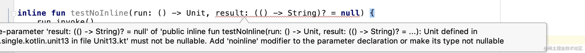
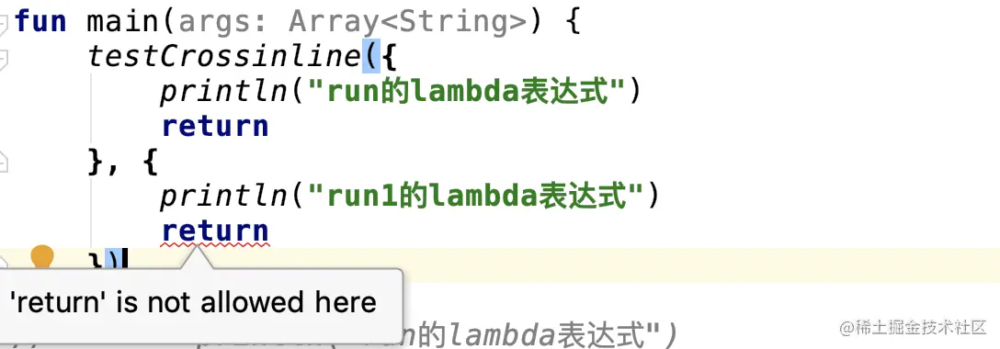
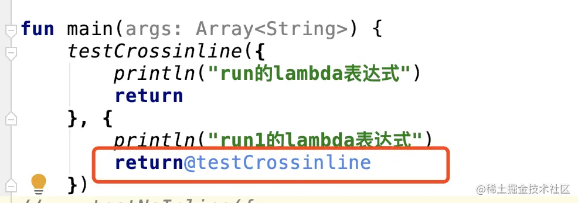

- ### 高阶函数

  相信用过kotlin的开发者们都知道高阶函数是什么，为了更好阐述这篇博客，我还是和大家说说高阶函数是什么，下面通过一个函数来说明高阶函数:

  ```kotlin
  fun runSomething(param: String, run: () -> Unit) {
      println("param:$param")
      run.invoke()
  }
  复制代码
  ```

  和java普通的函数不一样的是，java函数的参数必须是一个变量，而在kotlin中，函数表达式可以是一个表达式，上面的run参数其实是一个Lambda表达式，在调用的地方可以这么写:

  ```go
  runSomething("param1", {
      println("我是高阶函数的第二个参数")
  })
  复制代码
  ```

  在kotlin中有这个语法，如果函数的最后一个参数是一个Lambda表达式，可以将Lambda表达式放在小括号后面，因此又有下面的这种写法:

  ```javascript
  runSomething("param1"){
      println("我是高阶函数的第二个参数")
  }
  复制代码
  ```

  上面的runSomething就是一个高阶函数的函数，高阶函数可以通过传Lambda表达式的形式作为函数的参数。

  ### 扩展函数、扩展属性

  扩展函数一般指类的方法、变量的扩展，下面也通过例子来看如果扩展类的方法、变量，由于是对类的扩展，我这里先定义一个kotlin的类：

  ```kotlin
  class Animal
  复制代码
  ```

  一个动物类，然后扩展了eat(吃的方法)和name(名字的属性):

  ```kotlin
  fun Animal.eat(eat: () -> Unit) {
      eat.invoke()
  }
  
  val Animal.name: String
      get() {
          return "熊猫"
      }
  复制代码
  ```

  所以我们在用的时候，可以这么用:

  ```ini
  val animal = Animal()
  animal.eat {
      println("我吃竹子")
  }
  val animalName = animal.name
  复制代码
  ```

  说完了上面的高阶函数和扩展函数，下面要说下高阶函数中的内联函数。

  ### 内联函数(inline)

  相信大家在读kotlin很多源码的时候，都用了`inline`关键字，其实这个关键字在表面上是看不出来效果的，大家需要通过反编译的工具查看kotlin生成的class文件，给大家推荐一款比较不错的反编译工具，[jadx](https://link.juejin.cn?target=https%3A%2F%2Fgithub.com%2Fskylot%2Fjadx)，关于怎么用这个工具，github主页有介绍，我就直接拿反编译的代码，先看下没有带inline关键字的高阶函数，还是拿上面的runSomething函数作为例子，没有用inline修饰runSomething函数，在调用的地方是这样的:

  ```less
  public final class Unit13Kt {
      public static final void runSomething(@NotNull String param, @NotNull Function0<Unit> run) {
          Intrinsics.checkParameterIsNotNull(param, "param");
          Intrinsics.checkParameterIsNotNull(run, "run");
          System.out.println("param:" + param);
          run.invoke();
      }
  
      public static final void main(@NotNull String[] args) {
          Intrinsics.checkParameterIsNotNull(args, "args");
          //第二个参数是main.1.INSTANCE对象
          runSomething("param1", main.1.INSTANCE);
      }
  }
  
  //kotlin自动生成的一个类
  final class Unit13Kt$main$1 extends Lambda implements Function0<Unit> {
      //这里是runSomething方法用到的第二个参数
      public static final Unit13Kt$main$1 INSTANCE = new Unit13Kt$main$1();
  
      Unit13Kt$main$1() {
          super(0);
      }
  
      public final void invoke() {
          System.out.println("我是高阶函数的第二个参数");
      }
  }
  复制代码
  ```

  从上面反编译的代码可以看出来，runSomething的第二个参数传的是`main.1.INSTANCE`变量，而`main.1.INSTANCE`变量`Unit13Kt$main$1`类的一个变量，`Unit13Kt$main$1`是kotin自动生成的一个类，它继承了`Lambda`类实现了`Function0<Unit>`接口，关于lambda表达式的参数是几个对应的是java中Function**接口，大家可以测试看下lambda传参的情况，这里就不测试了。而它的invoke方法里面的语句是上面定义lambda表达式的方法体。 下面来看下高阶函数加inline关键字的情况，inline用法很简单，只需要在runSomething方法前面加个inline关键字:

  ```kotlin
  inline fun runSomething(param: String, run: () -> Unit) {
      println("param:$param")
      run.invoke()
  }
  复制代码
  ```

  我们主要来看下inline下生成的反编译代码:

  ```less
  public final class Unit13Kt {
      public static final void runSomething(@NotNull String param, @NotNull Function0<Unit> run) {
          Intrinsics.checkParameterIsNotNull(param, "param");
          Intrinsics.checkParameterIsNotNull(run, "run");
          System.out.println("param:" + param);
          run.invoke();
      }
  
      public static final void main(@NotNull String[] args) {
          Intrinsics.checkParameterIsNotNull(args, "args");
          System.out.println("param:" + "param1");
          System.out.println("我是高阶函数的第二个参数");
      }
  }
  复制代码
  ```

  **inline不会改变方法本身，只会改变调用处不会生成对应的intance变量来作为参数runSomething，而是直接将高阶函数的方法体挪到调用处，减少对象的创建。**

  #### 小结

  相信看了上面的反编译代码后，大家对inline有个初步的认识，而在实际使用中需要注意什么呢，如果该高阶函数使用的频率比较高，那么一般需要定义该高阶函数为inline类型，减少不必要的对象创建，反之该高阶函数使用不是很频繁，我们就没必要定义成inline类型的高阶函数，毕竟inline会带来程序的效率问题，可以说inline是用效率来换内存问题。

  ### noinline

  说完inline关键字后，相信大家还见过`noinline`，这个是跟inline相对立的，必须跟inline搭配着才能使用:

  

  

  这里截了一张图，在testNoInlne函数里面的第二个参数我定义为可空的lambda表达式，此时提示该lambda表达式必须要定义成noinline表达式，这是为什么呢，大家可以脑补下，如果是内联的表达式的话，是不是就没法给result表达式判空了呢，是不是这样的，我们在后面反编译代码中可以验证，那下面我们还是乖乖地加上noinline关键字:

  

  ```go
  testNoInline({
      println("run的lambda表达式")
  }, {
      println("result的lambda表达式")
      "result"
  })
  复制代码
  ```

  这里只是简单的测试代码，上面测试代码注意了，**lambda表达式的返回值是最后一个语句**，因此我加了个"result"的返回值。我们重点来看下反编译的代码:

  ```less
  public static final void testNoInline(@NotNull Function0<Unit> run, @Nullable Function0<String> result) {
      Intrinsics.checkParameterIsNotNull(run, "run");
      run.invoke();
      if (result != null) {
          String str = (String) result.invoke();
      }
  }
  
  public static final void main(@NotNull String[] args) {
      Intrinsics.checkParameterIsNotNull(args, "args");
      Function0 result$iv = main.2.INSTANCE;
      System.out.println("run的lambda表达式");
      if (result$iv != null) {
          String str = (String) result$iv.invoke();
      }
  }
  复制代码
  ```

  通过反编译可以看到如果在lambda表达式加了可空的修饰的话，会提示我们需要给lambda表达式加noinline关键字，因为在反编译代码需要加非空判断，如果没有noinline关键字，就没有instance的变量，也就没法处理非空的逻辑了，可以看出来result的lambda表达式需要定义成noinline的，而run表达式就没什么好说的，正常的走inline的修饰。

  #### 小结

  `noinline`用在不需要inline的lambda表达式上，比如上面的result表达式就需要定义成noinline表达式，如果定义成noinline，说明该表达式需要生成对应的instance变量的处理。

  ### crossinline

  可以说在我们自己定义高阶函数的时候，很少用到`crossinline`修饰符，该修饰符对于上面的`inline`和`noinline`，它只是在语法层面的一种规范，**crossinline也必须和inline搭配使用**下面通过例子也来说下:

  ```kotlin
  inline fun testCrossinline(run: () -> Unit, crossinline run1: () -> Unit) {
      run.invoke()
      run1.invoke()
  }
  复制代码
  ```

  定义了一个run1是crossinline类型的，然后看下调用的地方:

  

  

  在run1表达式中尝试使用return语句，直接提示不能这么使用，而在上面的run表达式中可以使用return表达式，说明`crossinline`限制了返回的范围，如果直接返回外层的方法是不行的，只能返回当前的方法，那怎么改才是对的呢:

  

  

  

  

  所以只能返回当前的函数，不能直接返回外层的main方法上，下面也来看看反编译的代码:

  ```less
  public static final void testCrossinline(@NotNull Function0<Unit> run, @NotNull Function0<Unit> run1) {
      Intrinsics.checkParameterIsNotNull(run, "run");
      Intrinsics.checkParameterIsNotNull(run1, "run1");
      run.invoke();
      run1.invoke();
  }
  
  public static final void main(@NotNull String[] args) {
      Intrinsics.checkParameterIsNotNull(args, "args");
      System.out.println("run的lambda表达式");
  }
  复制代码
  ```

  可以看到run1表达式是直接没有执行，是不是觉得`crossinline`很牛叉的样子，看来`crossinline`可以用在某些条件下不想执行lambda表达式的作用，所以return当前的方法就是不执行该表达式的作用。

  #### 小结

  `crossinline`用在某些条件下不想执行lambda表达式的作用，通过return当前的方法可以不执行表达式。这种在kotlin源码中很少见，如果大家看到kotlin源码中有关于`crossinline`的使用，可以对应该结论看下是不是这么回事。

  其实关于kotlin的高阶函数、扩展函数、扩展属性、内联函数在很多地方可以见到，在我们用到的kotlin标准函数，比如let、run、apply、also、with等都是用到了函数的扩展以及内联的使用。有时间，我把let这几个函数讲解给补上。

  ### 总结

  - 高阶函数:通过表达式作为函数的参数，该函数就是一个高阶函数
  - 扩展方法、扩展属性:通过不改变原有的类来重新定义一个函数、变量的形式来达到扩展的效果。
  - inline:是内联函数的一种体现，如果用了inline的函数，则lambda表达式不会产生多余的lambda对象，将方法体直接挪到了调用处，一般用在方法频繁调用的时候
  - noinline:是和inline对立的，但是需要和inline函数搭配使用，如果定义成noinline的表达式，则会产生对象，一般需要通过该对象操作某些逻辑而不得定义成noinline类型的lambda表达式，如上面的可空的lambda表达式。
  - crossinline:用在不能直接return外层的方法，而只能return当前方法。因为return当前方法的话，相当于不执行该表达式，一般用在某些条件下不执行该表达式的情况。