# 1.基本数据类型


 在Kotlin中，一切皆是对象。不存在int, double等关键字，只存在Int, Double等类。 

# 2.指针声明变量

 所有的对象都通过一个指针所持有，而指针只有两种类型：var 表示指针可变，val表示指针不可变。为了获得更好的空安全，Kotlin中所有的对象都明确指明可空或者非空属性，即这个对象是否可能为null。 

```kotlin
//类型后面添加 ? 标识可以为空
var age:String?="23"
//不做处理返回null
var age1 = age?.toInt()
//age 为空 返回 -1
val age2 = age?.toInt()?:-1
//抛出空指针异常
val age3 = age!!.toInt()
```

 对于可空类型的对象，直接调用其方法，在编译阶段就会报错。这样就杜绝了空指针异常NullPointerException的可能性。 

```kotlin
val age:String?= "30"
val agei:Int = age.toInt()
// 编译器会报错
//Error:Only safe (?.) or non-null asserted (!!.) calls are allowed on a nullable receiver of type String
```

## A：? 与!! 关系与区别  

1. =="?"加在变量名后，系统在任何情况不会报它的空指针异常。==
2. =="!!"加在变量名后，如果对象为null，那么系统一定会报异常！==

```kotlin
        val myList : ArrayList<String>? = null
        Log.d("TAG", "-->> List Size = ${myList!!.size}")
       //myList 为空 报错
        Caused by: kotlin.KotlinNullPointerException
        at com.example.androidproject.MainActivity.onCreate(MainActivity.kt:12)
        at android.app.Activity.performCreate(Activity.java:7894)
        at android.app.Activity.performCreate(Activity.java:7881)
        at android.app.Instrumentation.callActivityOnCreate(Instrumentation.java:1307)
        at android.app.ActivityThread.performLaunchActivity(ActivityThread.java:3283)
```

```kotlin
 		val myList : ArrayList<String>? = null
    	Log.d("TAG", "-->> List Size = ${myList?.size}")
          //myList 为空 不会报错 打印 null
         2020-07-21 15:50:46.839 8433-8433/com.example.androidproject D/sundu: -->> List Size = null
```
总结：==？空检测 用来避免空指针异常  !! 用来在需要的时候抛出空异常==

其他用法

```kotlin
    // 这样程序就默认的给room加上了!!，从此以后room不允许为null
    var room: Room = Room()
    private fun checkRoom() {
        // 当把null赋给room时，从编译的时候就已经不通过
        room = null
        // 并且编译器建议把对象后面的问号删除，因为这个对象永远不为空
        Log.d("TAG", "-->> room name = ${room.roomName}")
    }
```

 所以加上?是一种安全的写法，它体现了Kotlin null safety的特性。
KT的语法很灵动，定义参数还可以写成 

```kotlin
    val room: Room? = Room()    // 先实例化一个room，并且room可以为空
    val room: Room? = null  // 不实例化了，开始room就是空的

    val room: Room = Room()   // 实例化一个room，并且room永远不能为空
    val room = Room()   // 和上一行代码一样，是KT最常用的简写语法
```


```csharp
        val roomList: ArrayList<Room>? = null
        if (roomList?.size > 0) {
            Log.d("TAG", "-->> 房间数不是0")
        }
```

当我们判断list.size的时候，编译器会告诉我们"Operator call corresponds to a dot-qualified call 'roomList?.size.compareTo(0)' which is not allowed on a nullable receiver 'roomList?.size'."。大概意思是，当roomList为null的时，它的size返回就是"null"，但是"null"不可以和int值比大小，所以编译器建议我们写成roomList?.size!! > 0。

没错，经过编译器的建议加上了!!，我们程序运行到这行代码，roomList为null时它一定会报异常。所以是不是必须得在外面套一层if(roomList != null)这种Java常见语句才能避免异常吗？

==当然Kotlin不会让程序出现这种啰嗦的代码，所以里面提供了对象A ?: 对象B表达式，并且取消了Java中的条件表达式 ? 表达式1 : 表达式2这个三元表达式。
 ?:表示的意思是，当对象A值为null的时候，那么它就会返回后面的对象B。==

```kotlin
        val roomList: ArrayList<Room>? = null
        val mySize= roomList?.size ?: 0  


        val roomList: ArrayList<Room>? = null
        if (roomList?.size ?: 0 > 0) {    // 这一行添加了?:
            Log.d("TAG", "-->> 房间数不是0")
        }

```

## B：'?.' '?:' '!!' 'as?' '?'

#### `?.`安全调用符


```java
if (foo != null){
    return foo.bar()
}else{
    return null
}
```

#### `?:`

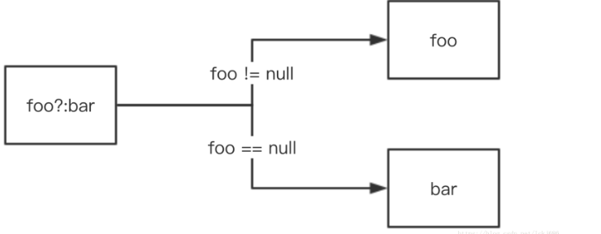

#### `as?`

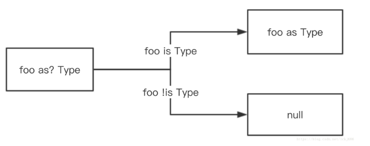

#### `!!`

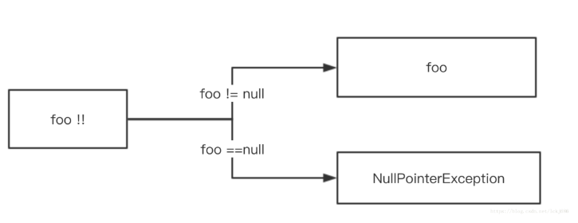

# 3:？表达式和Elvis表达式

 Kotlin特有的？表达式和Elvis表达式可以在确保安全的情况下，写出更加简洁的代码。比如我们在Android页面开发中常见的删除子控件操作，用Java来写是这样的： 

```java
if(view!= null){
    if(view.getParent() != null){
        if(view.getParent instanceof ViewGroup){
            ((ViewGroup)(view.getParent())).removeView(view)
        }
    }
}
```

 为了获得更加安全的代码，我们不得不加上很多if else 判断语句，来确保不会产生空指针异常。但Kotlin的？操作符可以非常简洁地实现上述逻辑： 

```kotlin
(view?.parent as? ViewGroup)?removeView(view)
```

 那么这个？表达式的内在逻辑是什么呢？以上述代码为例，若view == null，则后续调用均不会走到，整个表达式直接返回null，也不会抛出异常。也就是说，？表达式中，只要某个操作对象为null，则整个表达式直接返回null 

==除了？表达式Kotlin还有个大杀器叫Elvis表达式，即？： 表达式，这两个表达式加在一起可以以超简洁的形式表述一个复杂逻辑==

```kotlin

val v = a?.b?:c
//我们以b把它划分成两个部分。若前面部分为null，则整个表达式返回值等于c的值，否则等于前面部分的值。把它翻译成Java代码，是这样的

var temp = if(a!= null) a.b else null
val v = if(temp!= null) temp else c

//同样等价于
val v = if(a == null || a.b = null) c else a.b
//即Elvis表达式的含义在于为整个 ？表达式托底，即若整个表达式已经为null的情况下，Elvis表达式能够让这个表达式有个自定义的默认值。这样进一步保证了空安全，同时代码也不失简洁性。
```


# 4.简洁字符串


 同Java一样，Kotlin也可以用字面量对字符串对象进行初始化，但Kotlin有个特别的地方是使用了三引号”””来方便长篇字符串的书写。而且这种方法还不需要使用转义符。做到了字符串的所见即所得。 


```kotlin
val text = """
for(c in "foo"){
	print(c)
}
```


 Kotlin还引入了字符串模板，可以在字符串中直接访问变量和使用表达式： 

```kotlin
fun testString2(){
    val strings = arrayListOf("abc","efd"."gfg")
    println("First content is $strings")
    println("First content is ${strings[0]}")
    println("First content is ${if(strings.size > 0) strings[0] else "null"}")
}
```

# 5: 强大的when 语句

 Kotlin中没有switch操作符，而是使用when语句来替代。同样的，when 将它的参数和所有的分支条件顺序比较，直到某个分支满足条件。如果其他分支都不满足条件将会进入 else 分支。 

```kotlin
when(x){
    1-> print("x == 1")
    2-> print("x == 2")
    else->{
        print("x is neither 1 nor 2")
    }
}
```

## 1. 任意表达式（而不只是常量）作为分支条件 

```kotlin
when(x){
    in 1..10 -> print("x is int the range")
    !in 10..20 -> print("x is outside the range")
    is String -> print("x is a string")
    else -> {
        print("none of ths above")
    } 
}
```

 说起if else 链，我们可以直接用when语句把它给替换掉： 

```kotlin
when{
    x.isOdd()->print("x is odd")
    x.isEvent->print("x is event")
    else->print("x is funny")
}
```

# 6：对象比较

 Java的 == 操作符是比较引用值，但Kotlin 的 == 操作符是比较内容， === 才是比较引用值。基于这点，我们可以写出逻辑更简洁合理的代码： 

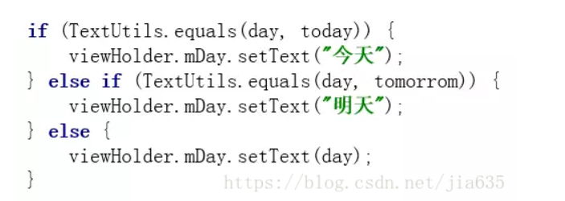


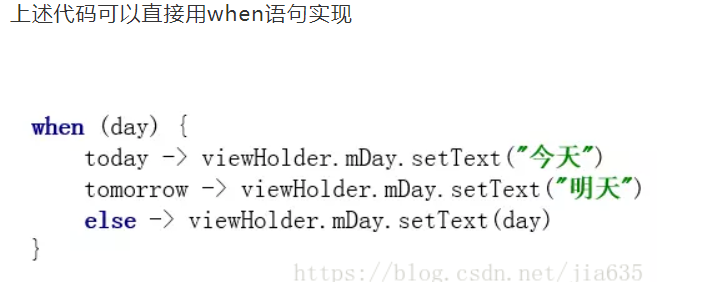


# 7：Nullable Receiver

 NullableReceiver我将其翻译成“可空接收者”，要理解接收者这个概念，我们先了解一下Kotlin中一个重要特性：扩展。Kotlin能够扩展一个类的新功能，这个扩展是无痕的，即我们无需继承该类或使用像装饰者的设计模式，同时这个扩展对使用者来说也是透明的，即使用者在使用该类扩展功能时，就像使用这个类自身的功能一样的。 

 声明一个扩展函数，我们需要用一个接收者类型，也就是被扩展的类型来作为他的前缀，以下述代码为例 

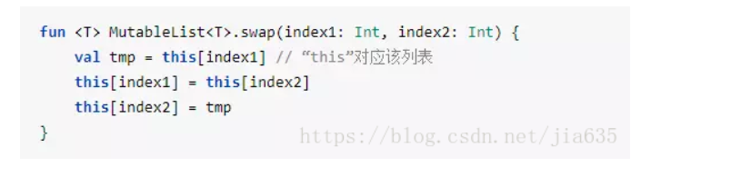

 上述代码为 MutableList<Int> 添加一个swap 函数， 我们可以对任意 MutableList<Int> 调用该函数了： 

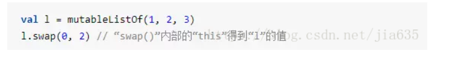

 其中MutableList<Int>就是这个扩展函数的接收者。值得注意的是，Kotlin允许这个接收者为null，这样我们可以写出一些在Java里面看似不可思议的代码。比如我们要把一个对象转换成字符串，在Kotlin中可以直接这么写： 

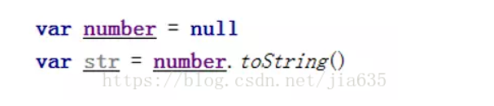

 上述代码先定义了一个空指针对象，然后调用toString方法，会不会Crash？其实不会发生Crash，答案就在“可空接收者”，也就是Nullable Receiver，我们可以看下这个扩展函数的定义： 

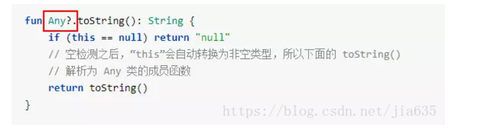

 扩展函数是可以拿到接收者对象的指针的，即this指针。从这个方法的定义我们可以看到，这个方法是对Any类进行扩展，而接收者类型后面加了个?号，所以准确来说，是对Any?类进行扩展。我们看到，扩展函数一开始就对接收者进行判空，若为null，则直接返回 “null” 字符串。所以无论对于什么对象，调用toString方法不会发生Crash. 

# 8:关键字Object

前面说过，kotlin 中一切皆是对象 object 再kotlin中是一个关键字，笼统来说是代表对象，在不同的场景中来说有不同的用法，

第一个：对象表达式，可以直接创建一个继承自某个或者某些类型的匿名对象，而无需先创建这个对象的类，这一点跟java类似：

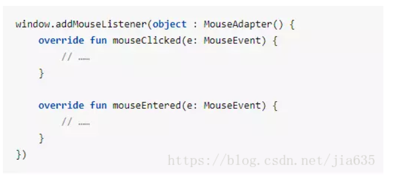

第二个：对象字面量，这个特性将数字字面量/字符字面量扩展到一般对象，对应的场景是我们如果只需要“一个对象而已”，并不需要超类型，典型的是某个地方比如函数部内部，我们需要零碎的使用一些一次性的对象的时候，非常有用

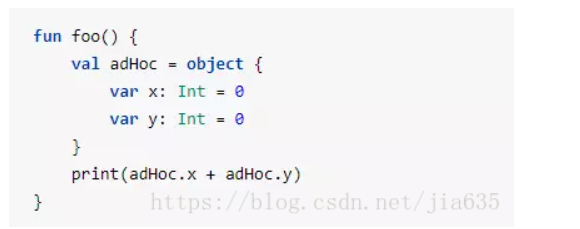


第三：对象声明：这个特性类似与java中的单例模式，但是我们不需要写单例模式的样板代码既可以实现

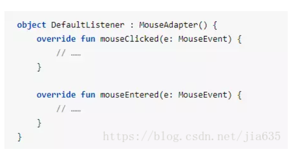

 请注意上述代码是声明了一个对象，而不是类，而我们想要使用这个对象，直接引用其名称即可： 

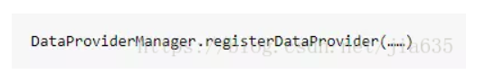

# 8：有趣的“冒号”

从语法上看，kotlin大量的使用的冒号（:）,这一符号，我们可以总结下，这个冒号再kotlin‘中究竟代表了什么

四种场景：

在变量定义中 ：代表类型

在类定义中：代表了基类类型

在函数定义中：代表了对象类型

在匿名对象中：代表了对象类型

总的来说，Kotlin 的设计者应该就是先用冒号来同意表示类型的这个概念

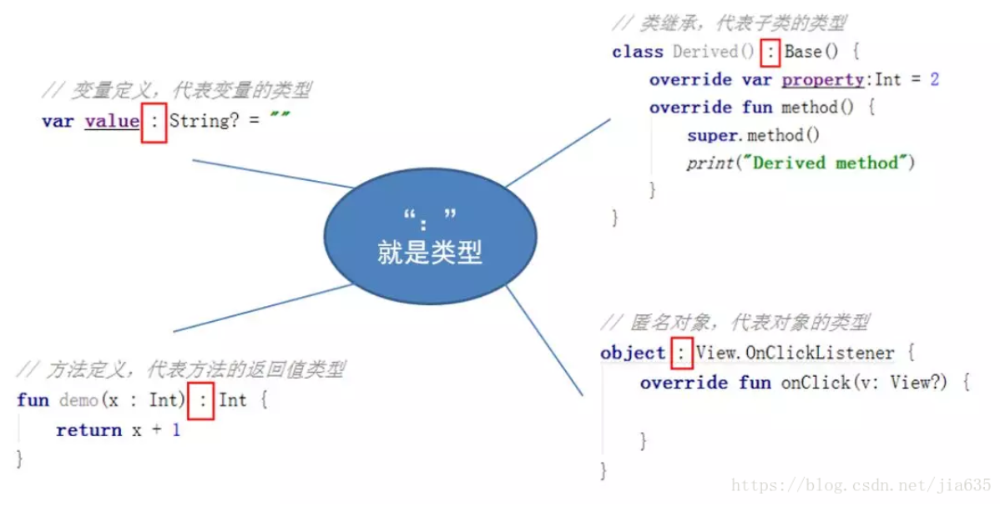


# 9：可观察性

 可观察属性，本质就是观察者模式，在Java中也可以实现这个设计模式，但Kotlin实现观察者模式不需要样板代码。在谈Kotlin的可观察属性前，先看下Kotlin里面的委托。同样的，委托也是一种设计模式，它的结构如下图所示： 

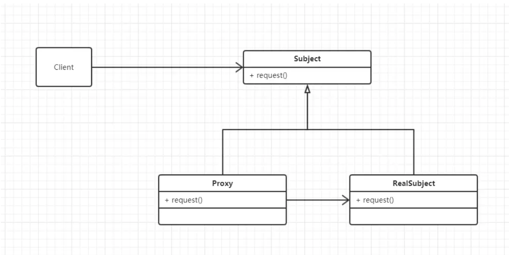

 Kotlin在语言级别支持它，不需要任何样板代码。Kotlin可以使用by关键字把子类的所有公有成员都委托给指定对象来实现基类的接口： 

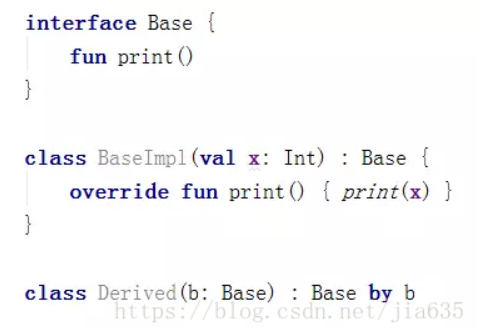

 上述代码中，Base是一个接口，BaseImpl是它的一个实现类，通过by b语句就可以把Derived类中的所有公有成员全部委托给b对象来实现。我们在创建Derived类时，在构造器中直接传入一个BaseImpl的实例，那么调用Derived的方法等同于调用BaseImpl的实例的方法，访问Derived的属性也等同于访问BaseImpl的实例的属性。 

 回到可观察属性这个概念，Kotlin通过 Delegates.observable()实现可观察属性： 

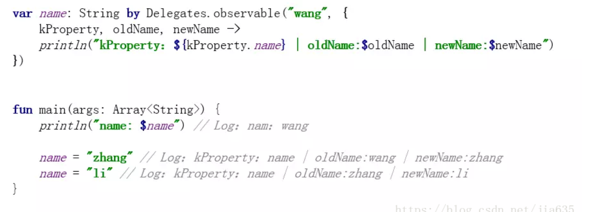

上述代码中，name是一个属性，改变它的值都会自动回调{ kProperty,  oldName,  newName -> }这个lambda表达式。简单来说，我们可以监听name这个属性的变化。


可观察属性有什么用处呢？ListView中有一个经典的Crash：在数据长度与Adapter中的Cell的长度不一致时，会报IllegalStateException异常。这个异常的根本原因是修改了数据之后，没有调用notifyDataSetChanged，导致ListView没有及时刷新。如果我们把数据做成可观察属性，在观察回调方法中直接刷新ListView，可以杜绝这个问题。

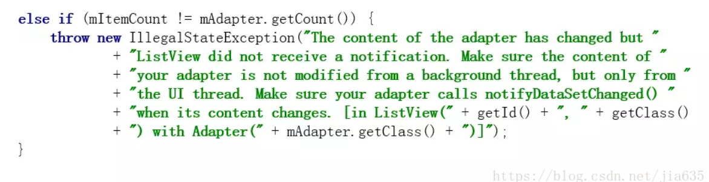


