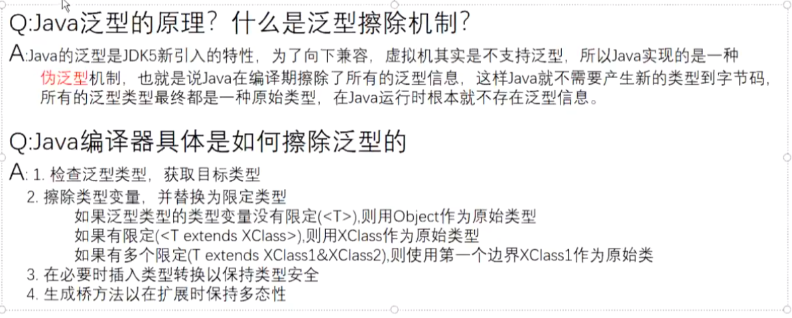
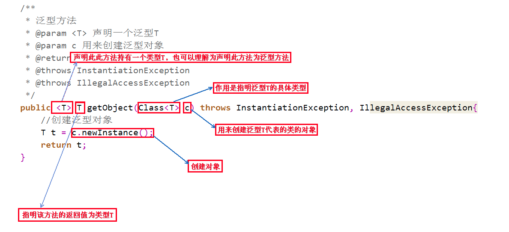
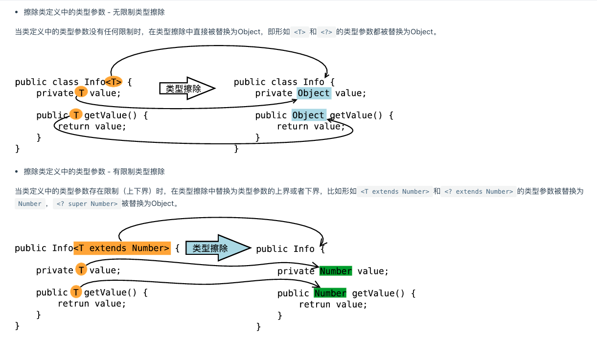
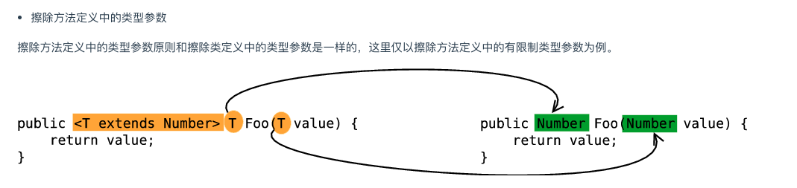

# 1:类的泛型

```java
public class Food<T,K,V>{
  private Object A;
  private Object B;
  private Object C;
  
  public void setData(T,K,V){
    A = T;
    B = K;
    C = V;
  }
}
```

# 2:接口的泛型

```java
public interface Test<T,K>{
  public void setVersion(T,K)
}
```


# 3:方法的泛型

```java
public <T,K> void setVersion<T,K>(T t,K k){
	
}
```





# 4:泛型边界问题

```java
著作权归https://pdai.tech所有。
链接：https://www.pdai.tech/md/java/basic/java-basic-x-generic.html

<?> 无限制通配符
<? extends E> extends 关键字声明了类型的上界，表示参数化的类型可能是所指定的类型，或者是此类型的子类
<? super E> super 关键字声明了类型的下界，表示参数化的类型可能是指定的类型，或者是此类型的父类

// 使用原则《Effictive Java》
// 为了获得最大限度的灵活性，要在表示 生产者或者消费者 的输入参数上使用通配符，使用的规则就是：生产者有上限、消费者有下限
1. 如果参数化类型表示一个 T 的生产者，使用 < ? extends T>;
2. 如果它表示一个 T 的消费者，就使用 < ? super T>；
3. 如果既是生产又是消费，那使用通配符就没什么意义了，因为你需要的是精确的参数类型。
```


```java
private  <E extends Comparable<? super E>> E max(List<? extends E> e1) {
    if (e1 == null){
        return null;
    }
    //迭代器返回的元素属于 E 的某个子类型
    Iterator<? extends E> iterator = e1.iterator();
    E result = iterator.next();
    while (iterator.hasNext()){
        E next = iterator.next();
        if (next.compareTo(result) > 0){
            result = next;
        }
    }
    return result;
}
著作权归https://pdai.tech所有。
链接：https://www.pdai.tech/md/java/basic/java-basic-x-generic.html

上述代码中的类型参数 E 的范围是<E extends Comparable<? super E>>，我们可以分步查看： 要进行比较，所以 E 需要是可比较的类，因此需要 extends Comparable<…>（注意这里不要和继承的 extends 搞混了，不一样） Comparable< ? super E> 要对 E 进行比较，即 E 的消费者，所以需要用 super 而参数 List< ? extends E> 表示要操作的数据是 E 的子类的列表，指定上限，这样容器才够大 多个限制
```

# 5：使用 & 连接多个继承

```java
public class Client {
    //工资低于2500元的上斑族并且站立的乘客车票打8折
    public static <T extends Staff & Passenger> void discount(T t){
        if(t.getSalary()<2500 && t.isStanding()){
            System.out.println("恭喜你！您的车票打八折！");
        }
    }
    public static void main(String[] args) {
        discount(new Me());
    }
}

```

# 6：如何理解Java中的泛型是伪泛型？泛型中类型擦除

**泛型的类型擦除原则**是：

- 消除类型参数声明，即删除`<>`及其包围的部分。
- 根据类型参数的上下界推断并替换所有的类型参数为原生态类型：如果类型参数是无限制通配符或没有上下界限定则替换为Object，如果存在上下界限定则根据子类替换原则取类型参数的最左边限定类型（即父类）。
- 为了保证类型安全，必要时插入强制类型转换代码。
- 自动产生“桥接方法”以保证擦除类型后的代码仍然具有泛型的“多态性”





# 7:泛型类型擦除之后 如何解决 多态问题的？

泛型的桥接方法  -- >所以，虚拟机巧妙的使用了桥方法，来解决了类型擦除和多态的冲突。

```java
class Pair<T> {  

    private T value;  

    public T getValue() {  
        return value;  
    }  

    public void setValue(T value) {  
        this.value = value;  
    }  
}

```

```java
class DateInter extends Pair<Date> {  

    @Override  
    public void setValue(Date value) {  
        super.setValue(value);  
    }  

    @Override  
    public Date getValue() {  
        return super.getValue();  
    }  
}

```

```java
public static void main(String[] args) throws ClassNotFoundException {  
        DateInter dateInter = new DateInter();  
        dateInter.setValue(new Date());                  
        dateInter.setValue(new Object()); //编译错误  
}

```

其中DateInter 中的 setValue 和 getValue 表面上是重载了父类的setValue 和 getValue 底层实现是 通过

重写

public void setValue(T value) {  
        this.value = value;  

​    }  


并桥接调用到 

public void setValue(Date value) {  
        super.setValue(value);  
    }  

首先，我们用javap -c className的方式反编译下DateInter子类的字节码，结果如下：

```java
字节码文件查看
class com.tao.test.DateInter extends com.tao.test.Pair<java.util.Date> {  
  com.tao.test.DateInter();  
    Code:  
       0: aload_0  
       1: invokespecial #8                  // Method com/tao/test/Pair."<init>":()V  
       4: return  

  public void setValue(java.util.Date);  //我们重写的setValue方法  
    Code:  
       0: aload_0  
       1: aload_1  
       2: invokespecial #16                 // Method com/tao/test/Pair.setValue:(Ljava/lang/Object;)V  
       5: return  

  public java.util.Date getValue();    //我们重写的getValue方法  
    Code:  
       0: aload_0  
       1: invokespecial #23                 // Method com/tao/test/Pair.getValue:()Ljava/lang/Object;  
       4: checkcast     #26                 // class java/util/Date  
       7: areturn  

  public java.lang.Object getValue();     //编译时由编译器生成的巧方法  
    Code:  
       0: aload_0  
       1: invokevirtual #28                 // Method getValue:()Ljava/util/Date 去调用我们重写的getValue方法;  
       4: areturn  

  public void setValue(java.lang.Object);   //编译时由编译器生成的巧方法  
    Code:  
       0: aload_0  
       1: aload_1  
       2: checkcast     #26                 // class java/util/Date  
       5: invokevirtual #30                 // Method setValue:(Ljava/util/Date; 去调用我们重写的setValue方法)V  
       8: return  
}

```

# 8：如何实例化一个泛型

泛型不能直接被实例化，可以通过反射来实现实例化

```java
著作权归https://pdai.tech所有。
链接：https://www.pdai.tech/md/java/basic/java-basic-x-generic.html

static <T> T newTclass (Class < T > clazz) throws InstantiationException, IllegalAccessException {
    T obj = clazz.newInstance();
    return obj;
}
```


# 9泛型数组：能不能采用具体的泛型类型进行初始化？

我们先来看下Oracle官网提供的一个例子：

```java
List<String>[] lsa = new List<String>[10]; // Not really allowed.
Object o = lsa;
Object[] oa = (Object[]) o;
List<Integer> li = new ArrayList<Integer>();
li.add(new Integer(3));
oa[1] = li; // Unsound, but passes run time store check
String s = lsa[1].get(0); // Run-time error ClassCastException.

    
```

由于 JVM 泛型的擦除机制，所以上面代码可以给 `oa[1]` 赋值为 ArrayList 也不会出现异常，但是在取出数据的时候却要做一次类型转换，所以就会出现 `ClassCastException`，如果可以进行泛型数组的声明则上面说的这种情况在编译期不会出现任何警告和错误，只有在运行时才会出错，但是泛型的出现就是为了消灭 `ClassCastException`，所以如果 Java 支持泛型数组初始化操作就是搬起石头砸自己的脚。

而对于下面的代码来说是成立的：

```java
List<?>[] lsa = new List<?>[10]; // OK, array of unbounded wildcard type.
Object o = lsa;
Object[] oa = (Object[]) o;
List<Integer> li = new ArrayList<Integer>();
li.add(new Integer(3));
oa[1] = li; // Correct.
Integer i = (Integer) lsa[1].get(0); // OK

  
        @pdai: 代码已经复制到剪贴板
    
```

所以说采用通配符的方式初始化泛型数组是允许的，因为对于通配符的方式最后取出数据是要做显式类型转换的，符合预期逻辑。综述就是说Java 的泛型数组初始化时数组类型不能是具体的泛型类型，只能是通配符的形式，因为具体类型会导致可存入任意类型对象，在取出时会发生类型转换异常，会与泛型的设计思想冲突，而通配符形式本来就需要自己强转，符合预期。

Oracle 官方文档：[https://docs.oracle.com/javase/tutorial/extra/generics/fineprint.html  (opens new window)](https://docs.oracle.com/javase/tutorial/extra/generics/fineprint.html)

更进一步的，我们看看如下的代码：

```java
List<String>[] list11 = new ArrayList<String>[10]; //编译错误，非法创建 
List<String>[] list12 = new ArrayList<?>[10]; //编译错误，需要强转类型 
List<String>[] list13 = (List<String>[]) new ArrayList<?>[10]; //OK，但是会有警告 
List<?>[] list14 = new ArrayList<String>[10]; //编译错误，非法创建 
List<?>[] list15 = new ArrayList<?>[10]; //OK 
List<String>[] list6 = new ArrayList[10]; //OK，但是会有警告

  
        @pdai: 代码已经复制到剪贴板
    
```

因为在 Java 中是不能创建一个确切的泛型类型的数组的，除非是采用通配符的方式且要做显式类型转换才可以。

###  泛型数组：如何正确的初始化泛型数组实例？

> 这个无论我们通过`new ArrayList[10]` 的形式还是通过泛型通配符的形式初始化泛型数组实例都是存在警告的，也就是说仅仅语法合格，运行时潜在的风险需要我们自己来承担，因此那些方式初始化泛型数组都不是最优雅的方式。

我们在使用到泛型数组的场景下应该尽量使用列表集合替换，此外也可以通过使用 `java.lang.reflect.Array.newInstance(Class<T> componentType, int length)` 方法来创建一个具有指定类型和维度的数组，如下：

```java
public class ArrayWithTypeToken<T> {
    private T[] array;

    public ArrayWithTypeToken(Class<T> type, int size) {
        array = (T[]) Array.newInstance(type, size);
    }

    public void put(int index, T item) {
        array[index] = item;
    }

    public T get(int index) {
        return array[index];
    }

    public T[] create() {
        return array;
    }
}
//...

ArrayWithTypeToken<Integer> arrayToken = new ArrayWithTypeToken<Integer>(Integer.class, 100);
Integer[] array = arrayToken.create();
    
```

所以使用反射来初始化泛型数组算是优雅实现，因为泛型类型 `T`在运行时才能被确定下来，我们能创建泛型数组也必然是在 Java 运行时想办法，而运行时能起作用的技术最好的就是反射了。

著作权归https://pdai.tech所有。 链接：https://www.pdai.tech/md/java/basic/java-basic-x-generic.html

### 如何理解泛型类中的静态方法和静态变量？

> 泛型类中的静态方法和静态变量不可以使用泛型类所声明的泛型类型参数

举例说明：

```java
public class Test2<T> {    
    public static T one;   //编译错误    
    public static  T show(T one){ //编译错误    
        return null;    
    }    
}

  
        @pdai: 代码已经复制到剪贴板
    
```

因为泛型类中的泛型参数的实例化是在定义对象的时候指定的，而静态变量和静态方法不需要使用对象来调用。对象都没有创建，如何确定这个泛型参数是何种类型，所以当然是错误的。

但是要注意区分下面的一种情况：

```java
public class Test2<T> {    

    public static <T >T show(T one){ //这是正确的    
        return null;    
    }    
}

  
        @pdai: 代码已经复制到剪贴板
    
```


因为这是一个泛型方法，在泛型方法中使用的T是自己在方法中定义的 T，而不是泛型类中的T。

### [¶](#如何理解异常中使用泛型) 如何理解异常中使用泛型？

- **不能抛出也不能捕获泛型类的对象**。事实上，泛型类扩展Throwable都不合法。例如：下面的定义将不会通过编译：

```java
public class Problem<T> extends Exception {

}

  
        @pdai: 代码已经复制到剪贴板
    
```

为什么不能扩展Throwable，因为异常都是在运行时捕获和抛出的，而在编译的时候，泛型信息全都会被擦除掉，那么，假设上面的编译可行，那么，在看下面的定义：

```java
try{

} catch(Problem<Integer> e1) {

} catch(Problem<Number> e2) {

} 

  
        @pdai: 代码已经复制到剪贴板
    
```


类型信息被擦除后，那么两个地方的catch都变为原始类型Object，那么也就是说，这两个地方的catch变的一模一样,就相当于下面的这样

```java
try{

} catch(Problem<Object> e1) {

} catch(Problem<Object> e2) {

}

  
        @pdai: 代码已经复制到剪贴板
    
```


这个当然就是不行的。

- **不能再catch子句中使用泛型变量**

```java
public static <T extends Throwable> void doWork(Class<T> t) {
    try {
        ...
    } catch(T e) { //编译错误
        ...
    }
}

  
        @pdai: 代码已经复制到剪贴板
    
```


因为泛型信息在编译的时候已经变味原始类型，也就是说上面的T会变为原始类型Throwable，那么如果可以再catch子句中使用泛型变量，那么，下面的定义呢：

```java
public static <T extends Throwable> void doWork(Class<T> t){
    try {

    } catch(T e) { //编译错误

    } catch(IndexOutOfBounds e) {

    }                         
}

  
        @pdai: 代码已经复制到剪贴板
    
```


根据异常捕获的原则，一定是子类在前面，父类在后面，那么上面就违背了这个原则。即使你在使用该静态方法的使用T是`ArrayIndexOutofBounds`，在编译之后还是会变成Throwable，`ArrayIndexOutofBounds`是IndexOutofBounds的子类，违背了异常捕获的原则。所以java为了避免这样的情况，禁止在catch子句中使用泛型变量。

- 但是在异常声明中可以使用类型变量。下面方法是合法的。

```java
public static<T extends Throwable> void doWork(T t) throws T {
    try{
        ...
    } catch(Throwable realCause) {
        t.initCause(realCause);
        throw t; 
    }
}

  
        @pdai: 代码已经复制到剪贴板
    
```

上面的这样使用是没问题的。

### [¶](#如何获取泛型的参数类型) 如何获取泛型的参数类型？

> 既然类型被擦除了，那么如何获取泛型的参数类型呢？可以通过反射（`java.lang.reflect.Type`）获取泛型

`java.lang.reflect.Type`是Java中所有类型的公共高级接口, 代表了Java中的所有类型. Type体系中类型的包括：数组类型(GenericArrayType)、参数化类型(ParameterizedType)、类型变量(TypeVariable)、通配符类型(WildcardType)、原始类型(Class)、基本类型(Class), 以上这些类型都实现Type接口。

```java
public class GenericType<T> {
    private T data;

    public T getData() {
        return data;
    }

    public void setData(T data) {
        this.data = data;
    }

    public static void main(String[] args) {
        GenericType<String> genericType = new GenericType<String>() {};
        Type superclass = genericType.getClass().getGenericSuperclass();
        //getActualTypeArguments 返回确切的泛型参数, 如Map<String, Integer>返回[String, Integer]
        Type type = ((ParameterizedType) superclass).getActualTypeArguments()[0]; 
        System.out.println(type);//class java.lang.String
    }
}

  
        @pdai: 代码已经复制到剪贴板
    
```

其中 `ParameterizedType`:

```java
public interface ParameterizedType extends Type {
    // 返回确切的泛型参数, 如Map<String, Integer>返回[String, Integer]
    Type[] getActualTypeArguments();
    
    //返回当前class或interface声明的类型, 如List<?>返回List
    Type getRawType();
    
    //返回所属类型. 如,当前类型为O<T>.I<S>, 则返回O<T>. 顶级类型将返回null 
    Type getOwnerType();
}

  
```