# 1：死锁 条件

syncnized造成死锁的情况

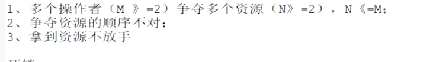

如何避免

使用：lock锁  

尝试拿锁机制

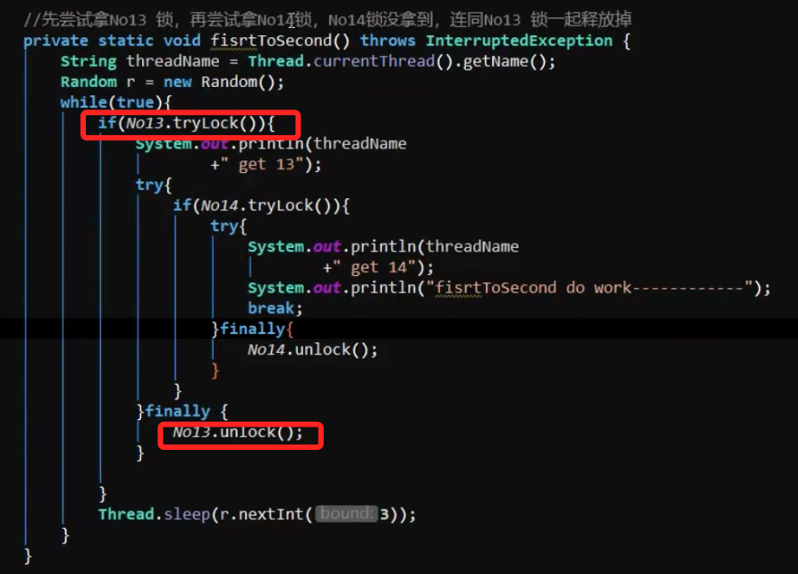

如果没有 Thread.sleep(r.nextInt(3))  会造成“活锁”

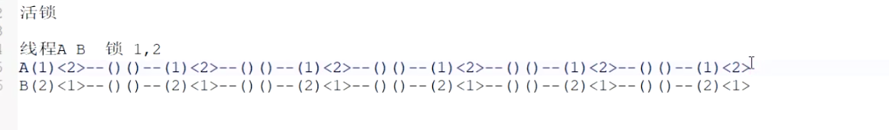

# 2：ThreadLocal

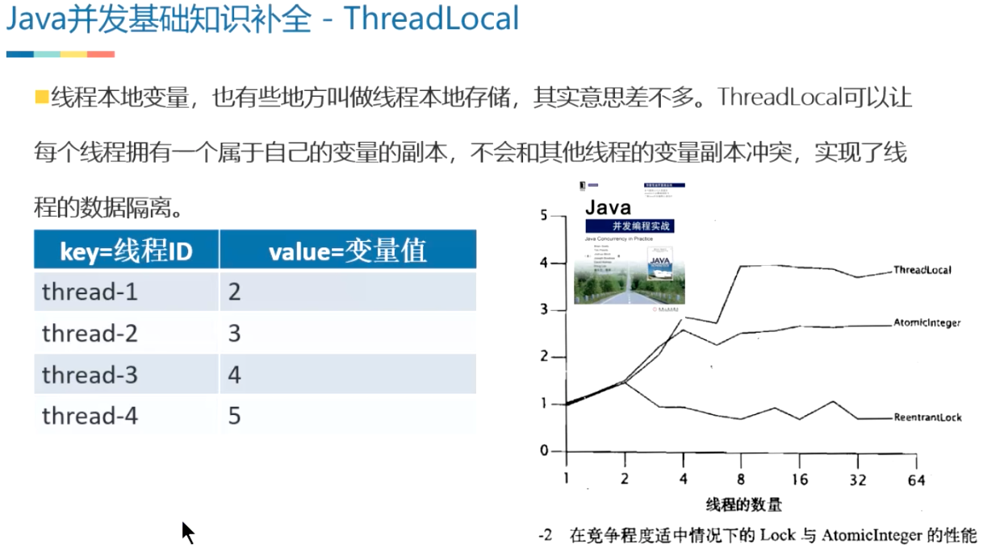

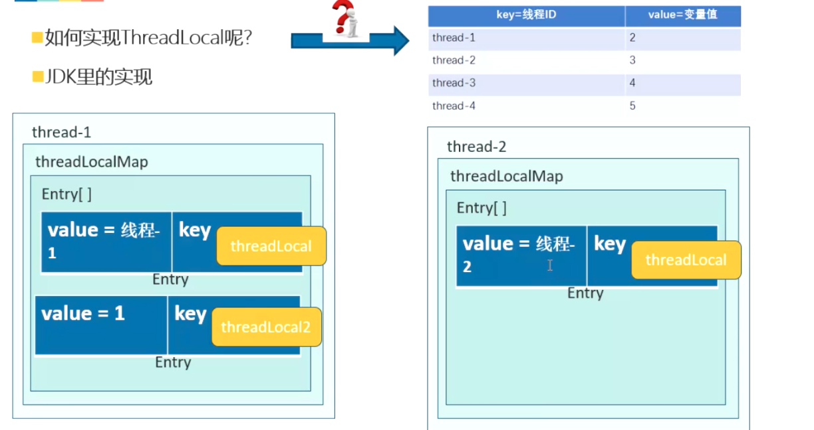

# 3：CAS

关键 CPU 提供的CAS指令

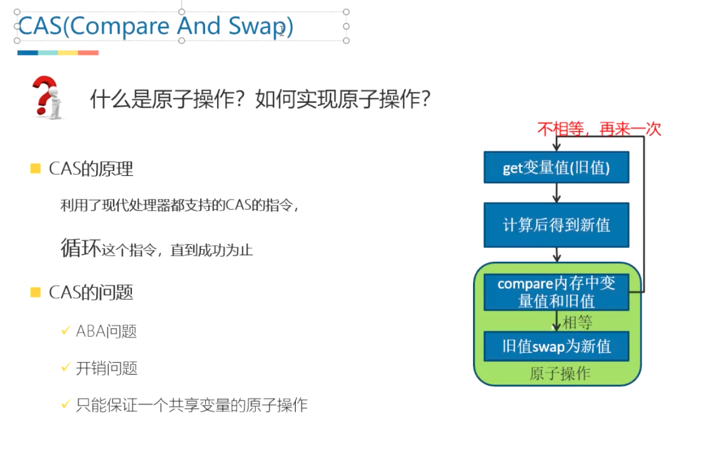

使用：

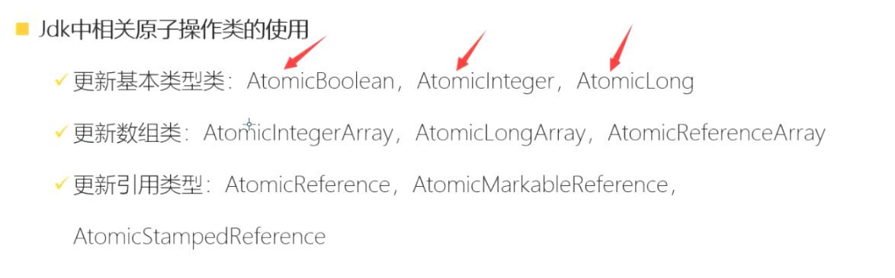

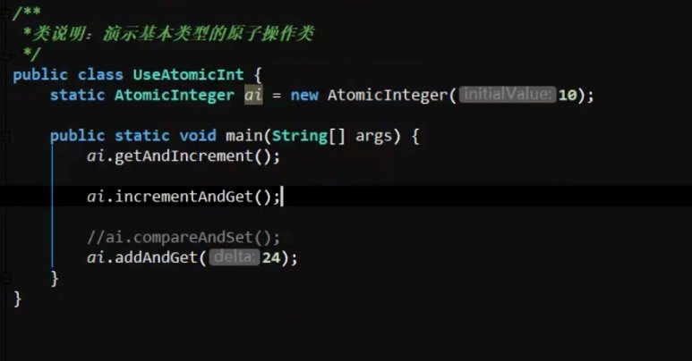

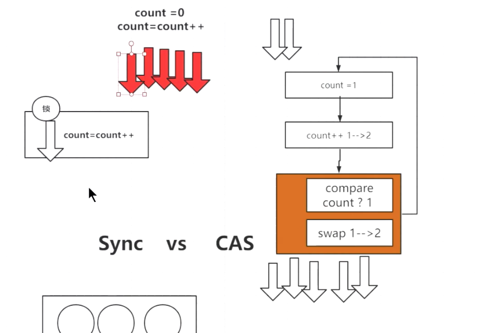

### a:CAS ABA问题：

解决问题：添加版本

AtomicMarkableReference 和 AtomicStampedReference 区别

AtomicMarkableReference 只关心 版本

AtomicStampedReference 不仅关心版本还关心更改了几次

b:开销问题：

c:只能保证一个共享变量的原子操作

# 4：阻塞队列

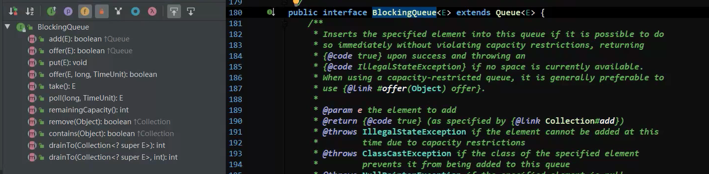

解决生产者消费者问题

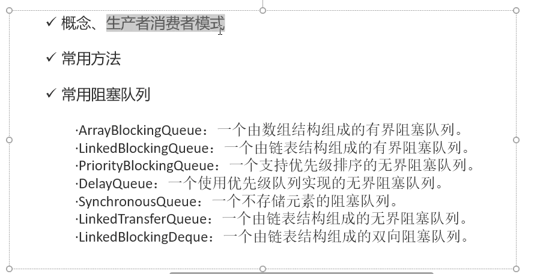

