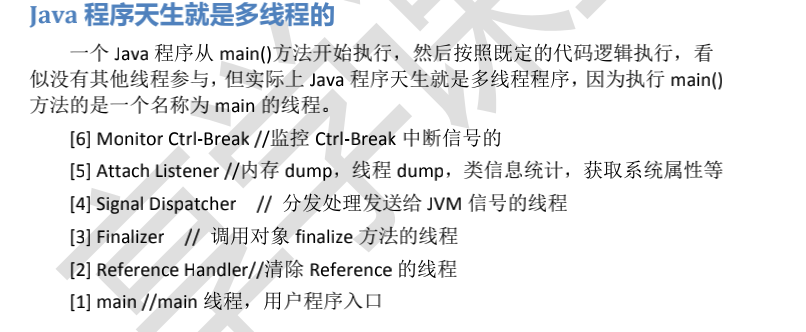
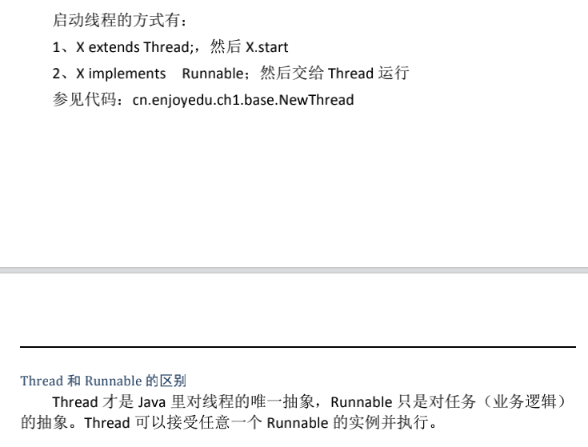
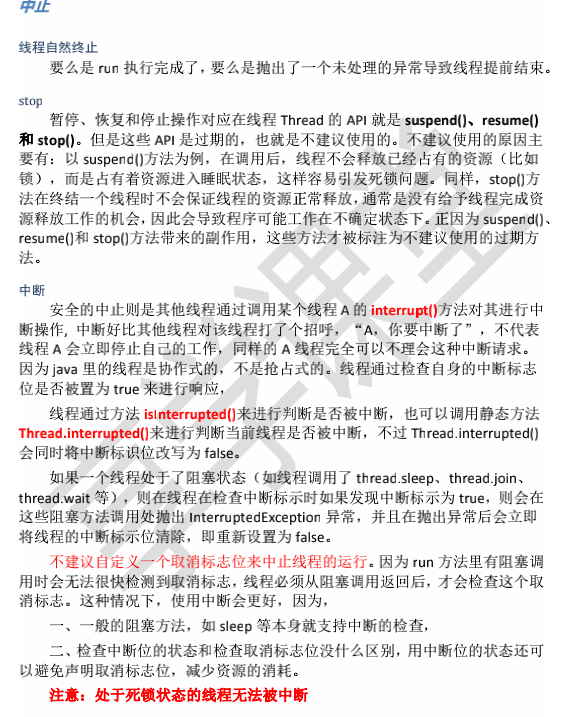
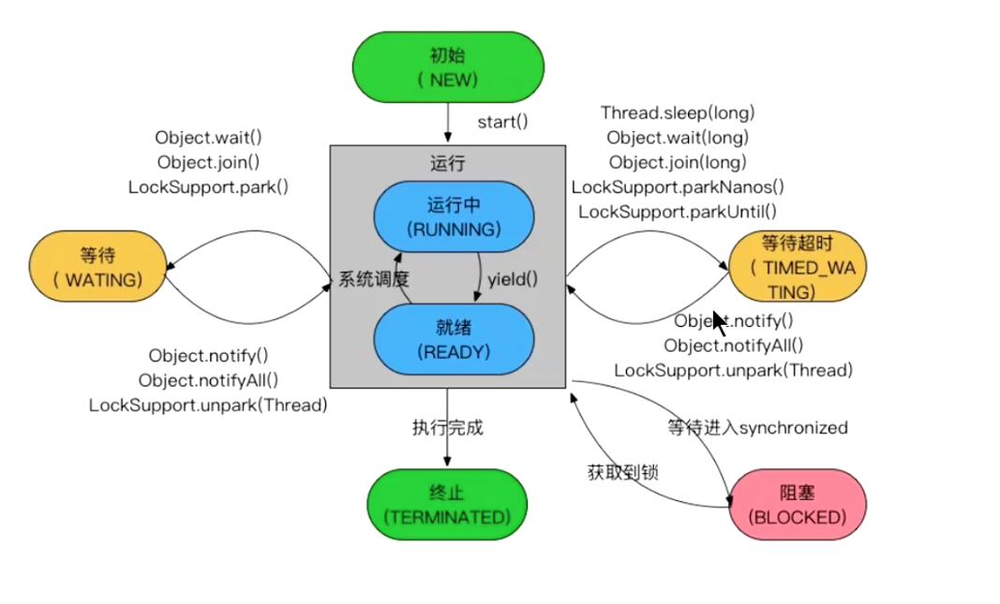

## 1:java 进程 和 java 线程 关系 

进程最少包含一个线程

java 线程状态/生命周期

# [在 java 中 wait 和 sleep 方法的不同？](https://www.cnblogs.com/programb/p/13021144.html)

sleep不会会释放CPUZ执行权 但是不会释放锁

最大的不同是在等待时 wait 会释放锁，而 sleep 一直持有锁。Wait 通常被用于线

程间交互，sleep 通常被用于暂停执行。

直接了解的深入一点吧：

**在 Java 中线程的状态一共被分成 6 种**：

**初始态**：NEW

创建一个 Thread 对象，但还未调用 start()启动线程时，线程处于初始态。

运行态：RUNNABLE

在 Java 中，运行态包括就绪态 和 运行态。

就绪态 该状态下的线程已经获得执行所需的所有资源，只要 CPU 分配执行权就

能运行。所有就绪态的线程存放在就绪队列中。

运行态 获得 CPU 执行权，正在执行的线程。由于一个 CPU 同一时刻只能执行一

条线程，因此每个 CPU 每个时刻只有一条运行态的线程。

**阻塞态**

当一条正在执行的线程请求某一资源失败时，就会进入阻塞态。而在 Java 中，阻

塞态专指请求锁失败时进入的状态。由一个阻塞队列存放所有阻塞态的线程。处

于阻塞态的线程会不断请求资源，一旦请求成功，就会进入就绪队列，等待执行。

PS：锁、IO、Socket 等都资源。

**等待态**

当前线程中调用 wait、join、park 函数时，当前线程就会进入等待态。也有一个

等待队列存放所有等待态的线程。线程处于等待态表示它需要等待其他线程的指

示才能继续运行。进入等待态的线程会释放 CPU 执行权，并释放资源（如：锁）

**超时等待态**

当运行中的线程调用 sleep(time)、wait、join、parkNanos、parkUntil 时，就

会进入该状态；它和等待态一样，并不是因为请求不到资源，而是主动进入，并

且进入后需要其他线程唤醒；进入该状态后释放 CPU 执行权 和 占有的资源。与

等待态的区别：到了超时时间后自动进入阻塞队列，开始竞争锁。

**终止态**

线程执行结束后的状态。

**注意**：

wait()方法会释放 CPU 执行权 和 占有的锁。

sleep(long)方法仅释放 CPU 使用权，锁仍然占用；线程被放入超时等待队列，与

yield 相比，它会使线程较长时间得不到运行。

yield()方法仅释放 CPU 执行权，锁仍然占用，线程会被放入就绪队列，会在短时

间内再次执行。

wait 和 notify 必须配套使用，即必须使用同一把锁调用；

wait 和 notify 必须放在一个同步块中调用 wait 和 notify 的对象必须是他们所处

同步块的锁对象。