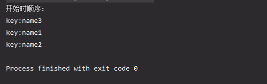

# 特性

- key和value都允许为空
- key重复会覆盖,value可以重复
- 有序的
- LinkedHashMap是非线程安全的

# 结构组织


在这里：

结构：table 数组（实际是Node）数据是继承来源于HashMap


元素：Entry  继承自 HashMap的 Node 结构  Node 实现 Map.Entry 用来实现 链表（主要原因是在基于原有的

key value next 三个属性外添加了 before 和 after 属性 使得LinkedHashMap 拥有了双端链表的能力）


# 有序性

LinkedHashMap 会有一个属性 accessOrder （访问顺序） 默认情况下 accessOrder 为false


false 插入时有序，hashmap插入是无序的


```dart
        Map<String, String> hashMap = new HashMap<String, String>();
        hashMap.put("name1", "josan1");
        hashMap.put("name2", "josan2");
        hashMap.put("name3", "josan3");
        Set<Entry<String, String>> set = hashMap.entrySet();
        Iterator<Entry<String, String>> iterator = set.iterator();
        while(iterator.hasNext()) {
            Entry entry = iterator.next();
            String key = (String) entry.getKey();
            String value = (String) entry.getValue();
            System.out.println("key:" + key + ",value:" + value);
        }
```


```java
LinkedHashMap<String, Entry> linkedHashMap = new LinkedHashMap<>(0, 0.75f, true);
linkedHashMap.put("name3", new Entry("josan3"));
linkedHashMap.put("name1", new Entry("josan1"));
linkedHashMap.put("name2", new Entry("josan2"));
System.out.println("开始时顺序：");
Set<Map.Entry<String, Entry>> set = linkedHashMap.entrySet();
Iterator<Map.Entry<String, Entry>> iterator = set.iterator();
while(iterator.hasNext()) {
    Map.Entry entry = iterator.next();
    String key = (String) entry.getKey();
    System.out.println("key:" + key );
}
```




true 访问时有序   不过是put操作还是get操作，都会将当前元素移至到链尾    

aftreNodeAccess(e)会把当前元素在链表中挪动到最后一位（修改指针 befor 和 after 是该元素到最后一位）


遍历链表的时候因为是按照链表指针来指向next 元素的，所以get之后的元素会被最后一个查找出来，**这个是Lru 算法重点**

```java
linkedHashMap.entrySet();

 final class LinkedEntrySet extends AbstractSet<Map.Entry<K,V>> {
        public final int size()                 { return size; }
        public final void clear()               { LinkedHashMap.this.clear(); }
        public final Iterator<Map.Entry<K,V>> iterator() {
            return new LinkedEntryIterator();
        }
        public final boolean contains(Object o) {
            if (!(o instanceof Map.Entry))
                return false;
            Map.Entry<?,?> e = (Map.Entry<?,?>) o;
            Object key = e.getKey();
            Node<K,V> candidate = getNode(hash(key), key);
            return candidate != null && candidate.equals(e);
        }
        public final boolean remove(Object o) {
            if (o instanceof Map.Entry) {
                Map.Entry<?,?> e = (Map.Entry<?,?>) o;
                Object key = e.getKey();
                Object value = e.getValue();
                return removeNode(hash(key), key, value, true, true) != null;
            }
            return false;
        }
        public final Spliterator<Map.Entry<K,V>> spliterator() {
            return Spliterators.spliterator(this, Spliterator.SIZED |
                                            Spliterator.ORDERED |
                                            Spliterator.DISTINCT);
        }
        public final void forEach(Consumer<? super Map.Entry<K,V>> action) {
            if (action == null)
                throw new NullPointerException();
            int mc = modCount;
            // Android-changed: Detect changes to modCount early.
            for (LinkedHashMapEntry<K,V> e = head; (e != null && mc == modCount); e = e.after)
                action.accept(e);
            if (modCount != mc)
                throw new ConcurrentModificationException();
        }
    }


 final class LinkedEntryIterator extends LinkedHashIterator
        implements Iterator<Map.Entry<K,V>> {
        public final Map.Entry<K,V> next() { return nextNode(); }
    }

   final LinkedHashMapEntry<K,V> nextNode() {
            LinkedHashMapEntry<K,V> e = next;
            if (modCount != expectedModCount)
                throw new ConcurrentModificationException();
            if (e == null)
                throw new NoSuchElementException();
            current = e;
            next = e.after;
            return e;
        }

```


# 循环性

就是因为多了head 和 tail 

```java
/**
     * The head (eldest) of the doubly linked list.
     */
    transient LinkedHashMapEntry<K,V> head;

    /**
     * The tail (youngest) of the doubly linked list.
     */
    transient LinkedHashMapEntry<K,V> tail;
```


# 操作（插入 删除 查找）

插入 删除  都是基于HashMap的  table操作


查找 get（key） 会移动指针 是元素变为链表的最后一个 而 table 的位置是不变的；


# 总结

1. LinkedHashMap 拥有与 HashMap 相同的底层哈希表结构，即数组 + 单链表 + 红黑树，也拥有相同的扩容机制。
2. LinkedHashMap 相比 HashMap 的拉链式存储结构，内部额外通过 Entry 维护了一个双向链表。
3. HashMap 元素的遍历顺序不一定与元素的插入顺序相同，而 LinkedHashMap 则通过遍历双向链表来获取元素，所以遍历顺序在一定条件下等于插入顺序。
4. LinkedHashMap 可以通过构造参数 accessOrder 来指定双向链表是否在元素被访问后改变其在双向链表中的位置。