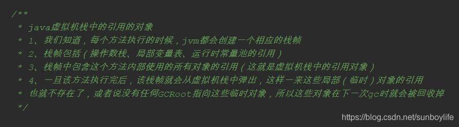
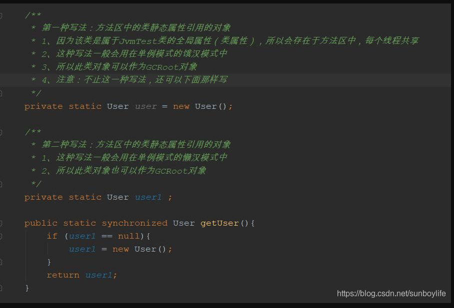
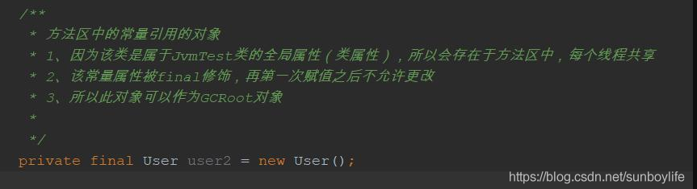
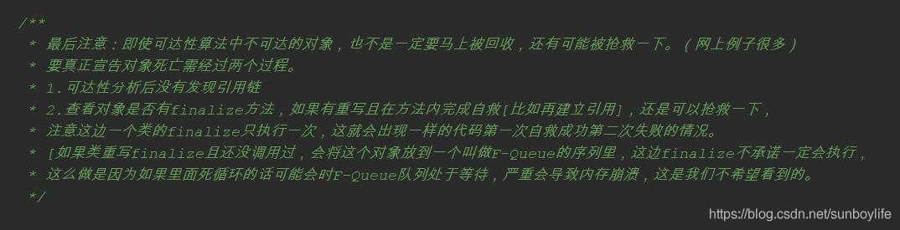

一：jvm内存回收算法一般有两种

1、引用计数法：如果有地方引用该对象，该对象的引用计数就+1，如果引用失效的话就减一。计数器为0的对象不可以被使用。

2、可达性分析法：如果我们将一些GC Roots对象作为起始点，从这些节点向下搜索，搜索到的路径为引用链，如果有一些对象没有任何引用链相连，那么这个对象对于GC Roots是不可达的，即使它们之间可能相互产生关联，所以将其判定为可回收对象

```
      试想一下，如果有两个对象互相引用，比如objA.instance = objB, objB.instance = objB，这个时候两个对象都不能被访问，但是互相引用导致引用计数不为0，这不就无法判定为死亡了吗？我们如果是GC，能允许这种长生不死的存在吗？肯定不。所以引用计数法并没有被采用在目前的JVM垃圾回收器中。所以jvm使用的是可达性分析法算法
1
```

二：什么是可达性分析算法呢？

可达性分析算法：通过一系列的名为“GC Root”的对象作为起点，从这些节点向下搜索，搜索所走过的路径称为引用链(Reference Chain)，当一个对象到GC Root没有任何引用链相连时（或者该对象不是GCRoot对象时），则认为该对象不可达，后面该对象将会被垃圾收集器回收其所占的内存。

三：在java语言中，什么对象可作为GCRoot的对象？

```
a. java虚拟机栈中的引用的对象。 

b.方法区中的类静态属性引用的对象。 （一般指被static修饰的对象，加载类的时候就加载到内存中。）

c.方法区中的常量引用的对象。 

d.本地方法栈中的JNI（native方法）引用的对象
```

四：怎么理解上面4中类型的GCroot对象呢？

```
a.java虚拟机栈中的引用的对象                                                                                                                                                               
1
```



b.方法区中的类静态属性引用的对象（一般指被static修饰的对象，加载类的时候就加载到内存中。）



c.方法区中的常量引用的对象



d.本地方法栈中的JNI（native方法）引用的对象

五：最后注意

