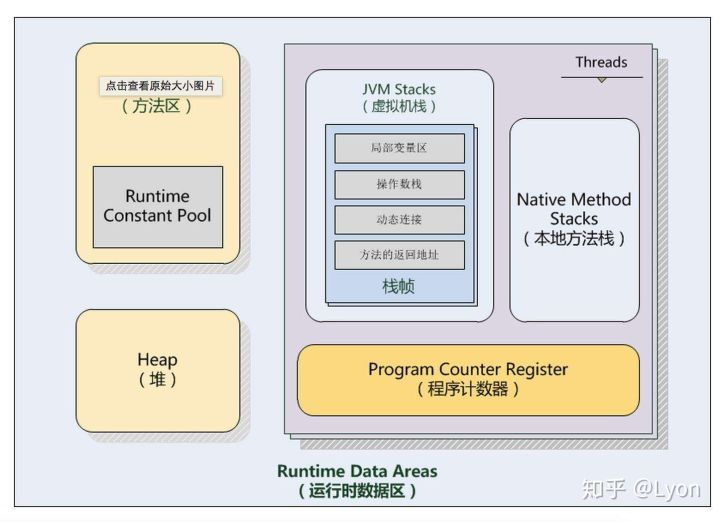
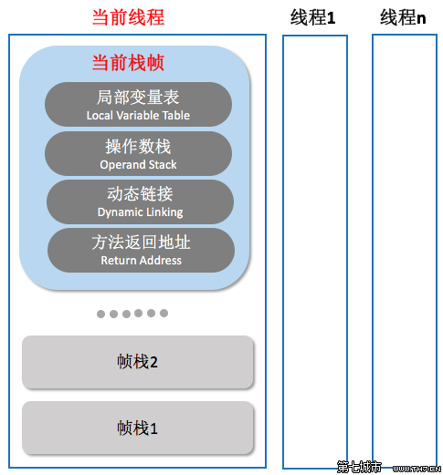
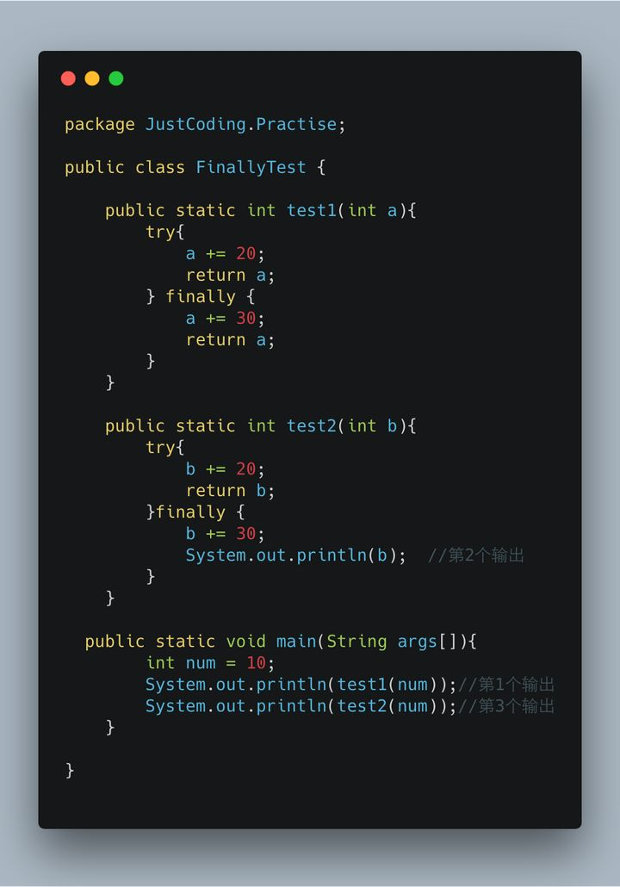
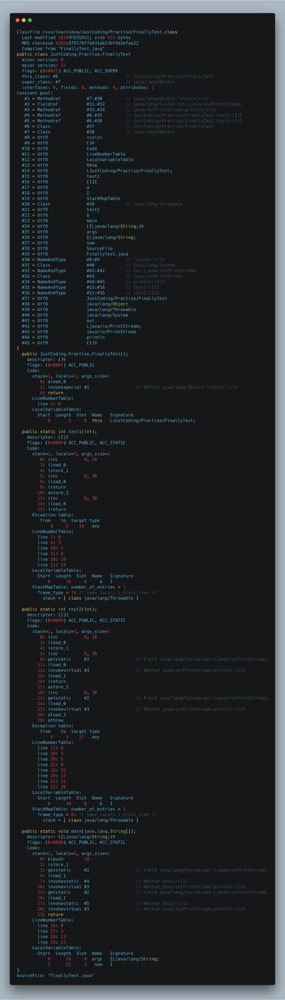

在之前的文章：[Java虚拟机—堆、栈、运行时数据区](https://zhuanlan.zhihu.com/p/44694290) 中，我们整体介绍了JVM在运行时的一些数据区域如堆、方法区、程序计数器、虚拟机栈、本地方法栈。本篇文章，我们围绕其中的一个区域展开——虚拟机栈中的栈元素栈帧

所以，本文的主要分为两部分：

1.Java虚拟机运行时栈帧介绍 2.一个关于字节码指令以及操作数出栈/入栈过程的小实例

其中，运行时栈帧介绍主要包括：

- **0.栈帧的概念**
- **1.局部变量表**
- **2.操作数栈**
- **3.动态链接**
- **4.方法返回**
- **5.附加信息**


------

## **Java虚拟机栈和运行时栈帧结构**

**Java虚拟机是基于「栈」架构的，如图所示：**



为什么要深入研究虚拟机栈呢？因为它hin重要。除了一些native方法是基于本地方法栈实现的，所有的Java方法几乎都是通Java虚拟机栈来实现方法的调用和执行过程(当然，需要程序计数器、堆、方法区的配合)，所以Java虚拟机栈是虚拟机执行引擎的核心之一。而Java虚拟机栈中出栈入栈的元素就称为「栈帧」。

## **0.栈帧的概念**

**栈帧(Stack Frame)是用于支持虚拟机进行方法调用和方法执行的数据结构。栈帧存储了方法的局部变量表、操作数栈、动态连接和方法返回地址等信息。每一个方法从调用至执行完成的过程，都对应着一个栈帧在虚拟机栈里从入栈到出栈的过程。**

一个线程中方法的调用链可能会很长，很多方法都同时处于执行状态。对于JVM执行引擎来说，在在活动线程中，只有位于JVM虚拟机栈栈顶的元素才是有效的，即称为**当前栈帧**，与这个栈帧相关连的方法称为**当前方法，**定义这个方法的类叫做**当前类**。

执行引擎运行的所有字节码指令都只针对当前栈帧进行操作。如果当前方法调用了其他方法，或者当前方法执行结束，那这个方法的栈帧就不再是当前栈帧了。

调用新的方法时，新的栈帧也会随之创建。并且随着程序控制权转移到新方法，新的栈帧成为了当前栈帧。方法返回之际，原栈帧会返回方法的执行结果给之前的栈帧(返回给方法调用者)，随后虚拟机将会丢弃此栈帧。

> 栈帧是线程本地的私有数据，不可能在一个栈帧中引用另外一个线程的栈帧。

在概念模型上，典型的栈帧结构如下：

图片来源：http://www.th7.cn/Program/java/201601/749326.shtml

关于「栈帧」，我们在看看《Java虚拟机规范》中的描述：

> 栈帧是用来存储数据和部分过程结果的数据结构，同时也用来处理动态连接、方法返回值和异常分派。
> 栈帧随着方法调用而创建，随着方法结束而销毁——无论方法正常完成还是异常完成都算作方法结束。
> 栈帧的存储空间由创建它的线程分配在Java虚拟机栈之中，每一个栈帧都有自己的本地变量表(局部变量表)、操作数栈和指向当前方法所属的类的运行时常量池的引用。

接下来，详细讲解一下栈帧中的局部变量表、操作数栈、动态连接、方法返回地址等各个部分的数据结构和作用。

## **1.局部变量表**

**局部变量表(Local Variable Table)**是一组变量值存储空间，用于存放方法参数和方法内定义的局部变量。局部变量表的容量以变量槽(Variable Slot)为最小单位，Java虚拟机规范并没有定义一个槽所应该占用内存空间的大小，但是规定了一个槽应该可以存放一个32位以内的数据类型。

> 在Java程序编译为Class文件时,就在方法的Code属性中的max_locals数据项中确定了该方法所需分配的局部变量表的最大容量。(最大Slot数量)

一个局部变量可以保存一个类型为boolean、byte、char、short、int、float、reference和returnAddress类型的数据。reference类型表示对一个对象实例的引用。returnAddress类型是为jsr、jsr_w和ret指令服务的，目前已经很少使用了。

虚拟机通过索引定位的方法查找相应的局部变量，索引的范围是从0~局部变量表最大容量。如果Slot是32位的，则遇到一个64位数据类型的变量(如long或double型)，则会连续使用两个连续的Slot来存储。

## **2.操作数栈**

**操作数栈(Operand Stack)**也常称为操作栈，它是一个后入先出栈(LIFO)。同局部变量表一样，操作数栈的最大深度也在编译的时候写入到方法的Code属性的max_stacks数据项中。

操作数栈的每一个元素可以是任意Java数据类型，32位的数据类型占一个栈容量，64位的数据类型占2个栈容量,且在方法执行的任意时刻，操作数栈的深度都不会超过max_stacks中设置的最大值。

当一个方法刚刚开始执行时，其操作数栈是空的，随着方法执行和字节码指令的执行，会从局部变量表或对象实例的字段中复制常量或变量写入到操作数栈，再随着计算的进行将栈中元素出栈到局部变量表或者返回给方法调用者，也就是出栈/入栈操作。一个完整的方法执行期间往往包含多个这样出栈/入栈的过程。

## **3.动态连接**

在一个class文件中，一个方法要调用其他方法，需要将这些方法的符号引用转化为其在内存地址中的直接引用，而符号引用存在于方法区中的运行时常量池。

Java虚拟机栈中，每个栈帧都包含一个指向运行时常量池中该栈所属方法的符号引用，持有这个引用的目的是为了支持方法调用过程中的**动态连接(Dynamic Linking)**。

这些符号引用一部分会在类加载阶段或者第一次使用时就直接转化为直接引用，这类转化称为**静态解析**。另一部分将在每次运行期间转化为直接引用，这类转化称为动态连接。

## **4.方法返回**

**当一个方法开始执行时，可能有两种方式退出该方法：**

- **正常完成出口**
- **异常完成出口**

**正常完成出口**是指方法正常完成并退出，没有抛出任何异常(包括Java虚拟机异常以及执行时通过throw语句显示抛出的异常)。如果当前方法正常完成，则根据当前方法返回的字节码指令，这时有可能会有返回值传递给方法调用者(调用它的方法)，或者无返回值。具体是否有返回值以及返回值的数据类型将根据该方法返回的字节码指令确定。

**异常完成出口**是指方法执行过程中遇到异常，并且这个异常在方法体内部没有得到处理，导致方法退出。

> 无论是Java虚拟机抛出的异常还是代码中使用athrow指令产生的异常，只要在本方法的异常表中没有搜索到相应的异常处理器，就会导致方法退出。

无论方法采用何种方式退出，在方法退出后都需要返回到方法被调用的位置，程序才能继续执行，方法返回时可能需要在当前栈帧中保存一些信息，用来帮他恢复它的上层方法执行状态。

> 方法退出过程实际上就等同于把当前栈帧出栈，因此退出可以执行的操作有：恢复上层方法的局部变量表和操作数栈，把返回值(如果有的话)压如调用者的操作数栈中，调整PC计数器的值以指向方法调用指令后的下一条指令。

一般来说，方法正常退出时，调用者的PC计数值可以作为返回地址，栈帧中可能保存此计数值。而方法异常退出时，返回地址是通过异常处理器表确定的，栈帧中一般不会保存此部分信息。

## **5.附加信息**

虚拟机规范允许具体的虚拟机实现增加一些规范中没有描述的信息到栈帧之中，例如和调试相关的信息，这部分信息完全取决于不同的虚拟机实现。在实际开发中，一般会把动态连接，方法返回地址与其他附加信息一起归为一类，称为栈帧信息。

------

## **一个字节码指令以及操作数出栈/入栈过程的小实例**

这个小例子是我之前在牛客网上做题碰到的，改了一点内容拿出来，还是挺有意思的~顺便介绍下字节码指令，以及对着实例讲解栈帧中操作数出栈入栈的整个过程。



问题：这个程序运行后会输出哪三个数字？(以及test1和test2函数中return和finally的执行情况？)

> 答案：
> System.*out*.println(*test1*(num)) ---- 60
> System.*out*.println(b); ---- 60
> System.*out*.println(*test2*(num)); -----30
> 执行情况，且看下面讲解

学Java时我们都知道：

1.执行完try中的语句后，无论是否有异常被catch到，finally中的语句都会被执行(除了exit以及其它异常外)，所以finally中通常用于关闭流关闭连接等操作。

2.finally中如果有return语句，则会用finally中的语句覆盖掉try/catch中的return。

```text
    public static int test1(int a){
        try{
            a+=20;
            return a;
        } finally {
            a+=30;
            return a;
        }
    }
```

于是，在test1中，try块中return时a的值为30，经过finally块+30后，值变为60，再return就是返回了finally中的a，即60。于是第一个输出为60，这个很简单。

```text
    public static int test2(int b){
        try{
            b+=20;
            return b;
        }finally {
            b+=30;
            System.out.println(b);
        }
    }
```

在test2中，try块中经过计算后return的b值为30，finally中没有返回语句，故return的b值以try中的b=30为准(即第三个输出为30)。

try语句块中return b=30这个比较好理解，但是接下来finally中又对b进行了+30的操作，那此时第二个输出System.out.println(b);输出的值是60？？？，还是30？ ！(好像都能说得通)。

> 答案是60，为什么？让我们用javap -c FinallyTest.class看一下其字节码，顺便学习下字节码指令和class文件中的各个属性。

------

首先**，第一个输出——System.\*out\*.println(\*test1\*(num))** 值是60，这个比较简单，就不细说了，我们主要讲解一下test2方法和第二个、第三个输出：***System.out.println(b); System.out.println(test2(num));\***

**对照之前的文章：[Java虚拟机—Class文件结构](https://zhuanlan.zhihu.com/p/45003974) 我们首先解析一下字节码文件中test2()方法及各个属性的作用，然后再对照字节码指令来详细看一下整个过程。**

**1.test2()方法字节码中的各个属性：**

```text
public static int test2(int);
    descriptor: (I)I
    flags: (0x0009) ACC_PUBLIC, ACC_STATIC
    Code:
      stack=2, locals=3, args_size=1
         0: iinc          0, 20
         3: iload_0
         4: istore_1
         5: iinc          0, 30
         8: getstatic     #2                  // Field java/lang/System.out:Ljava/io/PrintStream;
        11: iload_0
        12: invokevirtual #3                  // Method java/io/PrintStream.println:(I)V
        15: iload_1
        16: ireturn
        17: astore_2
        18: iinc          0, 30
        21: getstatic     #2                  // Field java/lang/System.out:Ljava/io/PrintStream;
        24: iload_0
        25: invokevirtual #3                  // Method java/io/PrintStream.println:(I)V
        28: aload_2
        29: athrow
      Exception table:
         from    to  target type
             0     5    17   any
      LineNumberTable:
        line 17: 0
        line 18: 3
        line 20: 5
        line 21: 8
        line 18: 15
        line 20: 17
        line 21: 21
        line 22: 28
      LocalVariableTable:
        Start  Length  Slot  Name   Signature
            0      30     0     b   I
      StackMapTable: number_of_entries = 1
        frame_type = 81 /* same_locals_1_stack_item */
          stack = [ class java/lang/Throwable ]
```

方法描述符descriptor为：(I)I；

test2()方法的访问标志flags:ACC_PUBLIC和ACC_STATIC表示此方法的修饰符有public和static。

属性表attribute_info中的“Code”属性：即为属性表集合，包括了：代码转换后字节码指令+Exceptiontable+LineNumberTable+LocalVariableTable+StackMapTable

Exceptiontable是异常表用于处理异常后的程序出口。

LineNumberTable：行号表，用于指示Java源码行号和字节码指令的对应关系

LocalVariableTable：局部变量表，用于存放运行期间和操作数栈交互(出栈/入栈)的局部变量

StackMapTable：JDK1.6后新增的属性，供新的类型检测器检查和处理目标方法的局部变量和操作数栈所需的类型是否匹配

**2.test2()方法中的字节码执行过程**

看完了上面的属性，下面让我们来一行行地看一遍字节码指令的部分，*关于指令描述可以参考之前的文章——[Java虚拟机—字节码指令初探](https://zhuanlan.zhihu.com/p/45050364) 。我们*

```text
Code:
      stack=2, locals=3, args_size=1                                           局部变量表     操作数栈
         0: iinc          0, 20  //自增指令，位于局部变量表中0号位置的int型数值+20   30          null
         3: iload_0              //从局部变量表0号位置加载一个int型值到操作数栈      30           30
         4: istore_1             //从操作数栈顶出栈一个int型值存到局部变量表1号位置 30，30        null
         5: iinc          0, 30  //局部变量表中0号位置的int型数值加30              60，30        null
         8: getstatic     #2     //访问类的静态字段值。#2表示静态字段位于运行时     60，30        null   
        11: iload_0              //从局部变量表0号位置加载一个int型值到操作数栈     60，30         60
        12: invokevirtual #3     //调用PrintStream类的实例方法——println输出60     60，30        null            
        15: iload_1              //从局部变量表1号位置加载一个int型值到操作数栈     60，30        30
        16: ireturn              //返回一个int型数值(从栈顶)                      60, 30        null
        17: astore_2             
        18: iinc          0, 30  
        21: getstatic     #2     
        24: iload_0              
        25: invokevirtual #3     
        28: aload_2              
        29: athrow               //抛出异常，程序跳转到异常处理器中，(Exception table)
     Exception table:
        from    to  target type
            0     5    17   any
```

如上，代码中序号0的指令——*0: iinc*对应test2源码中try块中：*b += 20*。此处test2()方法是在主函数main()中被调用的，在main()方法栈帧中操作数出栈一个int型值10，作为test2()方法调用的参数。test2()方法调用时，会新构建test2方法的栈帧(从而成为当前栈帧)，10作为参数就存到了当前栈帧的局部变量表0号位置。所以在0: iinc 0, 20执行时，test2()方法栈帧中局部变量表0号位置已经是有了10这个值的。然后，指令一行行地执行过程如上述注释↑。

## **有几点需要注意：**

- **getstatic**
- **invokevirtual**
- **ireturn**

**getstatic指令用于访问类的静态字段值**

以第一个getstatic指令为例，其后的参数#2,表示会在FinallyTest类的运行时常量池中2号位置查找此字段值。

```text
Constant pool:
   #1 = Methodref          #7.#30         // java/lang/Object."<init>":()V
   #2 = Fieldref           #31.#32        // java/lang/System.out:Ljava/io/PrintStream;
   #3 = Methodref          #33.#34        // java/io/PrintStream.println:(I)V
   #4 = Methodref          #6.#35         // JustCoding/Practise/FinallyTest.test1:(I)I
   #5 = Methodref          #6.#36         // JustCoding/Practise/FinallyTest.test2:(I)I
   #6 = Class              #37            // JustCoding/Practise/FinallyTest
   #7 = Class              #38            // java/lang/Object
         .....
  #30 = NameAndType        #8:#9          // "<init>":()V
  #31 = Class              #40            // java/lang/System
  #32 = NameAndType        #41:#42        // out:Ljava/io/PrintStream;
  #33 = Class              #43            // java/io/PrintStream
  #34 = NameAndType        #44:#45        // println:(I)V
  #35 = NameAndType        #15:#16        // test1:(I)I
  #36 = NameAndType        #21:#16        // test2:(I)I
         .....
```

常量池中2号位置的字段值是符号引用，该引用指向的是常量池中31号和32号位置，即java/lang/System类和java/io/PrintStream类中println的方法描述。如果该静态字段(#2号)所指向的类或接口没有被初始化，则指令执行过程将触发其初始化过程。

**invokevirtual指令用于调用实例方法**

此处调用java.io.PrintStream类中的println方法后，会自动从test2的操作数栈中出栈相应的参数(即60)。然后方法执行来到了println方法中，于是新建此方法的栈帧，将当前栈帧切换到println栈帧上，将参数60入栈，在完成println方法后(输出60)再切换回到test2的栈帧中。

**所以，第二个System.\*out\*.println(\*b\*);输出的是60.**

**iteturn指令用于从操作数栈顶出栈一个int型的值给方法调用者**

看一下test2方法的Java代码：

```text
public static int test2(int b){
        try{
            b += 20;
            return b;
        }finally {
            b += 30;
            System.out.println(b);
        }
    }
```

> 按道理应该try块中执行完b += 20后应该紧跟着就return了，不过由于finally块的存在，还需要执行后面的内容，那么在其字节码指令中是如何实现的呢？

*b += 20*对应*0: iinc、3: iload_0、4: istore_1*三条指令，之后执行了finally块中的内容：

*5: iinc* .....直到1*6: ireturn*才正式执行return操作。此时return的是局部变量表中1号位置暂存的值30，所以**第三个System.\*out\*.println(\*test2\*(num));输出的是30.**

最后，ireturn指令到throw之间的为什么会有一段指令？这个和finally块的设计相关稍微有点复杂，暂时不讲。

------

以下是完整的，javap -v FinallyTest.class后的字节码：

