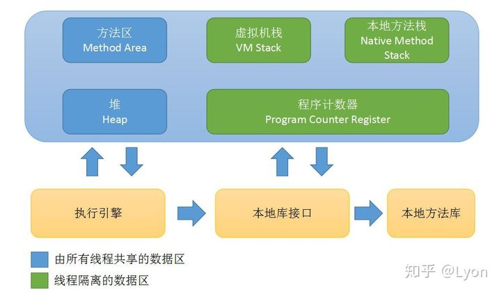
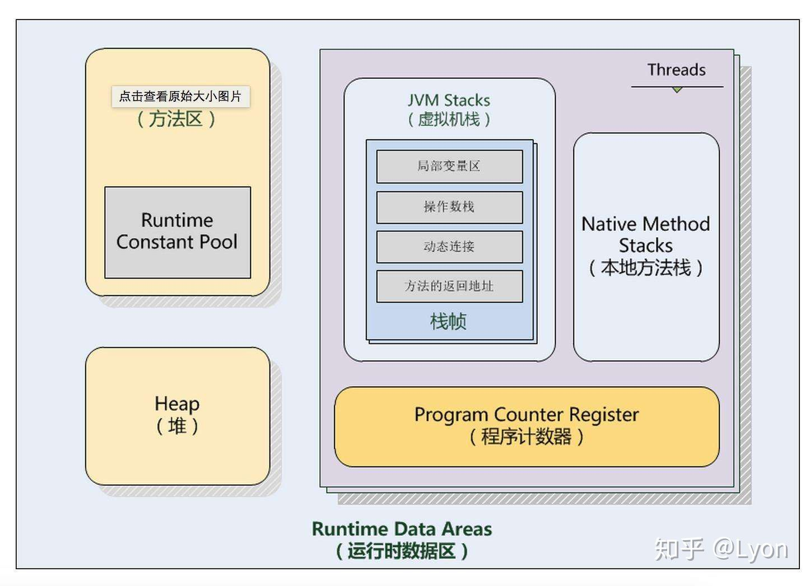

**在前面的文章中介绍了JVM的[类加载机制和类加载器](https://zhuanlan.zhihu.com/p/44670213)以及一些前置性的概念：[字节码、机器码和JVM](https://zhuanlan.zhihu.com/p/44657693)。本篇文章主要讲解Java(JVM)在运行期间，其运行时数据区域的作用、职责与划分。包括堆内存、栈内存——虚拟机栈、本地方法栈、方法区、常量池、程序计数器等概念。**

> *文章主要内容摘自《深入理解Java虚拟机》第二版-周志明和《Java虚拟机规范》-Java SE 8版。*

------

Java虚拟机在执行Java程序的过程中会把它所管理的内存划分为若干个不同的数据区域，这些区域有其各自的用途，以及创建销毁的时间，其中有些会一直存在，即随着虚拟机的启动而创建、随着虚拟机的退出而销毁；另外一些则是与虚拟机中的单个线程一一对应，这些与线程相对应的数据区域会随着线程的开始而创建、随着线程的结束即销毁。

这些区域如下图所示：



首先，整个运行时数据区指的是Java(JVM)运行时的数据区域划分。Java虚拟机是可以多线程并发执行的。对于一个CPU任意时刻，只能执行JVM中的一条线程。这就意味着，JVM要想实现多线程，则每条线程必须有**独立的程序计数器**用来标记线程执行的指令的位置（线程切换后恢复到正确的执行位置）。所以——程序计数器是**线程私有**的，私有意味着各条线程之间的计数器互不影响。如上图所示，绿色区域的部分都是线程私有(线程隔离)的，而蓝色部分则是所有线程可以共享的数据区域。

现在我们来具体看一下每个区域的具体信息：

## **1.程序计数器**

程序计数器(Program Counter Register)，是一块较小的内存空间，可以看作**是当前线程所执行的字节码的行号指示器**。在虚拟机的概念模型中字节码解释器的工作就是通过改变这个计数器的值来选取下一条需要执行的字节码指令，分支、循环、跳转、异常处理、线程恢复等基础功能都依赖于此计数器。JVM中的程序计数器也是在Java虚拟机规范中唯一一个没有规定任何OutOfMemoryError情况的区域。**在任意时刻一条JVM线程只能执行一个方法的代码，方法可以是Java方法，或者是native方法。**

此处还有2点需注意：

1.Java虚拟机中的程序计数器仅仅是虚拟机中的，**存在于内存之上的“虚拟”计数器**，而不是电脑中的实体程序计数器。

2.JVM线程中执行的方法有2种类型：普通Java方法和由其他语言实现的native方法。如果当前执行的是普通Java方法，则程序计数器记录的是虚拟机字节码指令的地址。如果当前执行的是native方法，则计数器的值为空（Undefined）。

*（native方法多由C和C++语言实现，譬如java.lang.Object类中的hashCode()方法就是native方法，其底层是通过C++实现的。）*

```text
public native int hashCode();
```

## **2.Java虚拟机栈**

和程序计数器一样，**Java虚拟机栈(Java Virtual Machine Stacks)也是线程私有的**，即生命周期和线程相同。Java虚拟机栈**和线程同时创建，用于存储栈帧**。每个方法在执行时都会创建一个**栈帧(Stack Frame)，**用于存储**局部变量表**、**操作数栈**、动态链接、方法出口等信息。每一个方法从调用直到执行完成的过程就对应着一个栈帧在虚拟机栈中从入栈到出栈的过程。

Java虚拟机规范中Java虚拟机栈内存的大小既可以被实现成固定大小，也可以根据计算动态拓展或收缩，当前大部分的JVM实现是支持动态拓展的。Java虚拟机栈可能发生的异常：

1.线程请求分配的栈容量>Java虚拟机最大栈容量，则JVM会抛出StackOverFlowError异常。

2.如果Java虚拟机可动态拓展，则如果在拓展的过程中无法申请到足够的内存，就会抛出OutOfMemoryError异常。

## **3.本地方法栈**

本地方法栈(Native Method Stack)和Java虚拟机栈类似**，**区别在于Java虚拟机栈是为了Java方法服务的，而**本地方法栈是为了native方法服务的**。在虚拟机规范中并没有对本地方法实现所采用的编程语言与数据结构采取强制规定，因此不同的JVM虚拟机可以自己实现自己的native方法。此处需要说明：Sun HotSpot虚拟机就直接将本地方法栈和Java虚拟机栈合二为一了。

## **4.Java堆**

前面所说的程序计数器、Java虚拟机栈、本地方法栈通常只占很小一部分的内存空间，对与大多数应用来说，**Java堆(Java Heap)才是JVM管理的内存空间中最大的一块。**此区域存在的唯一目的就是**存放对象实例**，几乎所有的对象实例都会在这被分配内存，而且**Java堆是被所有线程共享**的一块内存区域。

Java堆是Java中垃圾收集器管理的主要区域，因此也被称为**GC堆—**Garbage Collected Heap.

关于垃圾堆的问题O不，GC堆的问题，我们以后会经常见到，著名的**垃圾回收算法**我们也会再之后的文章中详细探讨。

*（根据Java虚拟机规范的规定,Java堆可以处于物理上不连续的内存之中，只要逻辑上是连续的即可。且和栈一样，不同的JVM实现可以有不同的内存分配策略，Java堆的内存既可以设计成固定大小，也可以是可动态拓展的。）*

## **5.方法区**

方法区(Method Area)，与Java堆一样是各个线程共享的内存区域。用于存储被JVM加载的类信息、常量、静态变量、即时编译器编译后的代码等数据。虽然Java虚拟机规范将方法区描述为堆的一个逻辑部分，但是它却有个别名叫做**Non-Heap(非堆),**目的就是和Java堆区分开来。

Java虚拟机规范对方法区的限制十分宽松，除了和Java堆一样不需要连续的内存空间分配和可选择固定大小或可拓展内存以外，方法区也可以被垃圾回收器管理或不受其管理。

首先，要明确一个「概念」——方法区，是一个概念，是Java虚拟机规范中定义的概念，一个「非堆」的运行时数据区域，用于存放被JVM加载的类信息、常量、静态变量、即时编译器编译后的代码等数据，运行时常量池也是存放于方法区中。逻辑上的「非堆」表示和Java堆独立，那物理上呢？**Java虚拟机规范中定义了方法区这个概念，但是并没有规定此区域的是否需要垃圾收集。**

**在Java7以前，HotSpot虚拟机中，方法区也被称为“永久代”**，因为在物理上，方法区使用的是由JVM开辟的堆内存，由于和Java堆共享内存且内存空间由垃圾收集器统一分配和管理，自然的垃圾收集也拓展到了方法区上。此时，Java堆中分区为青年代Young Generation和老年代Old Generation，而方法区自然地被称为永久代Permanent Generation 。

> （JVM虚拟机有不同的实现，比较主流的是sun公司的HotSpot虚拟机，在此才有“永久代的概念”，其他虚拟机不存在“永久代”这个概念）

**在Java8中，HotSpot虚拟机改变了原有方法区的物理实现，将原本由JVM管理内存的方法区的内存移到了虚拟机以外的计算机本地内存，并将其称为元空间（Metaspace）**。这样一来，现在的方法区实际存储在于元空间，再也不用和Java堆共享内存了，“永久代”也就永久地被撤销了。

> 尽管永久代撤销了，方法区这个逻辑上的空间一直是存在的，所以在java8以后，方法区的垃圾回收在物理上就是对元空间的垃圾回收。由于元空间用的是计算机本地内存，所以理论上来说只要内存足够大，方法区就能有多大，实际上Metaspace的大小是可以通过参数设定的，如果Metaspace的空间占用达到了设定的最大值，那么就会触发GC来收集死亡对象和类的加载器。常用的G1和CMS垃圾收集器都能很好地回收Metaspace区。

**5.1运行时常量池**

**运行时常量池**(Runtime Constant Pool)是.class文件中每一个类或接口的常量池表(constant pool table)的运行时表示形式，**属于方法区的一部分**。每一个运行时常量池都在Java虚拟机的方法区中分配，在加载类和接口道虚拟机后，就创建对应的运行时常量池。常量池的作用是：

**存放编译器生成的各种字面量和符号引用**。当虚拟机运行时，需要从常量池获得对应的符号引用，再在类创建或运行时解析、翻译到具体的内存地址之中。

**字面量(Literal)**,通俗理解就是Java中的常量，如文本字符串、声明为final的常量值等。

**符号引用(Symbolic References)**则是属于编译原理中的概念，包括了下面三类常量：

1.类和接口的全限定名

2.字段的名称和描述符

3.方法的名称和描述符



------

**最后：**
Java虚拟机以运行时数据区为主线，相关的知识点很多，有时一个点展开就够几篇文章了，所以此处只是概括性地介绍。还有很多具体的东西并未涉及譬如Java内存模型、JDK1.6以后字符串常量池的变化、new一个对象在堆内存中的详细过程、JVM虚拟机栈中的栈帧、局部变量表、常用指令......当然，在接下来的文章中会一一介绍。