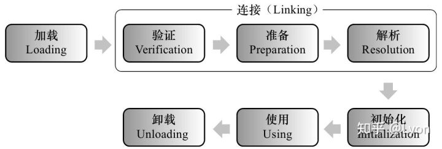

## **类加载过程**

**0.概述**

类从被加载到虚拟机内存中开始，到卸载出内存为止，它的整个生命周期包括：**Loading(加载)、Verification(验证)、Preparation(准备)、Resolution(解析)、Initialization(初始化)、Using(使用)和Unloading(卸载)**7个阶段。其中验证、准备、解析3个部分统称为**连接(Linking)**

注意：此处的类加载指的是一个.class文件的加载，在Java中.class文件可能是一个类，也可能是一个接口。此处都叫做**类加载**。整个类加载的过程即：加载→验证→准备→解析→初始化。概括地说即：

> **这里需要注意：从类的加载→验证→准备→初始化，过程是按顺序依次开始的，但是解析比较特殊。为了支持java语言的晚期绑定/动态绑定，有时解析可以在初始化之后才开始。而且，这只是开始顺序，一个阶段通常执行的过程中会激活调用另一个阶段，所以各个阶段只是按照这个顺序开始，而不会等一个阶段完全完成后才进行下一个阶段，各个阶段是交叉混合进行的，所以各阶段并不会严格按照此顺序结束。**

**1.Loading加载**

在加载阶段，虚拟机需要完成以下3件事情：
**1)通过一个类的全限定名来获取此类的二进制字节流。**
一个类的二进制字节流即.class文件，如何获取一个类的.class文件其实可以通过多种方法实现，譬如：从ZIP包中读取、从网络传输中获取、运行时计算生成(动态代理技术)、从数据库中读取等。
**2)将这个字节流所代表的静态存储结构转化为方法区的运行时数据结构。**
加载的过程中主要由【类加载器】来完成。类加载器也分为不同种类，具体见下文↓，除了JVM自带的类加载器，用户也可以使用自己定义的类加载器。
**3)在内存中生成一个代表这个类的java.lang.Class对象,作为方法区这个类的各种数据的访问入口。**
某个类的java.lang.Class对象，即通常所说的一个类的类对象，这个类对象作为程序调用这个类中方法和数据调用的入口。类对象生成的方式主要有以下5种：1). 使用new关键字创建对象2). 使用Class类的newInstance方法(反射机制)3). 使用Constructor类的newInstance方法(反射机制)4). 使用Clone方法创建对象5). 使用(反)序列化机制创建对象。具体可以看这篇文章：
[https://blog.csdn.net/justloveyou_/article/details/72466416](https://link.zhihu.com/?target=https%3A//blog.csdn.net/justloveyou_/article/details/72466416)

**2.Verification验证**

验证是连接阶段的第一步，这一阶段的主要目的是为了确保Class文件的字节流包含的信息符合当前虚拟机的要求，并且不会危害虚拟机自身的安全。验证阶段是非常重要的，这个阶段是否严谨，直接决定了Java虚拟机是否能够承受恶意代码的攻击，从执行性能的角度上讲，验证阶段的工作量在虚拟机的类加载子系统中又占据了相当大的一部分。
此阶段主要包含如下几个部分的验证：
1.文件格式验证 2.元数据验证 3.字节码验证 4.符号引用验证

**3.Preparation准备**

准备阶段是正式为类变量分配内存并设置类变量初始值的阶段，这些变量使用的内存都将在方法区中进行分配。（此处需注意的是，准备阶段是为类变量分配内存并设置初始值而不是实例变量，类变量属于class，实例变量属于方法。实例变量将会在对象实例化时随着对象一起被分配在Java堆中）

**4.Resolution解析**

解析阶段是虚拟机将常量池内的符号引用替换为直接引用的过程。解析主要包括：

1.类或接口的解析 2.字段解析 3.类方法解析 4.接口方法解析

**5.Initialization初始化**

类初始化阶段是类加载过程的最后一步，前面的类加载过程中，除了在加载阶段用户应用程序可以通过自定义类加载器参与之外，其余动作完全由虚拟机主导和控制。到了初始化阶段，才真正开始执行类中定义的Java程序代码(字节码)。初始化对于类来说，就是执行类构造器<clinit>()方法的过程。

## **类加载器**

**类加载器的作用：**

类加载器，顾名思义就是用来加载类的，但是**其作用不仅仅是加载类**。因为对于任意一个类，都需要由加载它的类加载器和这个类本身一同确立其在Java虚拟机中的唯一性，每一个类加载器都拥有一个独立的类名称空间。
说直白点：**比较两个类是否“相等”，只有它们是由同一个类加载器加载时，才有意义**。对于同一个类，如果由不同类加载器加载，则他们也必然不相等。
(相等包括Class对象的equals方法、isAssignableFrom()方法、isInstance()方法返回的结果,也包括用instanceof关键词判断的情况)

**类加载器的分类：**

**A.从Java虚拟机的角度：**

**1.Bootstrap ClassLoader启动类加载器**
**2.其他类加载器**
从JVM的角度，加载器只分为两类,即JVM自身实现的Bootstrap启动类加载器，和其他JVM以外的所有类加载器。Bootstrap翻译为根，故也叫根类加载器。

**B.从开发者的角度：**

**1.Bootstrap ClassLoader根类加载器**
**2.Extension ClassLoader拓展类加载器**
**3.Application ClassLoader应用程序类加载器**
1.根类加载器，加载位于/jre/lib目录中的或者被参数-Xbootclasspath所指定的目录下的核心Java类库。此类加载器是Java虚拟机的一部分，使用native代码(C++)编写。

如图所示，rt.jar这个jar包就是Bootstrap根类加载器负责加载的，其中包含了java各种核心的类如java.lang,java.io,java.util，java.sql等
2.扩展类加载器，加载位于/jre/lib/ext目录中的或者java.ext.dirs系统变量所指定的目录下的拓展类库。此加载器由sun.misc.Launcher$ExtClassLoader实现。
3.系统类加载器，加载用户路径(ClassPath)上所指定的类库。此加载器由sun.misc.Launcher$AppClassLoader实现。

## **双亲委派机制**

**类加载器之间的关系：**

应用程序都是由这3种类加载器互相配合进行加载的，如果有必要还可以加入自己定义的类加载器。这些类加载器之间的关系如下图：

图中的层次关系，称为类加载器的双亲委派模型。双亲委派模型要求除了顶层的根类加载器以外，其余的类加载器都应该有自己的父类加载器(一般不是以继承实现，而是使用组合关系来复用父加载器的代码)。
**如果一个类收到类加载请求，它首先请求父类加载器去加载这个类**，**只有当父类加载器无法完成加载时**(其目录搜索范围内没找到需要的类)，**子类加载器才会自己去加载。**

**双亲委派的优势：**

使用双亲委派模型来组织类加载器之间的关系，有一个显而易见的好处就是Java类随着它的类加载器一起具备了一种带有优先级的层次关系。例如类java.lang.Object(存放于rt.jar中)，是所有类的父类，所以任意一个类启动类加载时，都需要先加载Object类。在类加载器来看，所有的加载Object类的请求，都会逐级委托，最后都委托给Bootstrap根类加载器加载，因此Object类在程序的各种类加载器环境中都是同一个类。（否则，系统中出现的Object类都不尽相同则会出现一片混乱）