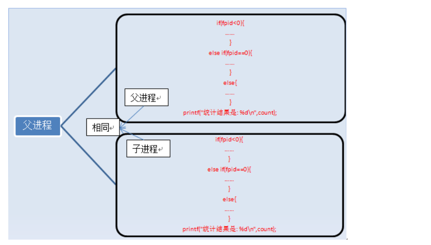
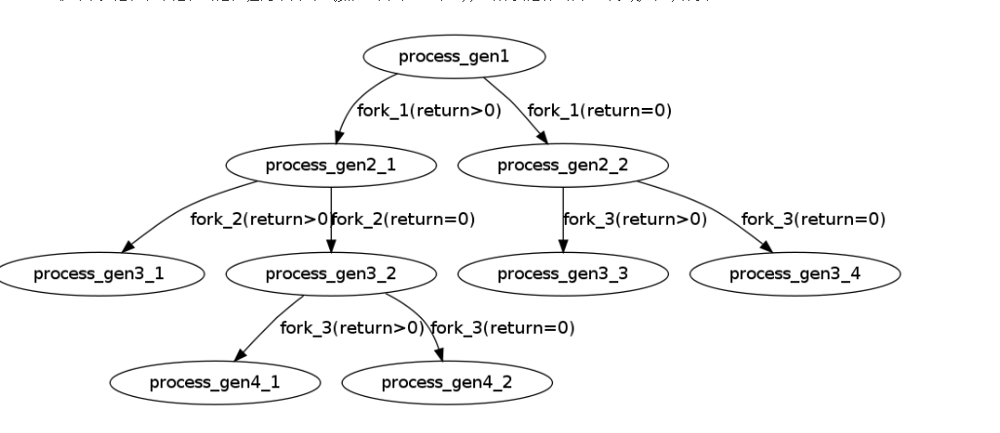

总结：linux 中 fock 进程

1：fock 当前执行位置和所有参数，相当于备份当前信息，包括局部变量

2：fock 一次 会有两次返回（父进程返回子进程 fpid ，子进程返回父进程 fpid = 0）

3：子进程 可以再次fock 子进程（这时候子进程相对于下一个子进程 为父进程）

4：拓展 ：因为android zygote 启动的时候会启动虚拟机，这也是每次fock app进程的时候会启动自有的虚拟机的原因（1：原因）

**fork入门知识**

   一个进程，包括代码、数据和分配给进程的资源。fork（）函数通过系统调用创建一个与原来进程几乎完全相同的进程，也就是两个进程可以做完全相同的事，但如果初始参数或者传入的变量不同，两个进程也可以做不同的事。
  一个进程调用fork（）函数后，系统先给新的进程分配资源，例如存储数据和代码的空间。然后把原来的进程的所有值都复制到新的新进程中，只有少数值与原来的进程的值不同。相当于克隆了一个自己。

   

我们来看一个例子：

**[cpp]**[view plain](http://blog.csdn.net/jason314/article/details/5640969#)

1. /* 
2.  \* fork_test.c 
3.  \* version 1 
4.  \* Created on: 2010-5-29 
5.  \*   Author: wangth 
6.  */ 
7. \#include <unistd.h> 
8. \#include <stdio.h>  
9. **int** main ()  
10. {  
11.   pid_t fpid; //fpid表示fork函数返回的值 
12.   **int** count=0; 
13.   fpid=fork();  
14.   **if** (fpid < 0)  
15. ​    printf("error in fork!");  
16.   **else** **if** (fpid == 0) { 
17. ​    printf("i am the child process, my process id is %d/n",getpid());  
18. ​    printf("我是爹的儿子/n");//对某些人来说中文看着更直白。 
19. ​    count++; 
20.   } 
21.   **else** { 
22. ​    printf("i am the parent process, my process id is %d/n",getpid());  
23. ​    printf("我是孩子他爹/n"); 
24. ​    count++; 
25.   } 
26.   printf("统计结果是: %d/n",count); 
27.   **return** 0; 
28. } 

   运行结果是：
  i am the child process, my process id is 5574
  我是爹的儿子
  统计结果是: 1
  i am the parent process, my process id is 5573
  我是孩子他爹
  统计结果是: 1
  在语句fpid=fork()之前，只有一个进程在执行这段代码，但在这条语句之后，就变成两个进程在执行了，这两个进程的几乎完全相同，将要执行的下一条语句都是if(fpid<0)……
  为什么两个进程的fpid不同呢，这与fork函数的特性有关。fork调用的一个奇妙之处就是它仅仅被调用一次，却能够返回两次，它可能有三种不同的返回值：
  1）在父进程中，fork返回新创建子进程的进程ID；
  2）在子进程中，fork返回0；
  3）如果出现错误，fork返回一个负值；

  在fork函数执行完毕后，如果创建新进程成功，则出现两个进程，一个是子进程，一个是父进程。在子进程中，fork函数返回0，在父进程中，fork返回新创建子进程的进程ID。我们可以通过fork返回的值来判断当前进程是子进程还是父进程。

  引用一位网友的话来解释fpid的值为什么在父子进程中不同。“其实就相当于链表，进程形成了链表，父进程的fpid(p 意味point)指向子进程的进程id, 因为子进程没有子进程，所以其fpid为0.
  fork出错可能有两种原因：
  1）当前的进程数已经达到了系统规定的上限，这时errno的值被设置为EAGAIN。
  2）系统内存不足，这时errno的值被设置为ENOMEM。
  创建新进程成功后，系统中出现两个基本完全相同的进程，这两个进程执行没有固定的先后顺序，哪个进程先执行要看系统的进程调度策略。
  每个进程都有一个独特（互不相同）的进程标识符（process ID），可以通过getpid（）函数获得，还有一个记录父进程pid的变量，可以通过getppid（）函数获得变量的值。
  fork执行完毕后，出现两个进程，

  有人说两个进程的内容完全一样啊，怎么打印的结果不一样啊，那是因为判断条件的原因，上面列举的只是进程的代码和指令，还有变量啊。
  执行完fork后，进程1的变量为count=0，fpid！=0（父进程）。进程2的变量为count=0，fpid=0（子进程），这两个进程的变量都是独立的，存在不同的地址中，不是共用的，这点要注意。可以说，我们就是通过fpid来识别和操作父子进程的。
  还有人可能疑惑为什么不是从#include处开始复制代码的，这是因为fork是把进程当前的情况拷贝一份，执行fork时，进程已经执行完了int count=0;fork只拷贝下一个要执行的代码到新的进程。

**二、fork进阶知识**

  先看一份代码：

**[cpp]**[view plain](http://blog.csdn.net/jason314/article/details/5640969#)

1. /* 
2.  \* fork_test.c 
3.  \* version 2 
4.  \* Created on: 2010-5-29 
5.  \*   Author: wangth 
6.  */ 
7. \#include <unistd.h> 
8. \#include <stdio.h> 
9. **int** main(**void**) 
10. { 
11.   **int** i=0; 
12.   printf("i son/pa ppid pid fpid/n"); 
13.   //ppid指当前进程的父进程pid 
14.   //pid指当前进程的pid, 
15.   //fpid指fork返回给当前进程的值 
16.   **for**(i=0;i<2;i++){ 
17. ​    pid_t fpid=fork(); 
18. ​    **if**(fpid==0) 
19. ​      printf("%d child %4d %4d %4d/n",i,getppid(),getpid(),fpid); 
20. ​    **else** 
21. ​      printf("%d parent %4d %4d %4d/n",i,getppid(),getpid(),fpid); 
22.   } 
23.   **return** 0; 
24. } 

  运行结果是：
  i son/pa ppid pid fpid
  0 parent 2043 3224 3225
  0 child 3224 3225  0
  1 parent 2043 3224 3226
  1 parent 3224 3225 3227
  1 child   1 3227  0
  1 child   1 3226  0 
  这份代码比较有意思，我们来认真分析一下：
  第一步：在父进程中，指令执行到for循环中，i=0，接着执行fork，fork执行完后，系统中出现两个进程，分别是p3224和p3225（后面我都用pxxxx表示进程id为xxxx的进程）。可以看到父进程p3224的父进程是p2043，子进程p3225的父进程正好是p3224。我们用一个链表来表示这个关系：
  p2043->p3224->p3225 
  第一次fork后，p3224（父进程）的变量为i=0，fpid=3225（fork函数在父进程中返向子进程id），代码内容为：

**[c-sharp]**[view plain](http://blog.csdn.net/jason314/article/details/5640969#)

1. **for**(i=0;i<2;i++){ 
2.   pid_t fpid=fork();//执行完毕，i=0，fpid=3225 
3.   **if**(fpid==0) 
4. ​    printf("%d child %4d %4d %4d/n",i,getppid(),getpid(),fpid); 
5.   **else** 
6. ​    printf("%d parent %4d %4d %4d/n",i,getppid(),getpid(),fpid); 
7. } 
8. **return** 0; 

  p3225（子进程）的变量为i=0，fpid=0（fork函数在子进程中返回0），代码内容为：

**[c-sharp]**[view plain](http://blog.csdn.net/jason314/article/details/5640969#)

1. **for**(i=0;i<2;i++){ 
2.   pid_t fpid=fork();//执行完毕，i=0，fpid=0 
3.   **if**(fpid==0) 
4. ​    printf("%d child %4d %4d %4d/n",i,getppid(),getpid(),fpid); 
5.   **else** 
6. ​    printf("%d parent %4d %4d %4d/n",i,getppid(),getpid(),fpid); 
7. } 
8. **return** 0; 

  所以打印出结果：
  0 parent 2043 3224 3225
  0 child 3224 3225  0
  第二步：假设父进程p3224先执行，当进入下一个循环时，i=1，接着执行fork，系统中又新增一个进程p3226，对于此时的父进程，p2043->p3224（当前进程）->p3226（被创建的子进程）。
  对于子进程p3225，执行完第一次循环后，i=1，接着执行fork，系统中新增一个进程p3227，对于此进程，p3224->p3225（当前进程）->p3227（被创建的子进程）。从输出可以看到p3225原来是p3224的子进程，现在变成p3227的父进程。父子是相对的，这个大家应该容易理解。只要当前进程执行了fork，该进程就变成了父进程了，就打印出了parent。
  所以打印出结果是：
  1 parent 2043 3224 3226
  1 parent 3224 3225 3227 
  第三步：第二步创建了两个进程p3226，p3227，这两个进程执行完printf函数后就结束了，因为这两个进程无法进入第三次循环，无法fork，该执行return 0;了，其他进程也是如此。
  以下是p3226，p3227打印出的结果：
  1 child   1 3227  0
  1 child   1 3226  0 
  细心的读者可能注意到p3226，p3227的父进程难道不该是p3224和p3225吗，怎么会是1呢？这里得讲到进程的创建和死亡的过程，在p3224和p3225执行完第二个循环后，main函数就该退出了，也即进程该死亡了，因为它已经做完所有事情了。p3224和p3225死亡后，p3226，p3227就没有父进程了，这在操作系统是不被允许的，所以p3226，p3227的父进程就被置为p1了，p1是永远不会死亡的，至于为什么，这里先不介绍，留到“三、fork高阶知识”讲。
  总结一下，这个程序执行的流程如下：

   这个程序最终产生了3个子进程，执行过6次printf（）函数。
  我们再来看一份代码：

**[cpp]**[view plain](http://blog.csdn.net/jason314/article/details/5640969#)

1. /* 
2.  \* fork_test.c 
3.  \* version 3 
4.  \* Created on: 2010-5-29 
5.  \*   Author: wangth 
6.  */ 
7. \#include <unistd.h> 
8. \#include <stdio.h> 
9. **int** main(**void**) 
10. { 
11.   **int** i=0; 
12.   **for**(i=0;i<3;i++){ 
13. ​    pid_t fpid=fork(); 
14. ​    **if**(fpid==0) 
15. ​      printf("son/n"); 
16. ​    **else** 
17. ​      printf("father/n"); 
18.   } 
19.   **return** 0; 
20.  
21. } 

   它的执行结果是：
  father
  son
  father
  father
  father
  father
  son
  son
  father
  son
  son
  son
  father
  son 
  这里就不做详细解释了，只做一个大概的分析。
  for    i=0     1      2
       father   father   father
                    son
               son    father
                     son
        son    father   father
                     son
               son    father
                    son
  其中每一行分别代表一个进程的运行打印结果。
  总结一下规律，对于这种N次循环的情况，执行printf函数的次数为2*（1+2+4+……+2N-1）次，创建的子进程数为1+2+4+……+2N-1个。**(感谢gao_jiawei网友指出的错误，原本我的结论是“执行printf函数的次数为2\*（1+2+4+……+2N）次，创建的子进程数为1+2+4+……+2N ”，这是错的)**
  网上有人说N次循环产生2*（1+2+4+……+2N）个进程，这个说法是不对的，希望大家需要注意。

  数学推理见http://202.117.3.13/wordpress/?p=81（该博文的最后）。
  同时，大家如果想测一下一个程序中到底创建了几个子进程，最好的方法就是调用printf函数打印该进程的pid，也即调用printf("%d/n",getpid());或者通过printf("+/n");来判断产生了几个进程。有人想通过调用printf("+");来统计创建了几个进程，这是不妥当的。具体原因我来分析。
  老规矩，大家看一下下面的代码：

**[cpp]**[view plain](http://blog.csdn.net/jason314/article/details/5640969#)

1. /* 
2.  \* fork_test.c 
3.  \* version 4 
4.  \* Created on: 2010-5-29 
5.  \*   Author: wangth 
6.  */ 
7. \#include <unistd.h> 
8. \#include <stdio.h> 
9. **int** main() { 
10.   pid_t fpid;//fpid表示fork函数返回的值 
11.   //printf("fork!"); 
12.   printf("fork!/n"); 
13.   fpid = fork(); 
14.   **if** (fpid < 0) 
15. ​    printf("error in fork!"); 
16.   **else** **if** (fpid == 0) 
17. ​    printf("I am the child process, my process id is %d/n", getpid()); 
18.   **else** 
19. ​    printf("I am the parent process, my process id is %d/n", getpid()); 
20.   **return** 0; 
21. } 

  **执行结果如下：
  fork!
  I am the parent process, my process id is 3361
  I am the child process, my process id is 3362 
  如果把语句printf("fork!/n");注释掉，执行printf("fork!");
  则新的程序的执行结果是：
  fork!I am the parent process, my process id is 3298
  fork!I am the child process, my process id is 3299 
  程序的唯一的区别就在于一个/n回车符号，为什么结果会相差这么大呢？
  这就跟printf的缓冲机制有关了，printf某些内容时，操作系统仅仅是把该内容放到了stdout的缓冲队列里了,并没有实际的写到屏幕上。但是,只要看到有/n 则会立即刷新stdout,因此就马上能够打印了。
  运行了printf("fork!")后,“fork!”仅仅被放到了缓冲里,程序运行到fork时缓冲里面的“fork!” 被子进程复制过去了。因此在子进程度stdout缓冲里面就也有了fork! 。所以,你最终看到的会是fork! 被printf了2次！！！！
  而运行printf("fork! /n")后,“fork!”被立即打印到了屏幕上,之后fork到的子进程里的stdout缓冲里不会有fork! 内容。因此你看到的结果会是fork! 被printf了1次！！！！
  所以说printf("+");不能正确地反应进程的数量。
  大家看了这么多可能有点疲倦吧，不过我还得贴最后一份代码来进一步分析fork函数。**

**[cpp]**[view plain](http://blog.csdn.net/jason314/article/details/5640969#)

1. \#include <stdio.h> 
2. \#include <unistd.h> 
3. **int** main(**int** argc, **char*** argv[]) 
4. { 
5.   fork(); 
6.   fork() && fork() || fork(); 
7.   fork(); 
8.   **return** 0; 
9. } 

  **问题是不算main这个进程自身，程序到底创建了多少个进程。
  为了解答这个问题，我们先做一下弊，先用程序验证一下，到此有多少个进程。**

**[c-sharp]**[view plain](http://blog.csdn.net/jason314/article/details/5640969#)

1. \#include <stdio.h> 
2. **int** main(**int** argc, **char*** argv[]) 
3. { 
4.   fork(); 
5.   fork() && fork() || fork(); 
6.   fork(); 
7.   printf("+/n"); 
8. } 

  **答案是总共20个进程，除去main进程，还有19个进程。
  我们再来仔细分析一下，为什么是还有19个进程。
  第一个fork和最后一个fork肯定是会执行的。
  主要在中间3个fork上，可以画一个图进行描述。
  这里就需要注意&&和||运算符。
  A&&B，如果A=0，就没有必要继续执行&&B了；A非0，就需要继续执行&&B。
  A||B，如果A非0，就没有必要继续执行||B了，A=0，就需要继续执行||B。
  fork()对于父进程和子进程的返回值是不同的，按照上面的A&&B和A||B的分支进行画图，可以得出5个分支。**

   加上前面的fork和最后的fork，总共4*5=20个进程，除去main主进程，就是19个进程了。